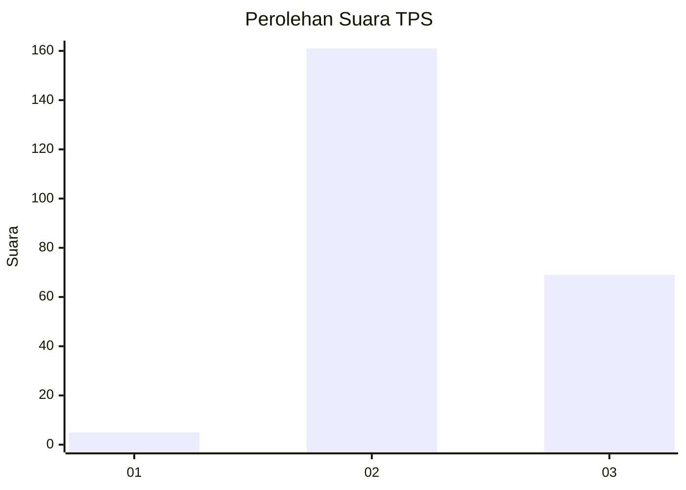

# Hasil

## Grafik

## Tabel

| No. | Nama Paslon    | Suara | Suara (raw) | Persentase |
|:--- |:-------------- | -----:| -----------:| ----------:|
| 1   | ANIES MUHAIMIN | 5     | [5][p-1]    | 2,13       |
| 2   | PRABOWO GIBRAN | 161   | [161][p-2]  | 68,51      |
| 3   | GANJAR MAHFUD  | 69    | [69][p-3]   | 29,36      |

[p-1]: https://github.com/gigit-pemilu/pemilu-2024/blob/main/pilpres/hitung-suara/sub/12-sumatera-utara/sub/02-tapanuli-utara/sub/04-sipoholon/sub/2014-hutaraja-simanungkalit/sub/001-tps/sub/paslon-1.txt
[p-2]: https://github.com/gigit-pemilu/pemilu-2024/blob/main/pilpres/hitung-suara/sub/12-sumatera-utara/sub/02-tapanuli-utara/sub/04-sipoholon/sub/2014-hutaraja-simanungkalit/sub/001-tps/sub/paslon-2.txt
[p-3]: https://github.com/gigit-pemilu/pemilu-2024/blob/main/pilpres/hitung-suara/sub/12-sumatera-utara/sub/02-tapanuli-utara/sub/04-sipoholon/sub/2014-hutaraja-simanungkalit/sub/001-tps/sub/paslon-3.txt

## Foto C Plano

https://sirekap-obj-formc.kpu.go.id/1ddf/pemilu/ppwp/12/02/04/20/14/1202042014001-20240217-133303--13350d58-ad74-4ced-b2b0-7dd1b49de236.jpg

https://sirekap-obj-formc.kpu.go.id/1ddf/pemilu/ppwp/12/02/04/20/14/1202042014001-20240217-133355--63d56b94-98a8-44e3-baa4-6ac12eef1335.jpg

https://sirekap-obj-formc.kpu.go.id/1ddf/pemilu/ppwp/12/02/04/20/14/1202042014001-20240217-132852--90b9fd9d-952a-4f69-8d16-e77347a05ea8.jpg

## Metadata

| Key        | Value               |
| ---------- | ------------------- |
| Time Stamp | 2024-02-17 13:37:34 |

