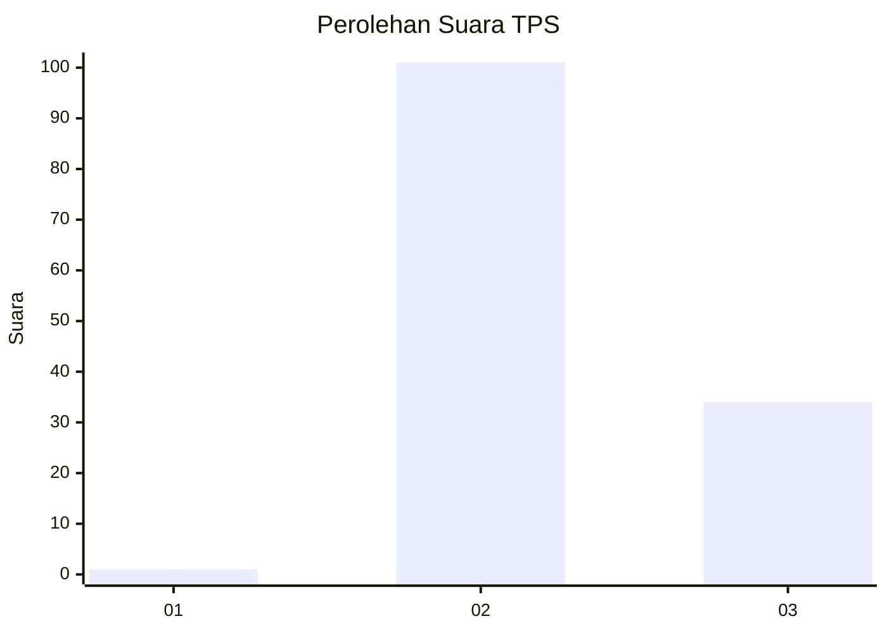
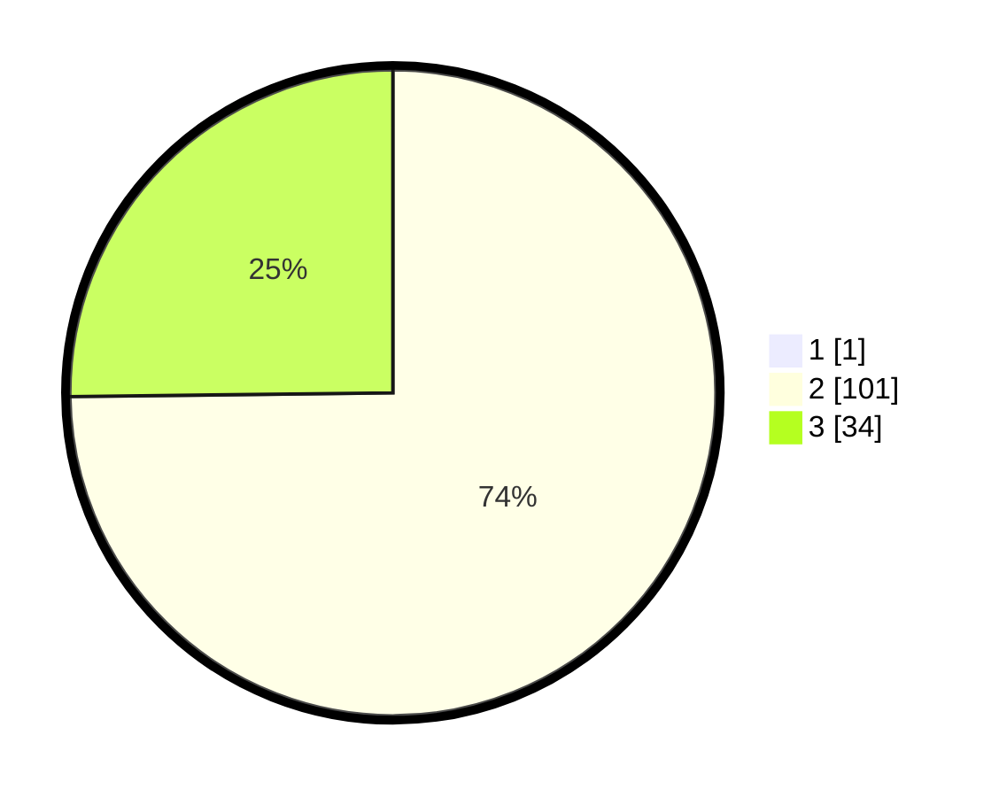

# Hasil

## Grafik

## Tabel

| No. | Nama Paslon    | Suara | Suara (raw) | Persentase |
|:--- |:-------------- | -----:| -----------:| ----------:|
| 1   | ANIES MUHAIMIN | 1     | [1][p-1]    | 0,74       |
| 2   | PRABOWO GIBRAN | 101   | [101][p-2]  | 74,26      |
| 3   | GANJAR MAHFUD  | 34    | [34][p-3]   | 25,00      |

[p-1]: https://github.com/gigit-pemilu/pemilu-2024-12-sumatera-utara/blob/main/pilpres/hitung-suara/sub/12-sumatera-utara/sub/02-tapanuli-utara/sub/04-sipoholon/sub/2014-hutaraja-simanungkalit/sub/002-tps/sub/paslon-1.txt
[p-2]: https://github.com/gigit-pemilu/pemilu-2024-12-sumatera-utara/blob/main/pilpres/hitung-suara/sub/12-sumatera-utara/sub/02-tapanuli-utara/sub/04-sipoholon/sub/2014-hutaraja-simanungkalit/sub/002-tps/sub/paslon-2.txt
[p-3]: https://github.com/gigit-pemilu/pemilu-2024-12-sumatera-utara/blob/main/pilpres/hitung-suara/sub/12-sumatera-utara/sub/02-tapanuli-utara/sub/04-sipoholon/sub/2014-hutaraja-simanungkalit/sub/002-tps/sub/paslon-3.txt

## Foto C Plano

https://sirekap-obj-formc.kpu.go.id/d044/pemilu/ppwp/12/02/04/20/14/1202042014002-20240217-150244--537c8707-ad43-4e01-8961-920c94384d3a.jpg

https://sirekap-obj-formc.kpu.go.id/d044/pemilu/ppwp/12/02/04/20/14/1202042014002-20240217-150431--745044e1-f846-4a76-92f0-9d0a940fc958.jpg

https://sirekap-obj-formc.kpu.go.id/d044/pemilu/ppwp/12/02/04/20/14/1202042014002-20240217-150739--63e783b0-438d-4cc0-8137-0d24ca454014.jpg

## Metadata

| Key        | Value               |
| ---------- | ------------------- |
| Time Stamp | 2024-02-24 22:31:28 |

