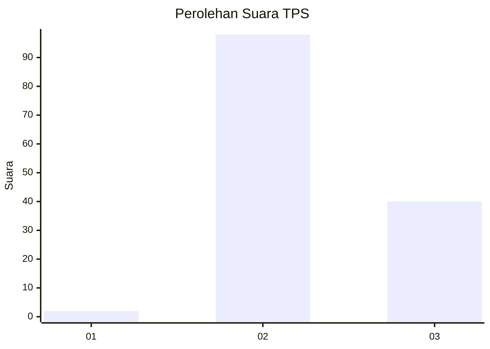
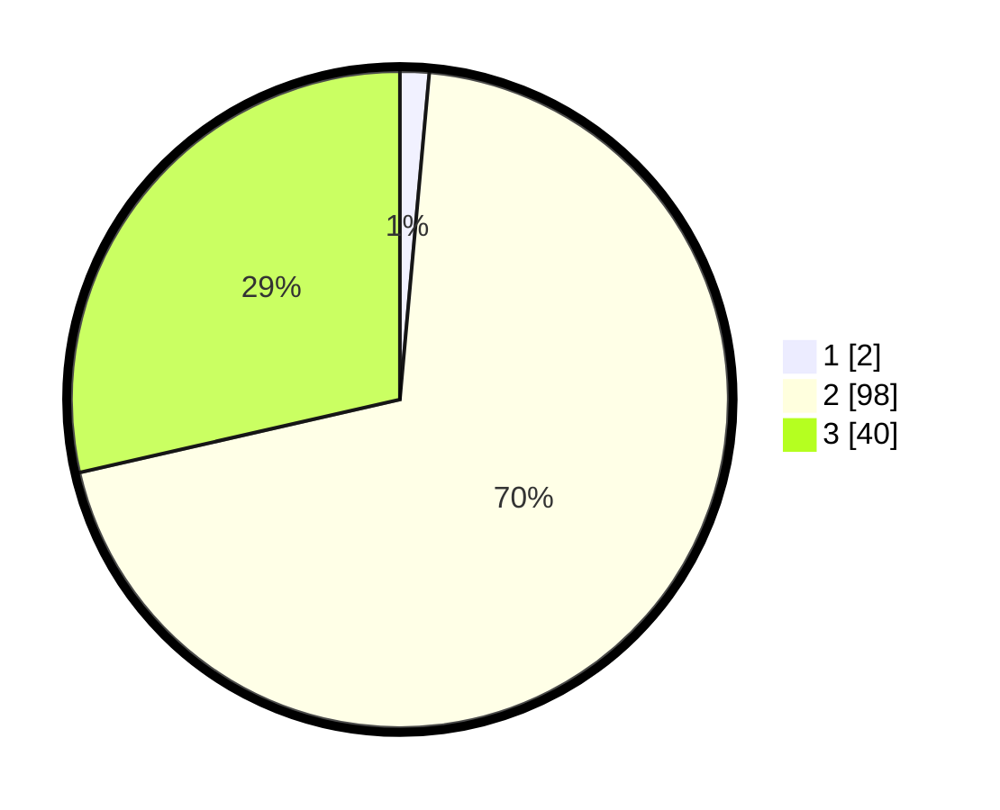

# Hasil

## Grafik

## Tabel

| No. | Nama Paslon    | Suara | Suara (raw) | Persentase |
|:--- |:-------------- | -----:| -----------:| ----------:|
| 1   | ANIES MUHAIMIN | 2     | [2][p-1]    | 1,43       |
| 2   | PRABOWO GIBRAN | 98    | [98][p-2]   | 70,00      |
| 3   | GANJAR MAHFUD  | 40    | [40][p-3]   | 28,57      |

[p-1]: https://github.com/gigit-pemilu/pemilu-2024/blob/main/pilpres/hitung-suara/sub/12-sumatera-utara/sub/02-tapanuli-utara/sub/04-sipoholon/sub/2014-hutaraja-simanungkalit/sub/003-tps/sub/paslon-1.txt
[p-2]: https://github.com/gigit-pemilu/pemilu-2024/blob/main/pilpres/hitung-suara/sub/12-sumatera-utara/sub/02-tapanuli-utara/sub/04-sipoholon/sub/2014-hutaraja-simanungkalit/sub/003-tps/sub/paslon-2.txt
[p-3]: https://github.com/gigit-pemilu/pemilu-2024/blob/main/pilpres/hitung-suara/sub/12-sumatera-utara/sub/02-tapanuli-utara/sub/04-sipoholon/sub/2014-hutaraja-simanungkalit/sub/003-tps/sub/paslon-3.txt

## Foto C Plano

https://sirekap-obj-formc.kpu.go.id/e3b4/pemilu/ppwp/12/02/04/20/14/1202042014003-20240217-153959--b7b1c27a-1c1b-407f-9cb8-b0d78e736d38.jpg

https://sirekap-obj-formc.kpu.go.id/e3b4/pemilu/ppwp/12/02/04/20/14/1202042014003-20240217-154121--fd91747f-bd43-43c2-9152-359594950fba.jpg

https://sirekap-obj-formc.kpu.go.id/e3b4/pemilu/ppwp/12/02/04/20/14/1202042014003-20240217-154316--06b7fd30-9106-413b-9299-d43a5a0a7a0e.jpg

## Metadata

| Key        | Value               |
| ---------- | ------------------- |
| Time Stamp | 2024-02-25 12:00:00 |

