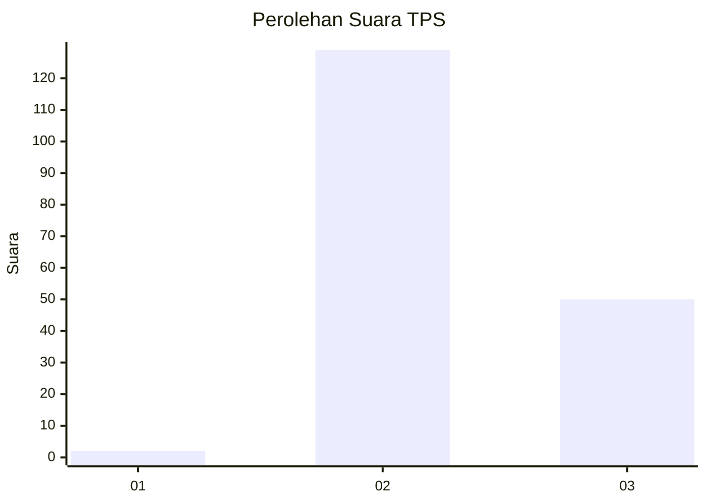
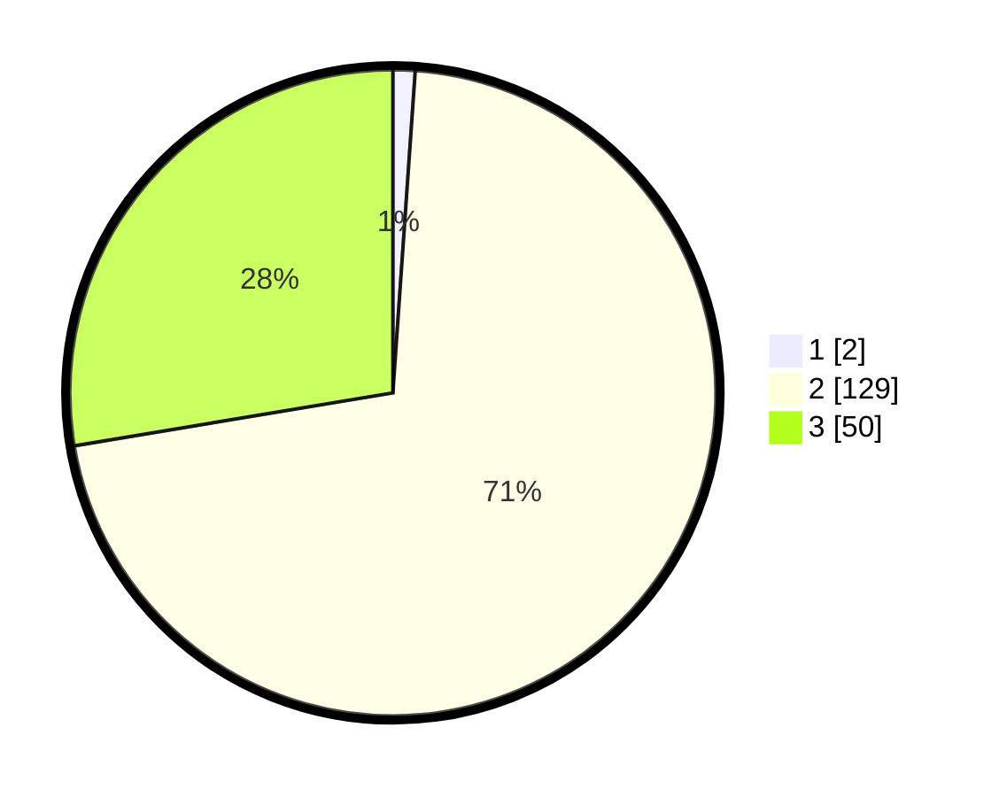

# Hasil

## Grafik

## Tabel

| No. | Nama Paslon    | Suara | Suara (raw) | Persentase |
|:--- |:-------------- | -----:| -----------:| ----------:|
| 1   | ANIES MUHAIMIN | 2     | [2][p-1]    | 1,10       |
| 2   | PRABOWO GIBRAN | 129   | [129][p-2]  | 71,27      |
| 3   | GANJAR MAHFUD  | 50    | [50][p-3]   | 27,62      |

[p-1]: https://github.com/gigit-pemilu/pemilu-2024-12-sumatera-utara/blob/main/pilpres/hitung-suara/sub/12-sumatera-utara/sub/02-tapanuli-utara/sub/05-pahae-julu/sub/1001-onan-hasang/sub/001-tps/sub/paslon-1.txt
[p-2]: https://github.com/gigit-pemilu/pemilu-2024-12-sumatera-utara/blob/main/pilpres/hitung-suara/sub/12-sumatera-utara/sub/02-tapanuli-utara/sub/05-pahae-julu/sub/1001-onan-hasang/sub/001-tps/sub/paslon-2.txt
[p-3]: https://github.com/gigit-pemilu/pemilu-2024-12-sumatera-utara/blob/main/pilpres/hitung-suara/sub/12-sumatera-utara/sub/02-tapanuli-utara/sub/05-pahae-julu/sub/1001-onan-hasang/sub/001-tps/sub/paslon-3.txt

## Foto C Plano

https://sirekap-obj-formc.kpu.go.id/7087/pemilu/ppwp/12/02/05/10/01/1202051001001-20240221-120755--f372812f-1c46-4dc9-97e3-65217c9b4f3f.jpg

https://sirekap-obj-formc.kpu.go.id/7087/pemilu/ppwp/12/02/05/10/01/1202051001001-20240221-120838--8f1efc8c-66c9-458d-b04b-444727f0b871.jpg

https://sirekap-obj-formc.kpu.go.id/7087/pemilu/ppwp/12/02/05/10/01/1202051001001-20240221-121556--5cdbaf2a-6826-49a4-af1f-1f116b89494f.jpg

## Metadata

| Key        | Value               |
| ---------- | ------------------- |
| Time Stamp | 2024-02-25 15:00:00 |

