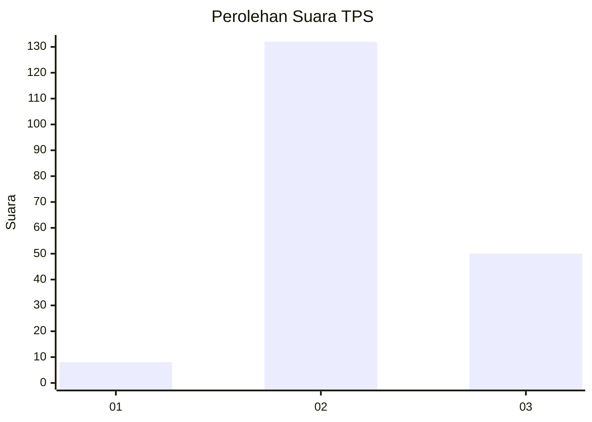

# Hasil

## Grafik

## Tabel

| No. | Nama Paslon    | Suara | Suara (raw) | Persentase |
|:--- |:-------------- | -----:| -----------:| ----------:|
| 1   | ANIES MUHAIMIN | 8     | [8][p-1]    | 4,21       |
| 2   | PRABOWO GIBRAN | 132   | [132][p-2]  | 69,47      |
| 3   | GANJAR MAHFUD  | 50    | [50][p-3]   | 26,32      |

[p-1]: https://github.com/gigit-pemilu/pemilu-2024-12-sumatera-utara/blob/main/pilpres/hitung-suara/sub/12-sumatera-utara/sub/02-tapanuli-utara/sub/05-pahae-julu/sub/1001-onan-hasang/sub/002-tps/sub/paslon-1.txt
[p-2]: https://github.com/gigit-pemilu/pemilu-2024-12-sumatera-utara/blob/main/pilpres/hitung-suara/sub/12-sumatera-utara/sub/02-tapanuli-utara/sub/05-pahae-julu/sub/1001-onan-hasang/sub/002-tps/sub/paslon-2.txt
[p-3]: https://github.com/gigit-pemilu/pemilu-2024-12-sumatera-utara/blob/main/pilpres/hitung-suara/sub/12-sumatera-utara/sub/02-tapanuli-utara/sub/05-pahae-julu/sub/1001-onan-hasang/sub/002-tps/sub/paslon-3.txt

## Foto C Plano

https://sirekap-obj-formc.kpu.go.id/756a/pemilu/ppwp/12/02/05/10/01/1202051001002-20240221-104010--d2323dfb-574d-4e6e-a1ab-085ec9fb9209.jpg

https://sirekap-obj-formc.kpu.go.id/756a/pemilu/ppwp/12/02/05/10/01/1202051001002-20240221-104052--c10f6f66-4363-4e4d-bfcf-eb4eaefe614f.jpg

https://sirekap-obj-formc.kpu.go.id/756a/pemilu/ppwp/12/02/05/10/01/1202051001002-20240221-104233--f8c7c227-94b4-496b-9da4-7b154cf63866.jpg

## Metadata

| Key        | Value               |
| ---------- | ------------------- |
| Time Stamp | 2024-02-25 16:00:00 |

