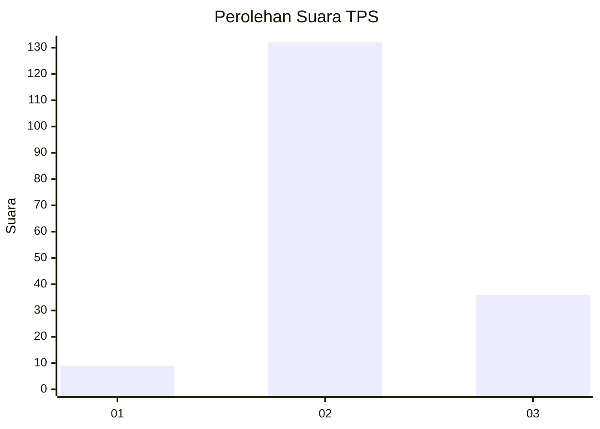

# Hasil

## Grafik

## Tabel

| No. | Nama Paslon    | Suara | Suara (raw) | Persentase |
|:--- |:-------------- | -----:| -----------:| ----------:|
| 1   | ANIES MUHAIMIN | 9     | [9][p-1]    | 5,08       |
| 2   | PRABOWO GIBRAN | 132   | [132][p-2]  | 74,58      |
| 3   | GANJAR MAHFUD  | 36    | [36][p-3]   | 20,34      |

[p-1]: https://github.com/gigit-pemilu/pemilu-2024-12-sumatera-utara/blob/main/pilpres/hitung-suara/sub/12-sumatera-utara/sub/02-tapanuli-utara/sub/05-pahae-julu/sub/2003-janji-natogu/sub/002-tps/sub/paslon-1.txt
[p-2]: https://github.com/gigit-pemilu/pemilu-2024-12-sumatera-utara/blob/main/pilpres/hitung-suara/sub/12-sumatera-utara/sub/02-tapanuli-utara/sub/05-pahae-julu/sub/2003-janji-natogu/sub/002-tps/sub/paslon-2.txt
[p-3]: https://github.com/gigit-pemilu/pemilu-2024-12-sumatera-utara/blob/main/pilpres/hitung-suara/sub/12-sumatera-utara/sub/02-tapanuli-utara/sub/05-pahae-julu/sub/2003-janji-natogu/sub/002-tps/sub/paslon-3.txt

## Foto C Plano

https://sirekap-obj-formc.kpu.go.id/d7c1/pemilu/ppwp/12/02/05/20/03/1202052003002-20240220-155944--d0864b44-509a-4a66-87dd-fefbb9961b7c.jpg

https://sirekap-obj-formc.kpu.go.id/d7c1/pemilu/ppwp/12/02/05/20/03/1202052003002-20240220-160044--b7bad844-588c-4a12-aeca-e8a536375531.jpg

https://sirekap-obj-formc.kpu.go.id/d7c1/pemilu/ppwp/12/02/05/20/03/1202052003002-20240220-141316--a26b4db0-8b4c-484b-9ca1-c813d189b442.jpg

## Metadata

| Key        | Value               |
| ---------- | ------------------- |
| Time Stamp | 2024-02-25 20:00:00 |

