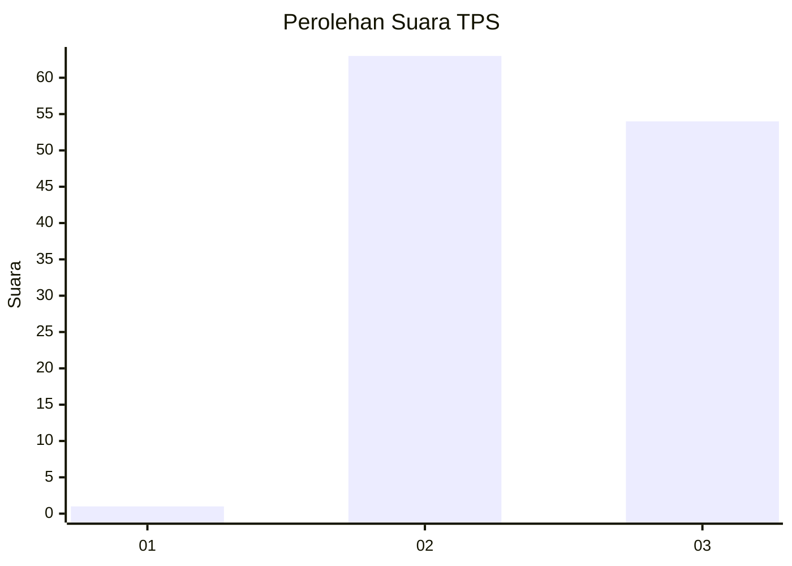
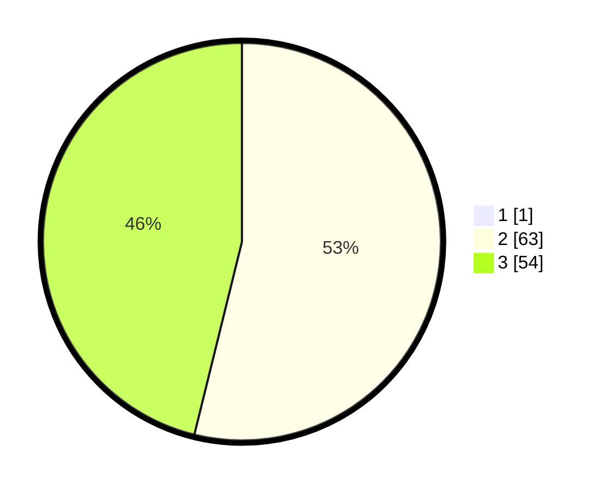

# Hasil

## Grafik

## Tabel

| No. | Nama Paslon    | Suara | Suara (raw) | Persentase |
|:--- |:-------------- | -----:| -----------:| ----------:|
| 1   | ANIES MUHAIMIN | 1     | [1][p-1]    | 0,85       |
| 2   | PRABOWO GIBRAN | 63    | [63][p-2]   | 53,39      |
| 3   | GANJAR MAHFUD  | 54    | [54][p-3]   | 45,76      |

[p-1]: https://github.com/gigit-pemilu/pemilu-2024/blob/main/pilpres/hitung-suara/sub/12-sumatera-utara/sub/02-tapanuli-utara/sub/05-pahae-julu/sub/2004-pagur-dotan/sub/003-tps/sub/paslon-1.txt
[p-2]: https://github.com/gigit-pemilu/pemilu-2024/blob/main/pilpres/hitung-suara/sub/12-sumatera-utara/sub/02-tapanuli-utara/sub/05-pahae-julu/sub/2004-pagur-dotan/sub/003-tps/sub/paslon-2.txt
[p-3]: https://github.com/gigit-pemilu/pemilu-2024/blob/main/pilpres/hitung-suara/sub/12-sumatera-utara/sub/02-tapanuli-utara/sub/05-pahae-julu/sub/2004-pagur-dotan/sub/003-tps/sub/paslon-3.txt

## Foto C Plano

https://sirekap-obj-formc.kpu.go.id/d5fc/pemilu/ppwp/12/02/05/20/04/1202052004003-20240214-221049--6531a908-3962-4b5f-a5d2-9c559c1d1407.jpg

https://sirekap-obj-formc.kpu.go.id/d5fc/pemilu/ppwp/12/02/05/20/04/1202052004003-20240214-221330--f0cdcd7b-1969-471f-b201-c479117d03df.jpg

https://sirekap-obj-formc.kpu.go.id/d5fc/pemilu/ppwp/12/02/05/20/04/1202052004003-20240214-221540--de2dfc0c-8051-44f9-a864-ab32e35149c0.jpg

## Metadata

| Key        | Value               |
| ---------- | ------------------- |
| Time Stamp | 2024-02-15 23:29:50 |

