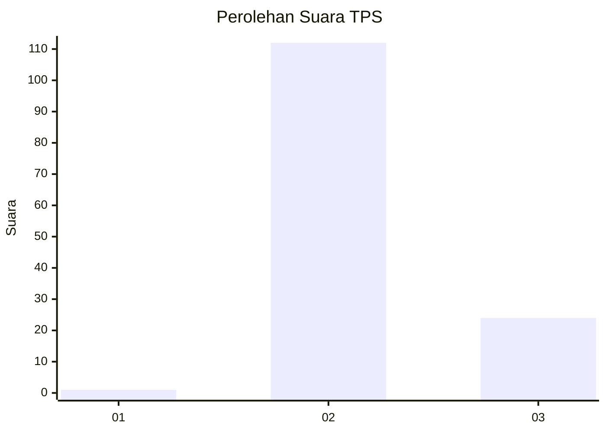
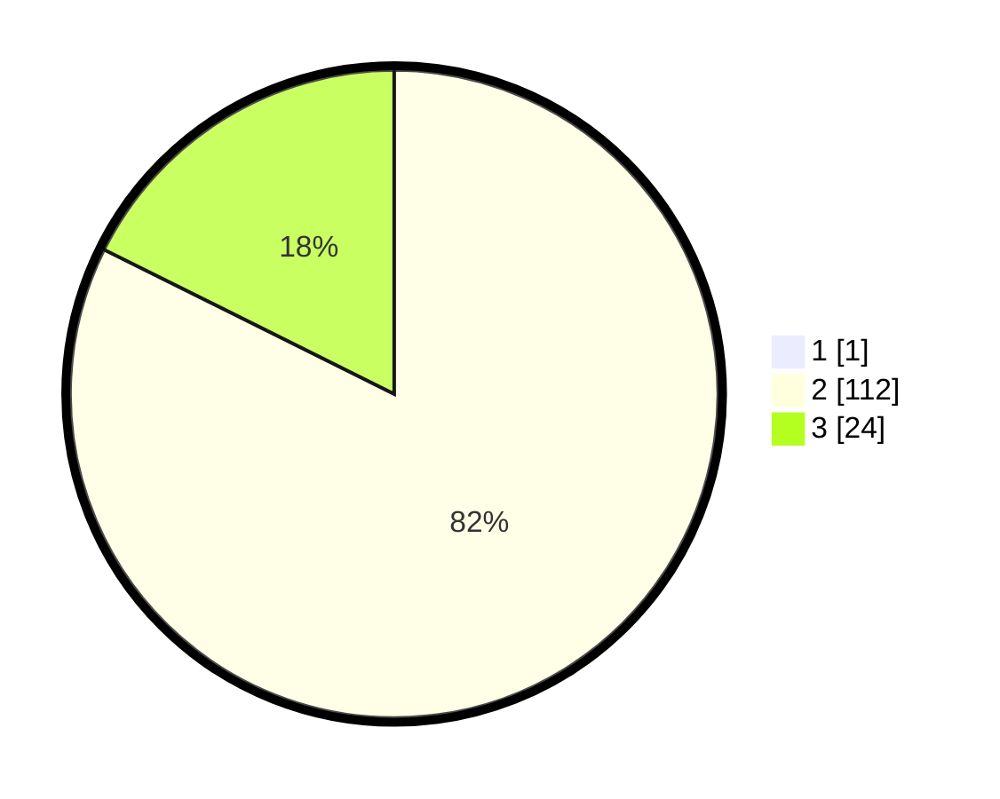

# Hasil

## Grafik

## Tabel

| No. | Nama Paslon    | Suara | Suara (raw) | Persentase |
|:--- |:-------------- | -----:| -----------:| ----------:|
| 1   | ANIES MUHAIMIN | 1     | [1][p-1]    | 0,73       |
| 2   | PRABOWO GIBRAN | 112   | [112][p-2]  | 81,75      |
| 3   | GANJAR MAHFUD  | 24    | [24][p-3]   | 17,52      |

[p-1]: https://github.com/gigit-pemilu/pemilu-2024/blob/main/pilpres/hitung-suara/sub/12-sumatera-utara/sub/02-tapanuli-utara/sub/05-pahae-julu/sub/2007-sitolu-ama/sub/002-tps/sub/paslon-1.txt
[p-2]: https://github.com/gigit-pemilu/pemilu-2024/blob/main/pilpres/hitung-suara/sub/12-sumatera-utara/sub/02-tapanuli-utara/sub/05-pahae-julu/sub/2007-sitolu-ama/sub/002-tps/sub/paslon-2.txt
[p-3]: https://github.com/gigit-pemilu/pemilu-2024/blob/main/pilpres/hitung-suara/sub/12-sumatera-utara/sub/02-tapanuli-utara/sub/05-pahae-julu/sub/2007-sitolu-ama/sub/002-tps/sub/paslon-3.txt

## Foto C Plano

https://sirekap-obj-formc.kpu.go.id/985d/pemilu/ppwp/12/02/05/20/07/1202052007002-20240222-101314--f6ffbe10-a371-401a-ad7f-18bbc2590c7e.jpg

https://sirekap-obj-formc.kpu.go.id/985d/pemilu/ppwp/12/02/05/20/07/1202052007002-20240222-101516--9fcd425f-5385-4e69-95f9-a7cbe90f829f.jpg

https://sirekap-obj-formc.kpu.go.id/985d/pemilu/ppwp/12/02/05/20/07/1202052007002-20240222-101749--23ddbfcb-428f-4bcc-86cf-0c1d77281cee.jpg

## Metadata

| Key        | Value               |
| ---------- | ------------------- |
| Time Stamp | 2024-02-24 22:31:28 |

