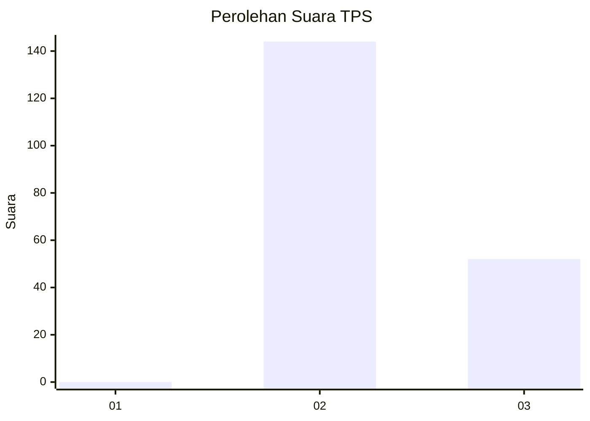
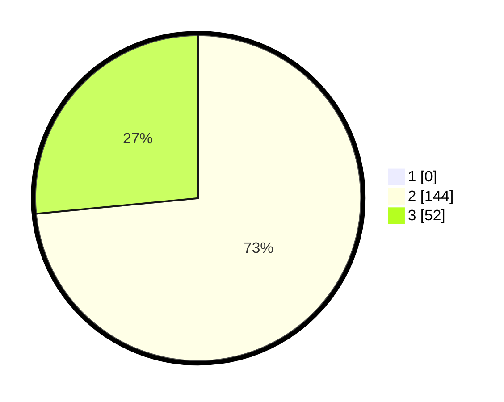

# Hasil

## Grafik

## Tabel

| No. | Nama Paslon    | Suara | Suara (raw) | Persentase |
|:--- |:-------------- | -----:| -----------:| ----------:|
| 1   | ANIES MUHAIMIN | 0     | [0][p-1]    | 0,00       |
| 2   | PRABOWO GIBRAN | 144   | [144][p-2]  | 73,47      |
| 3   | GANJAR MAHFUD  | 52    | [52][p-3]   | 26,53      |

[p-1]: https://github.com/gigit-pemilu/pemilu-2024/blob/main/pilpres/hitung-suara/sub/12-sumatera-utara/sub/02-tapanuli-utara/sub/06-pahae-jae/sub/2003-sigurung-gurung/sub/002-tps/sub/paslon-1.txt
[p-2]: https://github.com/gigit-pemilu/pemilu-2024/blob/main/pilpres/hitung-suara/sub/12-sumatera-utara/sub/02-tapanuli-utara/sub/06-pahae-jae/sub/2003-sigurung-gurung/sub/002-tps/sub/paslon-2.txt
[p-3]: https://github.com/gigit-pemilu/pemilu-2024/blob/main/pilpres/hitung-suara/sub/12-sumatera-utara/sub/02-tapanuli-utara/sub/06-pahae-jae/sub/2003-sigurung-gurung/sub/002-tps/sub/paslon-3.txt

## Foto C Plano

https://sirekap-obj-formc.kpu.go.id/6b12/pemilu/ppwp/12/02/06/20/03/1202062003002-20240214-155424--4f939cde-61b4-4a56-9fb6-99e9f8fb091d.jpg

https://sirekap-obj-formc.kpu.go.id/6b12/pemilu/ppwp/12/02/06/20/03/1202062003002-20240214-155407--8c612811-8bf3-4f9a-9980-80eeed951a7a.jpg

https://sirekap-obj-formc.kpu.go.id/6b12/pemilu/ppwp/12/02/06/20/03/1202062003002-20240214-155634--8032223c-5afa-40c0-b451-b2cb4d58a464.jpg

## Metadata

| Key        | Value               |
| ---------- | ------------------- |
| Time Stamp | 2024-02-16 00:00:26 |

## DATA PEMILIH TETAP

Jumlah pemilih dalam DPT: **245**.
 * L: **227**.
 * P: **724**.

## DATA PENGGUNA HAK PILIH

Jumlah pengguna hak pilih dalam DPT: **792**.
 * L: **892**.
 * P: **99**.

Jumlah pengguna hak pilih dalam DPTb: **7**.
 * L: **807**.
 * P: **80**.

Jumlah pengguna hak pilih dalam DPK: **4**.
 * L: **2**.
 * P: **2**.

Jumlah pengguna hak pilih: **796**.
 * L: **95**.
 * P: **705**.

## JUMLAH SUARA SAH DAN TIDAK SAH

JUMLAH SELURUH SUARA SAH: **196**.

JUMLAH SUARA TIDAK SAH: **0**.

JUMLAH SELURUH SUARA SAH DAN SUARA TIDAK SAH: **196**.

