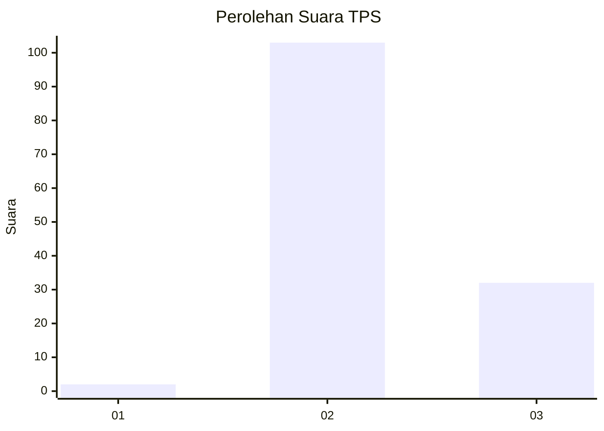
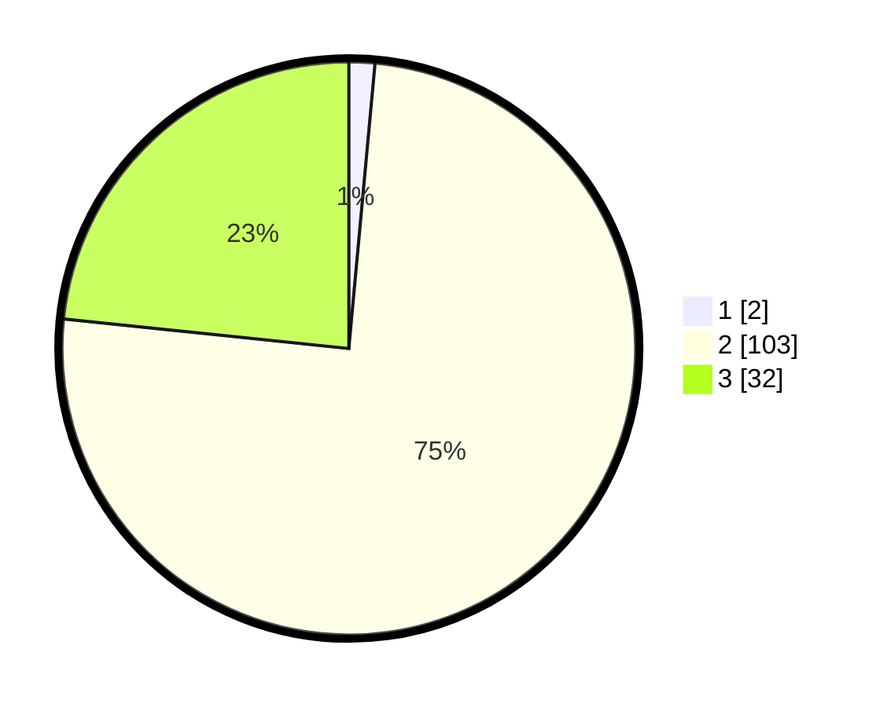

# Hasil

## Grafik

## Tabel

| No. | Nama Paslon    | Suara | Suara (raw) | Persentase |
|:--- |:-------------- | -----:| -----------:| ----------:|
| 1   | ANIES MUHAIMIN | 2     | [2][p-1]    | 1,46       |
| 2   | PRABOWO GIBRAN | 103   | [103][p-2]  | 75,18      |
| 3   | GANJAR MAHFUD  | 32    | [32][p-3]   | 23,36      |

[p-1]: https://github.com/gigit-pemilu/pemilu-2024/blob/main/pilpres/hitung-suara/sub/12-sumatera-utara/sub/02-tapanuli-utara/sub/06-pahae-jae/sub/2003-sigurung-gurung/sub/003-tps/sub/paslon-1.txt
[p-2]: https://github.com/gigit-pemilu/pemilu-2024/blob/main/pilpres/hitung-suara/sub/12-sumatera-utara/sub/02-tapanuli-utara/sub/06-pahae-jae/sub/2003-sigurung-gurung/sub/003-tps/sub/paslon-2.txt
[p-3]: https://github.com/gigit-pemilu/pemilu-2024/blob/main/pilpres/hitung-suara/sub/12-sumatera-utara/sub/02-tapanuli-utara/sub/06-pahae-jae/sub/2003-sigurung-gurung/sub/003-tps/sub/paslon-3.txt

## Foto C Plano

https://sirekap-obj-formc.kpu.go.id/8919/pemilu/ppwp/12/02/06/20/03/1202062003003-20240219-132742--7ff6a73e-d03d-4d4d-95ff-ddb6c48eb9b5.jpg

https://sirekap-obj-formc.kpu.go.id/8919/pemilu/ppwp/12/02/06/20/03/1202062003003-20240219-132142--a32ece55-3517-4958-ba67-12121e34ab2a.jpg

https://sirekap-obj-formc.kpu.go.id/8919/pemilu/ppwp/12/02/06/20/03/1202062003003-20240219-132840--5082a1f1-4135-4db5-9242-9a76cf189282.jpg

## Metadata

| Key        | Value               |
| ---------- | ------------------- |
| Time Stamp | 2024-02-21 09:00:00 |

