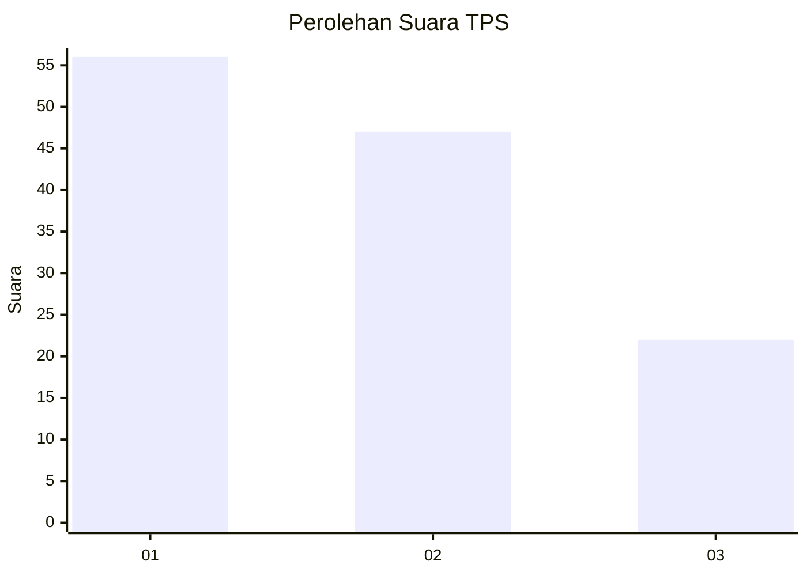
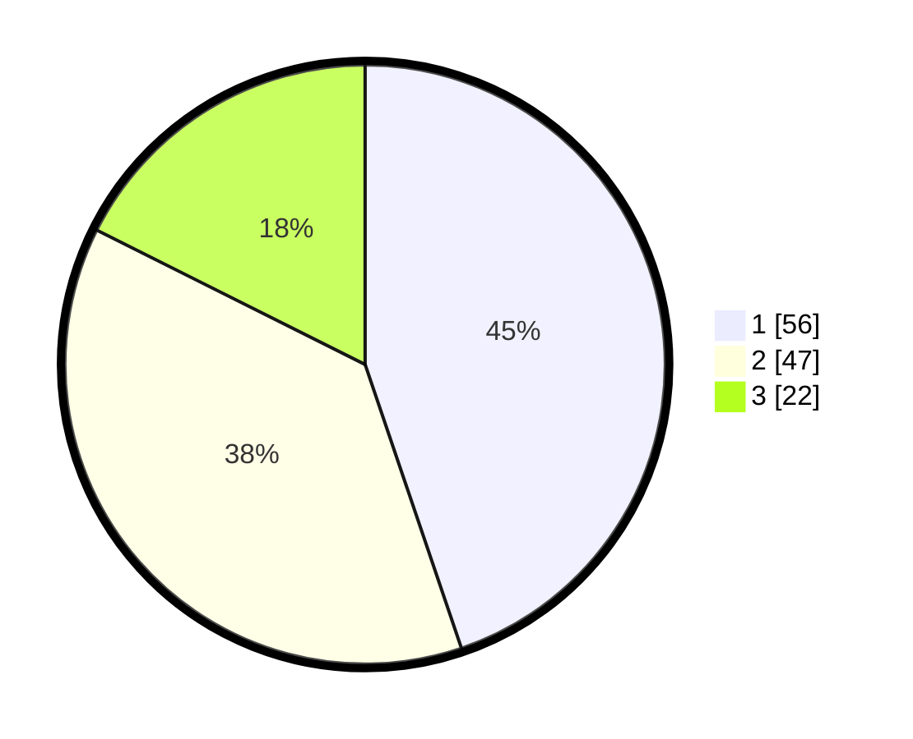

# Hasil

## Grafik

## Tabel

| No. | Nama Paslon    | Suara | Suara (raw) | Persentase |
|:--- |:-------------- | -----:| -----------:| ----------:|
| 1   | ANIES MUHAIMIN | 56    | [56][p-1]   | 44,80      |
| 2   | PRABOWO GIBRAN | 47    | [47][p-2]   | 37,60      |
| 3   | GANJAR MAHFUD  | 22    | [22][p-3]   | 17,60      |

[p-1]: https://github.com/gigit-pemilu/pemilu-2024-12-sumatera-utara/blob/main/pilpres/hitung-suara/sub/12-sumatera-utara/sub/02-tapanuli-utara/sub/08-purba-tua/sub/2002-sibulan-bulan/sub/001-tps/sub/paslon-1.txt
[p-2]: https://github.com/gigit-pemilu/pemilu-2024-12-sumatera-utara/blob/main/pilpres/hitung-suara/sub/12-sumatera-utara/sub/02-tapanuli-utara/sub/08-purba-tua/sub/2002-sibulan-bulan/sub/001-tps/sub/paslon-2.txt
[p-3]: https://github.com/gigit-pemilu/pemilu-2024-12-sumatera-utara/blob/main/pilpres/hitung-suara/sub/12-sumatera-utara/sub/02-tapanuli-utara/sub/08-purba-tua/sub/2002-sibulan-bulan/sub/001-tps/sub/paslon-3.txt

## Foto C Plano

https://sirekap-obj-formc.kpu.go.id/7ac1/pemilu/ppwp/12/02/08/20/02/1202082002001-20240214-214548--667d345a-f2f0-4275-aa8f-743474747f83.jpg

https://sirekap-obj-formc.kpu.go.id/7ac1/pemilu/ppwp/12/02/08/20/02/1202082002001-20240214-214639--00ae6f51-0476-4680-b20b-700fb07a04a7.jpg

https://sirekap-obj-formc.kpu.go.id/7ac1/pemilu/ppwp/12/02/08/20/02/1202082002001-20240214-214727--259d45ce-de5f-456e-8bf9-3b2de3e2febf.jpg

## Metadata

| Key        | Value               |
| ---------- | ------------------- |
| Time Stamp | 2024-02-15 23:29:50 |

