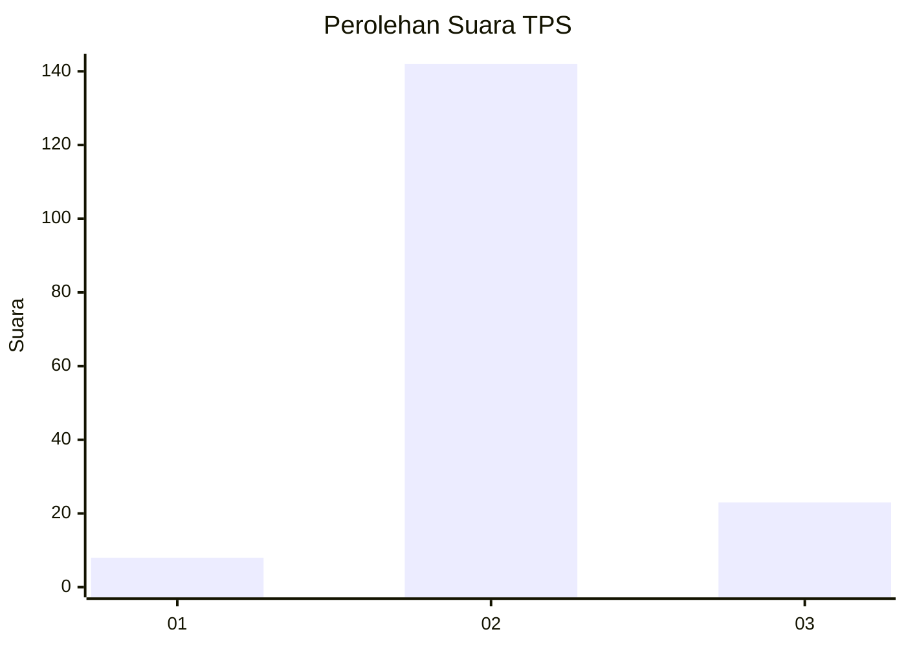
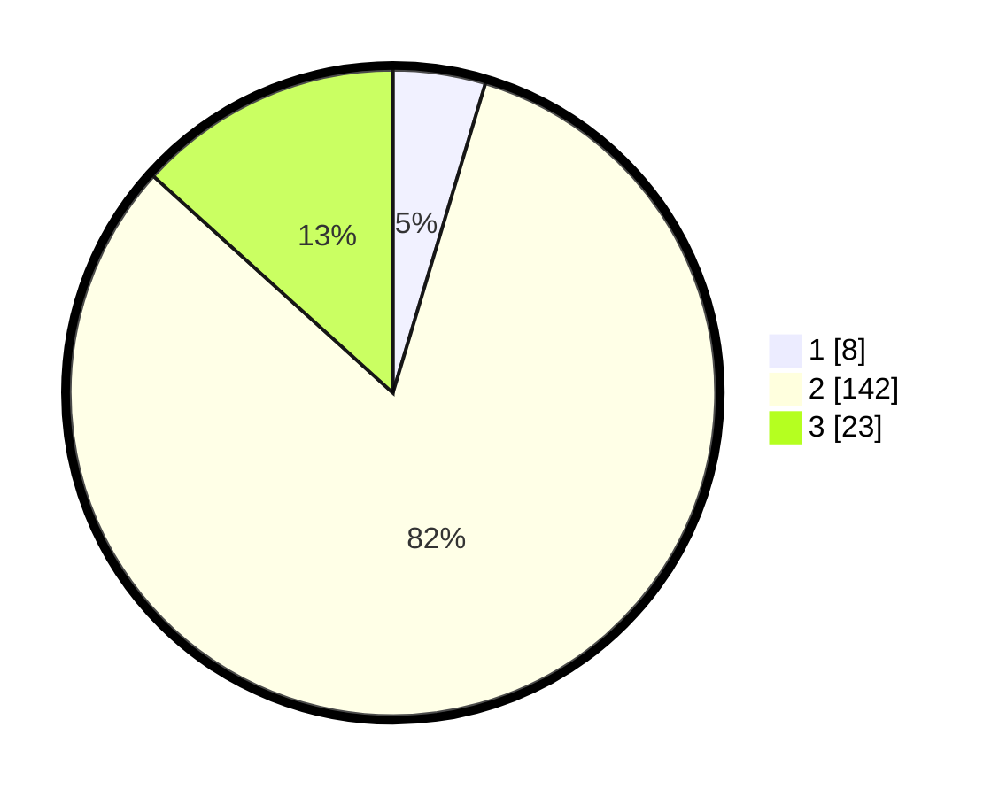

# Hasil

## Grafik

## Tabel

| No. | Nama Paslon    | Suara | Suara (raw) | Persentase |
|:--- |:-------------- | -----:| -----------:| ----------:|
| 1   | ANIES MUHAIMIN | 8     | [8][p-1]    | 4,62       |
| 2   | PRABOWO GIBRAN | 142   | [142][p-2]  | 82,08      |
| 3   | GANJAR MAHFUD  | 23    | [23][p-3]   | 13,29      |

[p-1]: https://github.com/gigit-pemilu/pemilu-2024/blob/main/pilpres/hitung-suara/sub/12-sumatera-utara/sub/02-tapanuli-utara/sub/08-purba-tua/sub/2005-hutanagodang/sub/001-tps/sub/paslon-1.txt
[p-2]: https://github.com/gigit-pemilu/pemilu-2024/blob/main/pilpres/hitung-suara/sub/12-sumatera-utara/sub/02-tapanuli-utara/sub/08-purba-tua/sub/2005-hutanagodang/sub/001-tps/sub/paslon-2.txt
[p-3]: https://github.com/gigit-pemilu/pemilu-2024/blob/main/pilpres/hitung-suara/sub/12-sumatera-utara/sub/02-tapanuli-utara/sub/08-purba-tua/sub/2005-hutanagodang/sub/001-tps/sub/paslon-3.txt

## Foto C Plano

https://sirekap-obj-formc.kpu.go.id/1537/pemilu/ppwp/12/02/08/20/05/1202082005001-20240214-235623--0e2cb08c-4d79-46d4-9955-dc02ca742b2a.jpg

https://sirekap-obj-formc.kpu.go.id/1537/pemilu/ppwp/12/02/08/20/05/1202082005001-20240214-235955--3e811a11-d237-4bb9-8408-1c34956239d5.jpg

https://sirekap-obj-formc.kpu.go.id/1537/pemilu/ppwp/12/02/08/20/05/1202082005001-20240215-000057--7c42c138-7ed4-4e3c-b9a4-6eff172f48fb.jpg

## Metadata

| Key        | Value               |
| ---------- | ------------------- |
| Time Stamp | 2024-02-15 23:29:50 |

