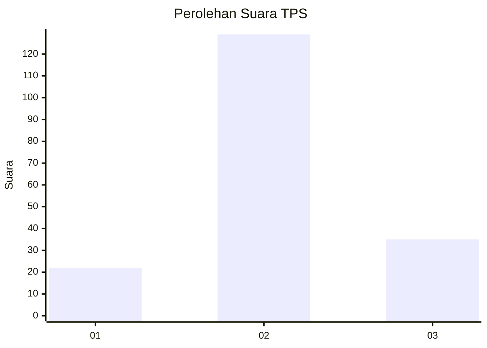
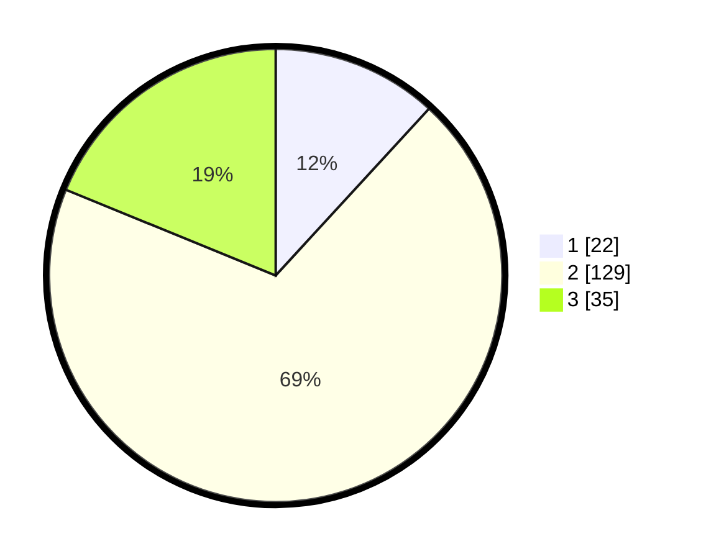

# Hasil

## Grafik

## Tabel

| No. | Nama Paslon    | Suara | Suara (raw) | Persentase |
|:--- |:-------------- | -----:| -----------:| ----------:|
| 1   | ANIES MUHAIMIN | 22    | [22][p-1]   | 11,83      |
| 2   | PRABOWO GIBRAN | 129   | [129][p-2]  | 69,35      |
| 3   | GANJAR MAHFUD  | 35    | [35][p-3]   | 18,82      |

[p-1]: https://github.com/gigit-pemilu/pemilu-2024/blob/main/pilpres/hitung-suara/sub/12-sumatera-utara/sub/02-tapanuli-utara/sub/08-purba-tua/sub/2007-janji-nauli/sub/003-tps/sub/paslon-1.txt
[p-2]: https://github.com/gigit-pemilu/pemilu-2024/blob/main/pilpres/hitung-suara/sub/12-sumatera-utara/sub/02-tapanuli-utara/sub/08-purba-tua/sub/2007-janji-nauli/sub/003-tps/sub/paslon-2.txt
[p-3]: https://github.com/gigit-pemilu/pemilu-2024/blob/main/pilpres/hitung-suara/sub/12-sumatera-utara/sub/02-tapanuli-utara/sub/08-purba-tua/sub/2007-janji-nauli/sub/003-tps/sub/paslon-3.txt

## Foto C Plano

https://sirekap-obj-formc.kpu.go.id/270c/pemilu/ppwp/12/02/08/20/07/1202082007003-20240214-232954--908bbf1a-dbd9-4c5b-93ba-3575b7e1e683.jpg

https://sirekap-obj-formc.kpu.go.id/270c/pemilu/ppwp/12/02/08/20/07/1202082007003-20240214-233411--d2efa1ea-52ef-4927-bc4c-48705c4cadd1.jpg

https://sirekap-obj-formc.kpu.go.id/270c/pemilu/ppwp/12/02/08/20/07/1202082007003-20240215-020839--b56970ec-5218-4d31-9e4e-a5fef2e99318.jpg

## Metadata

| Key        | Value               |
| ---------- | ------------------- |
| Time Stamp | 2024-02-16 00:30:27 |

