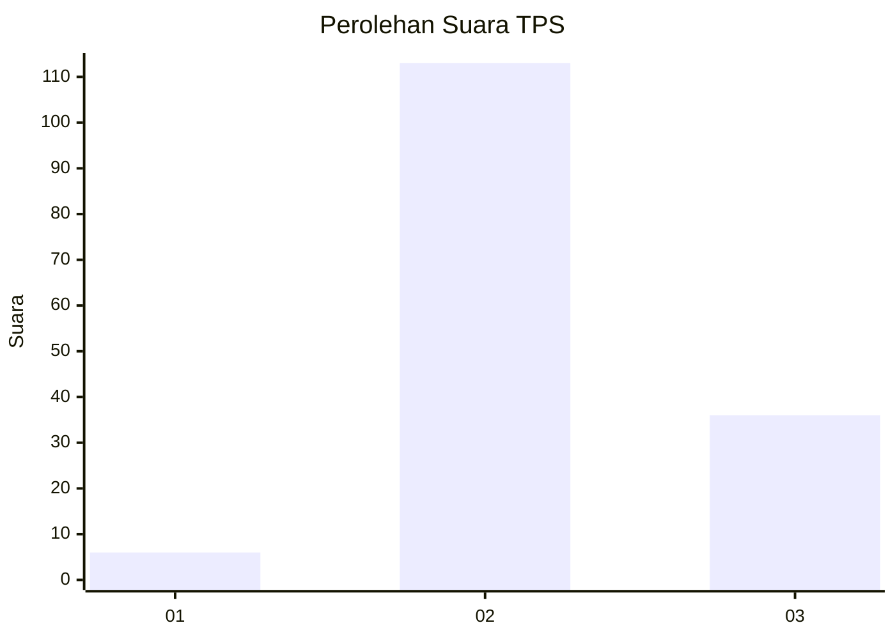
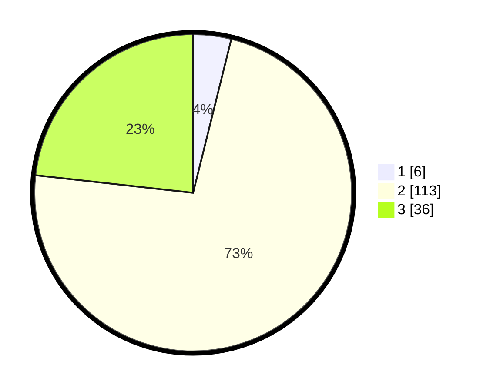

# Hasil

## Grafik

## Tabel

| No. | Nama Paslon    | Suara | Suara (raw) | Persentase |
|:--- |:-------------- | -----:| -----------:| ----------:|
| 1   | ANIES MUHAIMIN | 6     | [6][p-1]    | 3,87       |
| 2   | PRABOWO GIBRAN | 113   | [113][p-2]  | 72,90      |
| 3   | GANJAR MAHFUD  | 36    | [36][p-3]   | 23,23      |

[p-1]: https://github.com/gigit-pemilu/pemilu-2024/blob/main/pilpres/hitung-suara/sub/12-sumatera-utara/sub/02-tapanuli-utara/sub/08-purba-tua/sub/2011-parsaoran-j-angkola/sub/001-tps/sub/paslon-1.txt
[p-2]: https://github.com/gigit-pemilu/pemilu-2024/blob/main/pilpres/hitung-suara/sub/12-sumatera-utara/sub/02-tapanuli-utara/sub/08-purba-tua/sub/2011-parsaoran-j-angkola/sub/001-tps/sub/paslon-2.txt
[p-3]: https://github.com/gigit-pemilu/pemilu-2024/blob/main/pilpres/hitung-suara/sub/12-sumatera-utara/sub/02-tapanuli-utara/sub/08-purba-tua/sub/2011-parsaoran-j-angkola/sub/001-tps/sub/paslon-3.txt

## Foto C Plano

https://sirekap-obj-formc.kpu.go.id/f30a/pemilu/ppwp/12/02/08/20/11/1202082011001-20240214-210337--b3df4b9b-2fbe-46ef-a2f5-1fd29319f158.jpg

https://sirekap-obj-formc.kpu.go.id/f30a/pemilu/ppwp/12/02/08/20/11/1202082011001-20240214-231500--9f3cca13-2967-4f97-ad6c-032622601b09.jpg

https://sirekap-obj-formc.kpu.go.id/f30a/pemilu/ppwp/12/02/08/20/11/1202082011001-20240214-210425--c0558e8e-226c-4e3f-ae01-a9e9614a12ca.jpg

## Metadata

| Key        | Value               |
| ---------- | ------------------- |
| Time Stamp | 2024-02-15 23:29:50 |

