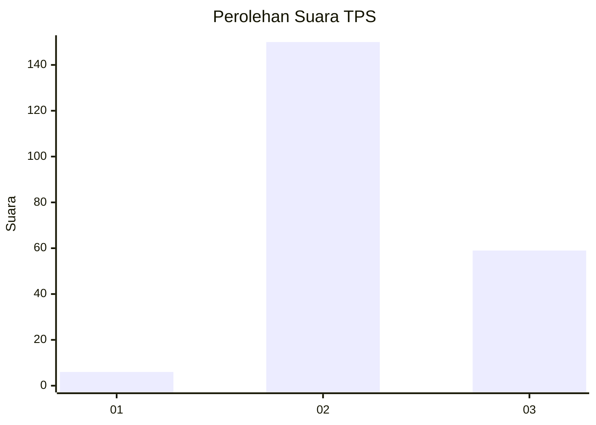
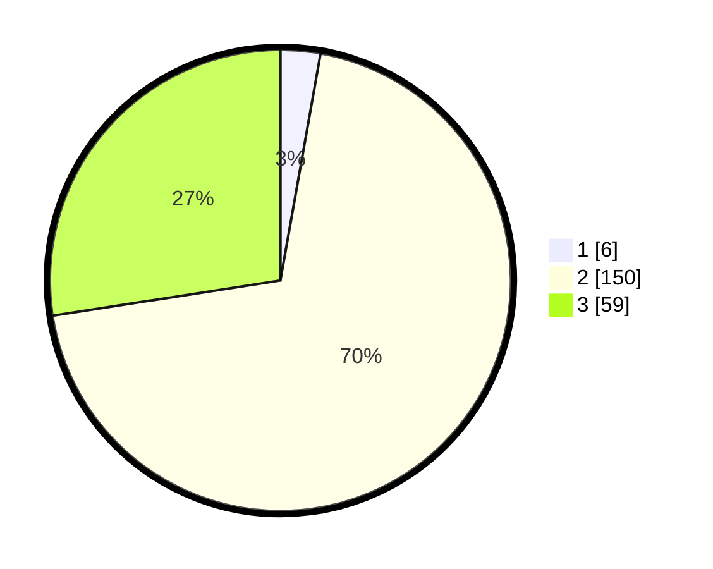

# Hasil

## Grafik

## Tabel

| No. | Nama Paslon    | Suara | Suara (raw) | Persentase |
|:--- |:-------------- | -----:| -----------:| ----------:|
| 1   | ANIES MUHAIMIN | 6     | [6][p-1]    | 2,79       |
| 2   | PRABOWO GIBRAN | 150   | [150][p-2]  | 69,77      |
| 3   | GANJAR MAHFUD  | 59    | [59][p-3]   | 27,44      |

[p-1]: https://github.com/gigit-pemilu/pemilu-2024-12-sumatera-utara/blob/main/pilpres/hitung-suara/sub/12-sumatera-utara/sub/02-tapanuli-utara/sub/09-siborong-borong/sub/1001-psr-siborong-borong/sub/002-tps/sub/paslon-1.txt
[p-2]: https://github.com/gigit-pemilu/pemilu-2024-12-sumatera-utara/blob/main/pilpres/hitung-suara/sub/12-sumatera-utara/sub/02-tapanuli-utara/sub/09-siborong-borong/sub/1001-psr-siborong-borong/sub/002-tps/sub/paslon-2.txt
[p-3]: https://github.com/gigit-pemilu/pemilu-2024-12-sumatera-utara/blob/main/pilpres/hitung-suara/sub/12-sumatera-utara/sub/02-tapanuli-utara/sub/09-siborong-borong/sub/1001-psr-siborong-borong/sub/002-tps/sub/paslon-3.txt

## Foto C Plano

https://sirekap-obj-formc.kpu.go.id/00a2/pemilu/ppwp/12/02/09/10/01/1202091001002-20240217-144232--baa04708-4eff-43fb-b9ca-1c896a42cbc7.jpg

https://sirekap-obj-formc.kpu.go.id/00a2/pemilu/ppwp/12/02/09/10/01/1202091001002-20240217-144325--afc5baab-0bdd-48d0-bd21-80c8d85edda5.jpg

https://sirekap-obj-formc.kpu.go.id/00a2/pemilu/ppwp/12/02/09/10/01/1202091001002-20240217-144419--cec4544a-2eb2-49f1-9449-bec47214963a.jpg

## Metadata

| Key        | Value               |
| ---------- | ------------------- |
| Time Stamp | 2024-02-24 22:31:28 |

