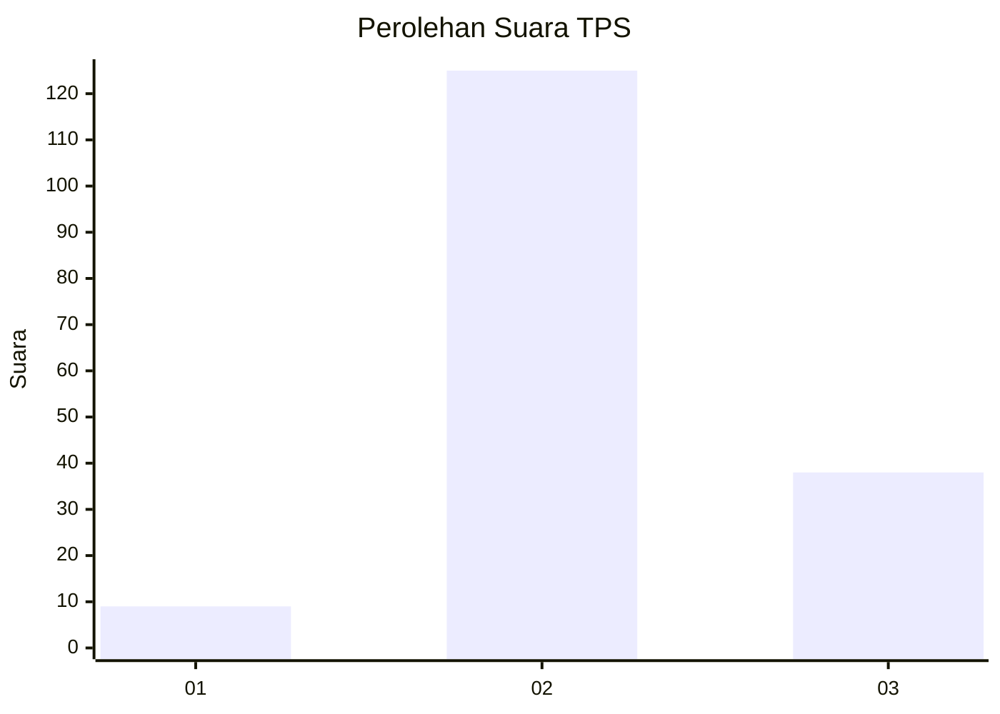

# Hasil

## Grafik

## Tabel

| No. | Nama Paslon    | Suara | Suara (raw) | Persentase |
|:--- |:-------------- | -----:| -----------:| ----------:|
| 1   | ANIES MUHAIMIN | 9     | [9][p-1]    | 5,23       |
| 2   | PRABOWO GIBRAN | 125   | [125][p-2]  | 72,67      |
| 3   | GANJAR MAHFUD  | 38    | [38][p-3]   | 22,09      |

[p-1]: https://github.com/gigit-pemilu/pemilu-2024/blob/main/pilpres/hitung-suara/sub/12-sumatera-utara/sub/02-tapanuli-utara/sub/09-siborong-borong/sub/1001-psr-siborong-borong/sub/005-tps/sub/paslon-1.txt
[p-2]: https://github.com/gigit-pemilu/pemilu-2024/blob/main/pilpres/hitung-suara/sub/12-sumatera-utara/sub/02-tapanuli-utara/sub/09-siborong-borong/sub/1001-psr-siborong-borong/sub/005-tps/sub/paslon-2.txt
[p-3]: https://github.com/gigit-pemilu/pemilu-2024/blob/main/pilpres/hitung-suara/sub/12-sumatera-utara/sub/02-tapanuli-utara/sub/09-siborong-borong/sub/1001-psr-siborong-borong/sub/005-tps/sub/paslon-3.txt

## Foto C Plano

https://sirekap-obj-formc.kpu.go.id/c5a9/pemilu/ppwp/12/02/09/10/01/1202091001005-20240214-215414--27289a9b-50a4-4300-aed3-c84499560a9f.jpg

https://sirekap-obj-formc.kpu.go.id/c5a9/pemilu/ppwp/12/02/09/10/01/1202091001005-20240214-214556--d46b2454-b330-4a61-9226-a57a87718837.jpg

https://sirekap-obj-formc.kpu.go.id/c5a9/pemilu/ppwp/12/02/09/10/01/1202091001005-20240214-215500--183bdf9e-da03-4a73-92f5-0eafcc6565bc.jpg

## Metadata

| Key        | Value               |
| ---------- | ------------------- |
| Time Stamp | 2024-02-16 01:30:27 |

