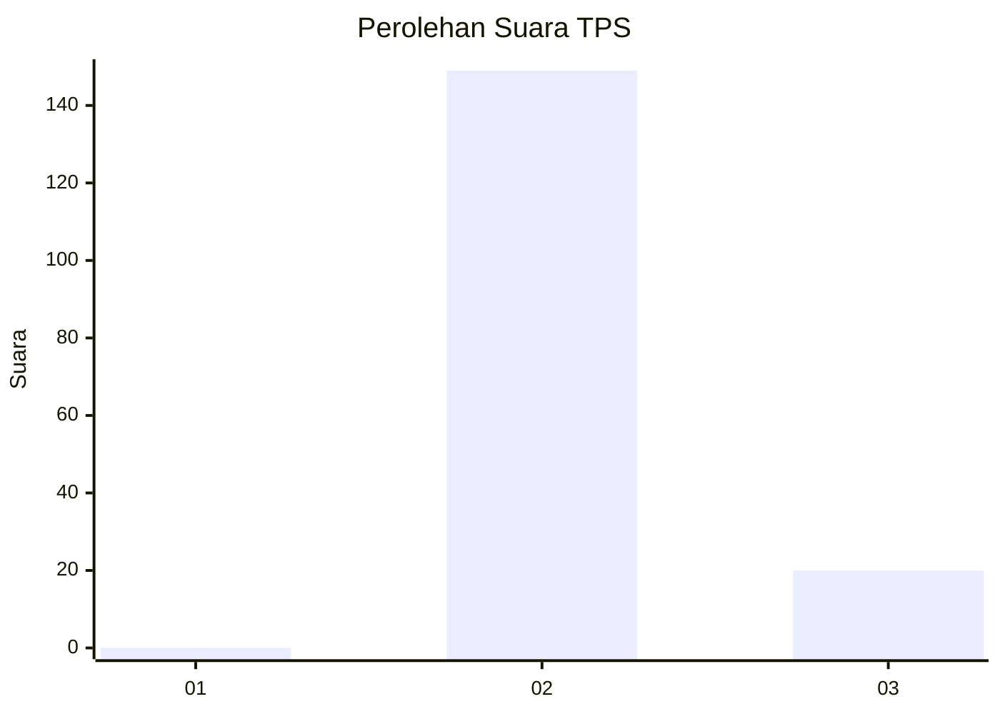
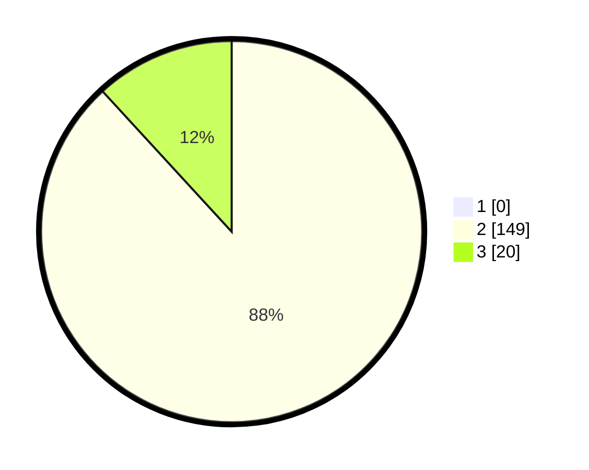

# Hasil

## Grafik

## Tabel

| No. | Nama Paslon    | Suara | Suara (raw) | Persentase |
|:--- |:-------------- | -----:| -----------:| ----------:|
| 1   | ANIES MUHAIMIN | 0     | [0][p-1]    | 0,00       |
| 2   | PRABOWO GIBRAN | 149   | [149][p-2]  | 88,17      |
| 3   | GANJAR MAHFUD  | 20    | [20][p-3]   | 11,83      |

[p-1]: https://github.com/gigit-pemilu/pemilu-2024-12-sumatera-utara/blob/main/pilpres/hitung-suara/sub/12-sumatera-utara/sub/02-tapanuli-utara/sub/11-parmonangan/sub/2003-manalu-dolok/sub/001-tps/sub/paslon-1.txt
[p-2]: https://github.com/gigit-pemilu/pemilu-2024-12-sumatera-utara/blob/main/pilpres/hitung-suara/sub/12-sumatera-utara/sub/02-tapanuli-utara/sub/11-parmonangan/sub/2003-manalu-dolok/sub/001-tps/sub/paslon-2.txt
[p-3]: https://github.com/gigit-pemilu/pemilu-2024-12-sumatera-utara/blob/main/pilpres/hitung-suara/sub/12-sumatera-utara/sub/02-tapanuli-utara/sub/11-parmonangan/sub/2003-manalu-dolok/sub/001-tps/sub/paslon-3.txt

## Foto C Plano

https://sirekap-obj-formc.kpu.go.id/f7ee/pemilu/ppwp/12/02/11/20/03/1202112003001-20240214-213813--8d34c7fe-1199-44d3-8986-8b5e41e70454.jpg

https://sirekap-obj-formc.kpu.go.id/f7ee/pemilu/ppwp/12/02/11/20/03/1202112003001-20240215-090330--27fcb5b9-514a-45f9-b756-4d54653a9013.jpg

https://sirekap-obj-formc.kpu.go.id/f7ee/pemilu/ppwp/12/02/11/20/03/1202112003001-20240214-214252--87262a78-7b3d-4a7a-bbbc-ad4a1597ae05.jpg

## Metadata

| Key        | Value               |
| ---------- | ------------------- |
| Time Stamp | 2024-02-15 23:29:50 |

