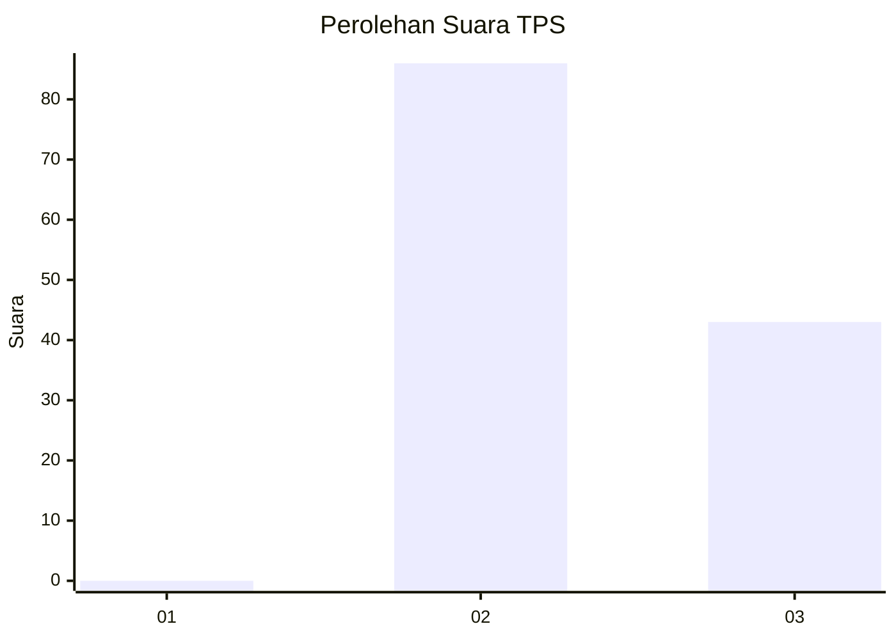
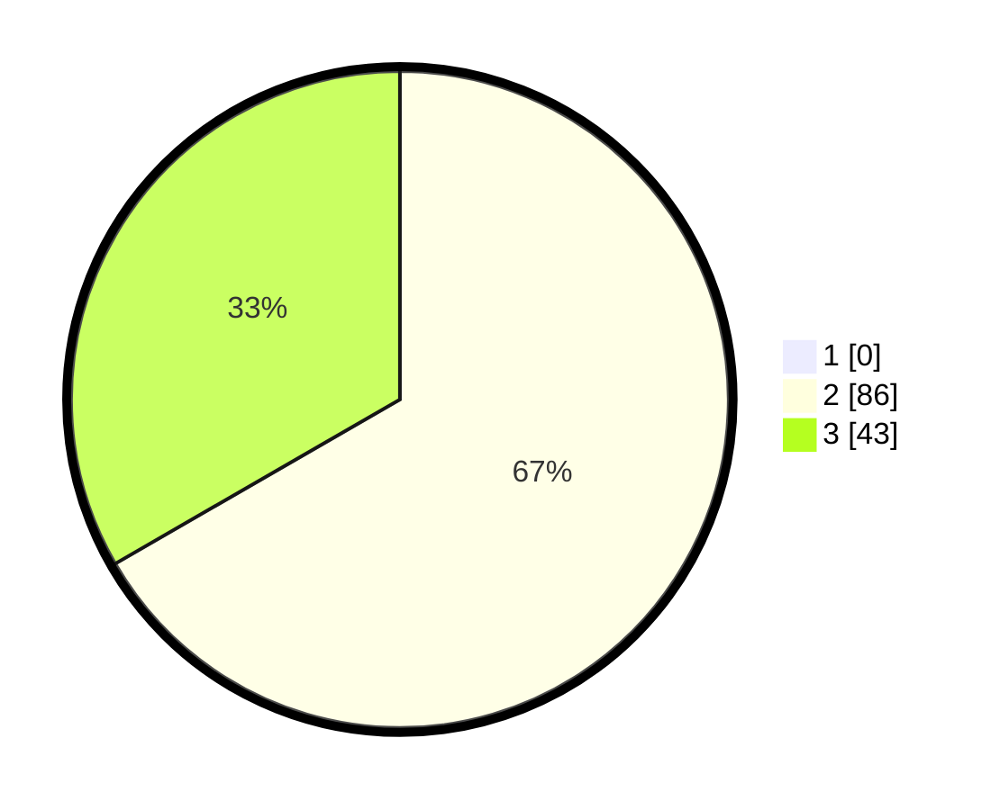

# Hasil

## Grafik

## Tabel

| No. | Nama Paslon    | Suara | Suara (raw) | Persentase |
|:--- |:-------------- | -----:| -----------:| ----------:|
| 1   | ANIES MUHAIMIN | 0     | [0][p-1]    | 0,00       |
| 2   | PRABOWO GIBRAN | 86    | [86][p-2]   | 66,67      |
| 3   | GANJAR MAHFUD  | 43    | [43][p-3]   | 33,33      |

[p-1]: https://github.com/gigit-pemilu/pemilu-2024-12-sumatera-utara/blob/main/pilpres/hitung-suara/sub/12-sumatera-utara/sub/02-tapanuli-utara/sub/11-parmonangan/sub/2003-manalu-dolok/sub/003-tps/sub/paslon-1.txt
[p-2]: https://github.com/gigit-pemilu/pemilu-2024-12-sumatera-utara/blob/main/pilpres/hitung-suara/sub/12-sumatera-utara/sub/02-tapanuli-utara/sub/11-parmonangan/sub/2003-manalu-dolok/sub/003-tps/sub/paslon-2.txt
[p-3]: https://github.com/gigit-pemilu/pemilu-2024-12-sumatera-utara/blob/main/pilpres/hitung-suara/sub/12-sumatera-utara/sub/02-tapanuli-utara/sub/11-parmonangan/sub/2003-manalu-dolok/sub/003-tps/sub/paslon-3.txt

## Foto C Plano

https://sirekap-obj-formc.kpu.go.id/a7c8/pemilu/ppwp/12/02/11/20/03/1202112003003-20240214-212155--9b23461c-4538-4194-8255-63f5b0a79221.jpg

https://sirekap-obj-formc.kpu.go.id/a7c8/pemilu/ppwp/12/02/11/20/03/1202112003003-20240214-212437--89b78028-a263-4c9f-a4a0-65d9397e9fd7.jpg

https://sirekap-obj-formc.kpu.go.id/a7c8/pemilu/ppwp/12/02/11/20/03/1202112003003-20240214-212921--c79be5d0-be2a-479b-9e9b-7b27db433b72.jpg

## Metadata

| Key        | Value               |
| ---------- | ------------------- |
| Time Stamp | 2024-02-15 23:29:50 |

