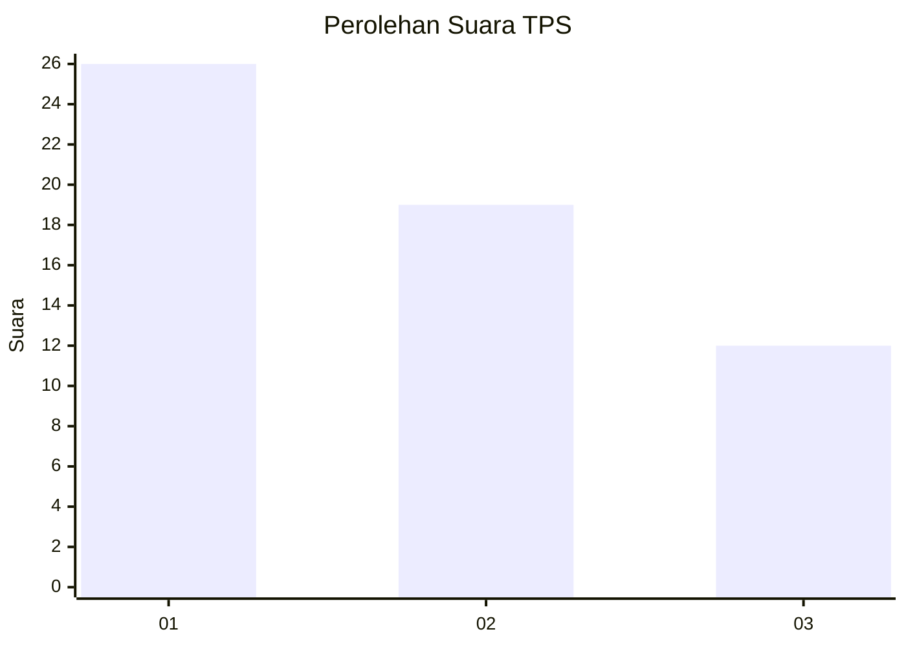
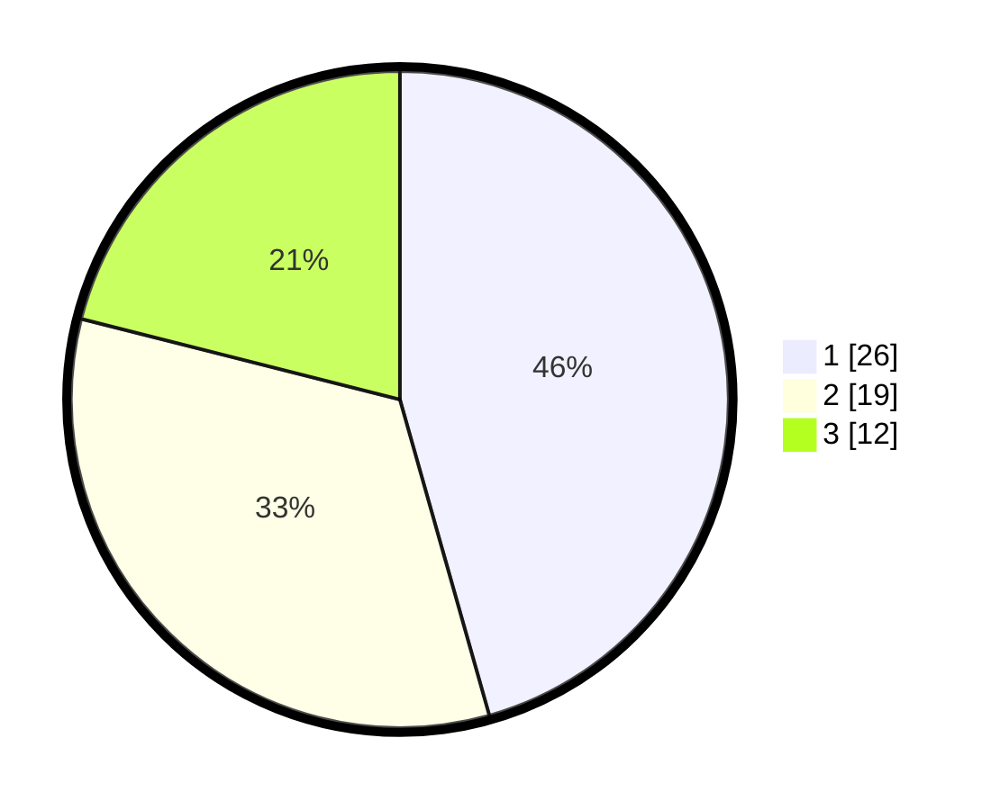

# Hasil

## Grafik

## Tabel

| No. | Nama Paslon    | Suara | Suara (raw) | Persentase |
|:--- |:-------------- | -----:| -----------:| ----------:|
| 1   | ANIES MUHAIMIN | 26    | [26][p-1]   | 45,61      |
| 2   | PRABOWO GIBRAN | 19    | [19][p-2]   | 33,33      |
| 3   | GANJAR MAHFUD  | 12    | [12][p-3]   | 21,05      |

[p-1]: https://github.com/gigit-pemilu/pemilu-2024/blob/main/pilpres/hitung-suara/sub/12-sumatera-utara/sub/02-tapanuli-utara/sub/11-parmonangan/sub/2011-hutajulu-parbalik/sub/001-tps/sub/paslon-1.txt
[p-2]: https://github.com/gigit-pemilu/pemilu-2024/blob/main/pilpres/hitung-suara/sub/12-sumatera-utara/sub/02-tapanuli-utara/sub/11-parmonangan/sub/2011-hutajulu-parbalik/sub/001-tps/sub/paslon-2.txt
[p-3]: https://github.com/gigit-pemilu/pemilu-2024/blob/main/pilpres/hitung-suara/sub/12-sumatera-utara/sub/02-tapanuli-utara/sub/11-parmonangan/sub/2011-hutajulu-parbalik/sub/001-tps/sub/paslon-3.txt

## Foto C Plano

https://sirekap-obj-formc.kpu.go.id/5388/pemilu/ppwp/12/02/11/20/11/1202112011001-20240222-123016--c9f59b31-f1a9-46d4-baae-a94fd66feca1.jpg

https://sirekap-obj-formc.kpu.go.id/5388/pemilu/ppwp/12/02/11/20/11/1202112011001-20240222-123343--2d459fbc-d501-45d3-b4cf-171fb4047afd.jpg

## Metadata

| Key        | Value               |
| ---------- | ------------------- |
| Time Stamp | 2024-02-24 22:31:28 |

