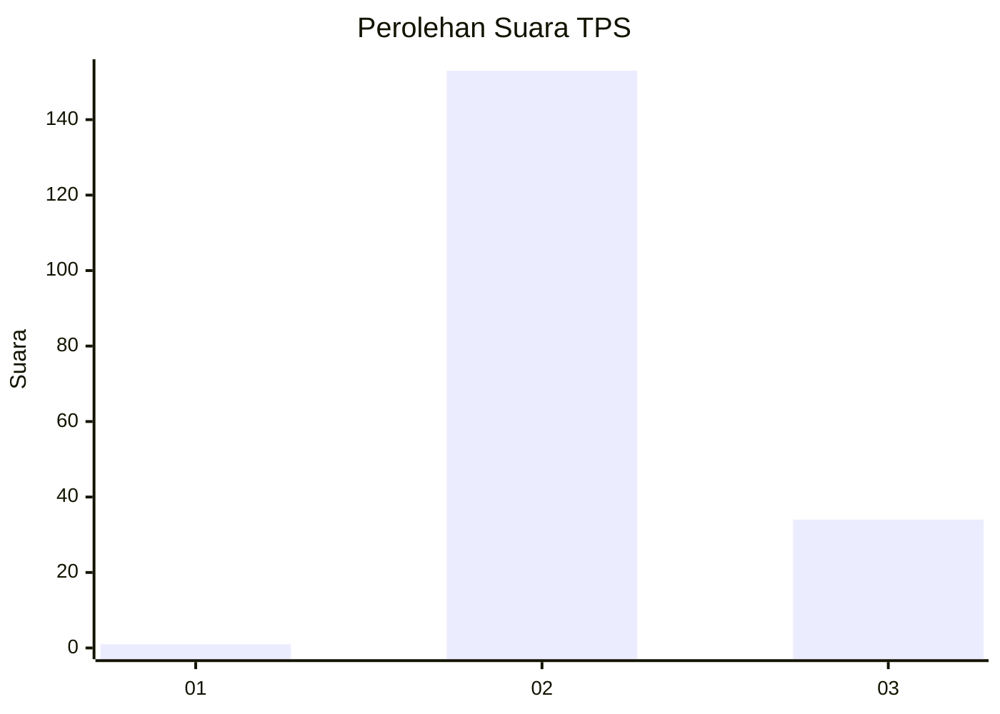
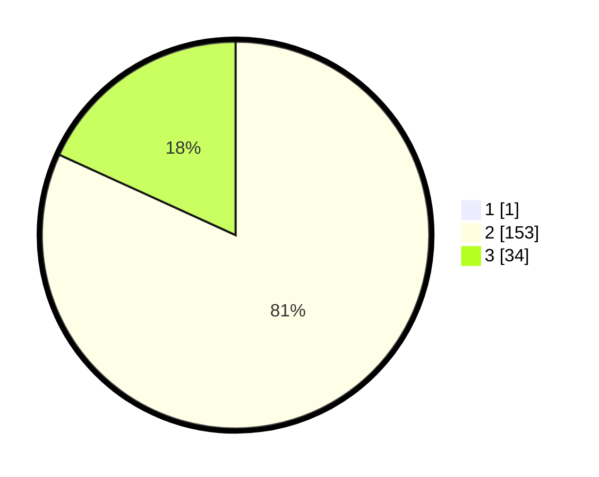

# Hasil

## Grafik

## Tabel

| No. | Nama Paslon    | Suara | Suara (raw) | Persentase |
|:--- |:-------------- | -----:| -----------:| ----------:|
| 1   | ANIES MUHAIMIN | 1     | [1][p-1]    | 0,53       |
| 2   | PRABOWO GIBRAN | 153   | [153][p-2]  | 81,38      |
| 3   | GANJAR MAHFUD  | 34    | [34][p-3]   | 18,09      |

[p-1]: https://github.com/gigit-pemilu/pemilu-2024-12-sumatera-utara/blob/main/pilpres/hitung-suara/sub/12-sumatera-utara/sub/02-tapanuli-utara/sub/12-sipahutar/sub/2001-sabungannihuta-iv/sub/001-tps/sub/paslon-1.txt
[p-2]: https://github.com/gigit-pemilu/pemilu-2024-12-sumatera-utara/blob/main/pilpres/hitung-suara/sub/12-sumatera-utara/sub/02-tapanuli-utara/sub/12-sipahutar/sub/2001-sabungannihuta-iv/sub/001-tps/sub/paslon-2.txt
[p-3]: https://github.com/gigit-pemilu/pemilu-2024-12-sumatera-utara/blob/main/pilpres/hitung-suara/sub/12-sumatera-utara/sub/02-tapanuli-utara/sub/12-sipahutar/sub/2001-sabungannihuta-iv/sub/001-tps/sub/paslon-3.txt

## Foto C Plano

https://sirekap-obj-formc.kpu.go.id/2ddf/pemilu/ppwp/12/02/12/20/01/1202122001001-20240222-152339--f32d513c-fa77-4ab1-ad12-96b5190ccb4f.jpg

https://sirekap-obj-formc.kpu.go.id/2ddf/pemilu/ppwp/12/02/12/20/01/1202122001001-20240222-152400--8983582e-833c-4275-b26b-0a5e748f3b14.jpg

https://sirekap-obj-formc.kpu.go.id/2ddf/pemilu/ppwp/12/02/12/20/01/1202122001001-20240222-152424--7ccff5f3-d892-42c4-b7cb-625c7fcfd2bb.jpg

## Metadata

| Key        | Value               |
| ---------- | ------------------- |
| Time Stamp | 2024-02-25 13:00:00 |

