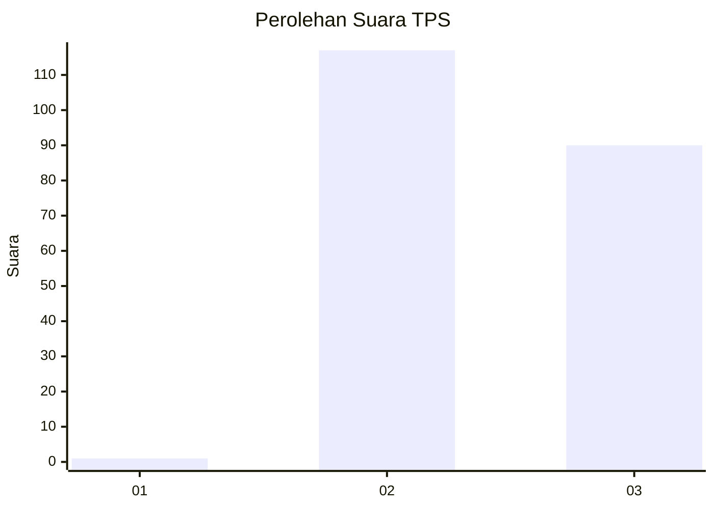
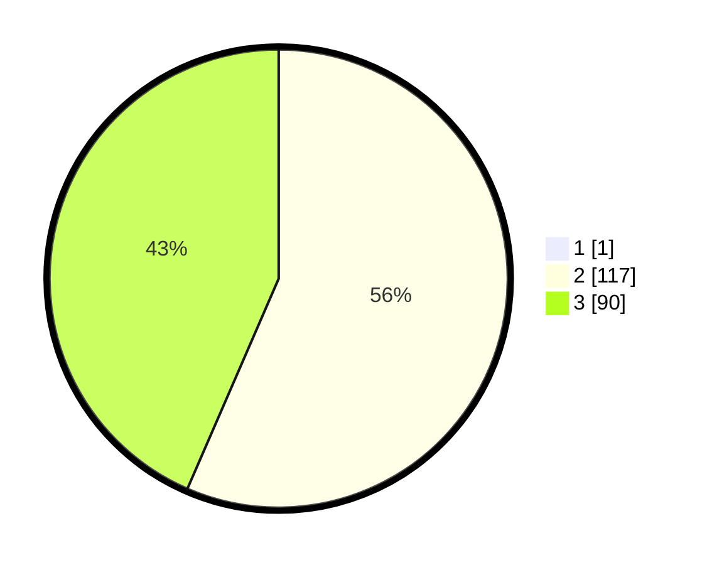

# Hasil

## Grafik

## Tabel

| No. | Nama Paslon    | Suara | Suara (raw) | Persentase |
|:--- |:-------------- | -----:| -----------:| ----------:|
| 1   | ANIES MUHAIMIN | 1     | [1][p-1]    | 0,48       |
| 2   | PRABOWO GIBRAN | 117   | [117][p-2]  | 56,25      |
| 3   | GANJAR MAHFUD  | 90    | [90][p-3]   | 43,27      |

[p-1]: https://github.com/gigit-pemilu/pemilu-2024-12-sumatera-utara/blob/main/pilpres/hitung-suara/sub/12-sumatera-utara/sub/02-tapanuli-utara/sub/12-sipahutar/sub/2001-sabungannihuta-iv/sub/002-tps/sub/paslon-1.txt
[p-2]: https://github.com/gigit-pemilu/pemilu-2024-12-sumatera-utara/blob/main/pilpres/hitung-suara/sub/12-sumatera-utara/sub/02-tapanuli-utara/sub/12-sipahutar/sub/2001-sabungannihuta-iv/sub/002-tps/sub/paslon-2.txt
[p-3]: https://github.com/gigit-pemilu/pemilu-2024-12-sumatera-utara/blob/main/pilpres/hitung-suara/sub/12-sumatera-utara/sub/02-tapanuli-utara/sub/12-sipahutar/sub/2001-sabungannihuta-iv/sub/002-tps/sub/paslon-3.txt

## Foto C Plano

https://sirekap-obj-formc.kpu.go.id/33c4/pemilu/ppwp/12/02/12/20/01/1202122001002-20240222-160817--4f97d1f3-3896-4e8c-bb0e-76c307f154f9.jpg

https://sirekap-obj-formc.kpu.go.id/33c4/pemilu/ppwp/12/02/12/20/01/1202122001002-20240222-160848--597249eb-94a9-4a77-865a-ffbbfaa6fea6.jpg

https://sirekap-obj-formc.kpu.go.id/33c4/pemilu/ppwp/12/02/12/20/01/1202122001002-20240222-160924--2c1b9cf9-bdb7-433f-915a-0376b3e0ff79.jpg

## Metadata

| Key        | Value               |
| ---------- | ------------------- |
| Time Stamp | 2024-02-24 22:31:28 |

