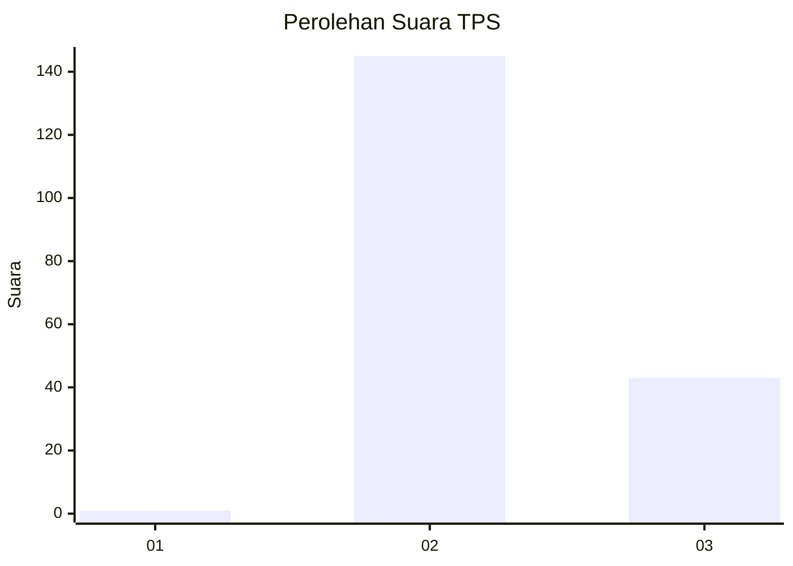
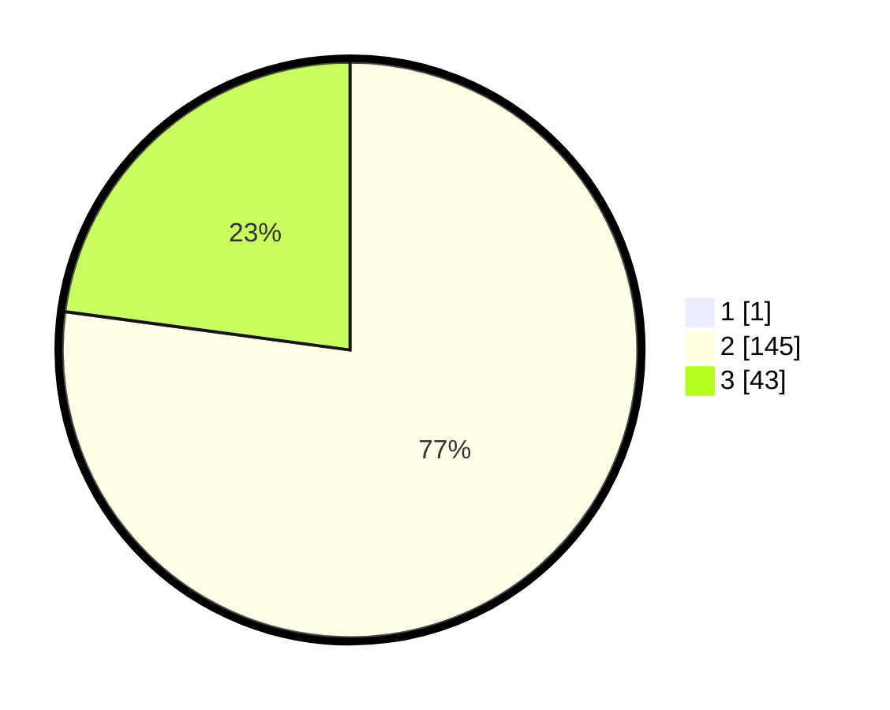

# Hasil

## Grafik

## Tabel

| No. | Nama Paslon    | Suara | Suara (raw) | Persentase |
|:--- |:-------------- | -----:| -----------:| ----------:|
| 1   | ANIES MUHAIMIN | 1     | [1][p-1]    | 0,53       |
| 2   | PRABOWO GIBRAN | 145   | [145][p-2]  | 76,72      |
| 3   | GANJAR MAHFUD  | 43    | [43][p-3]   | 22,75      |

[p-1]: https://github.com/gigit-pemilu/pemilu-2024-12-sumatera-utara/blob/main/pilpres/hitung-suara/sub/12-sumatera-utara/sub/02-tapanuli-utara/sub/12-sipahutar/sub/2001-sabungannihuta-iv/sub/003-tps/sub/paslon-1.txt
[p-2]: https://github.com/gigit-pemilu/pemilu-2024-12-sumatera-utara/blob/main/pilpres/hitung-suara/sub/12-sumatera-utara/sub/02-tapanuli-utara/sub/12-sipahutar/sub/2001-sabungannihuta-iv/sub/003-tps/sub/paslon-2.txt
[p-3]: https://github.com/gigit-pemilu/pemilu-2024-12-sumatera-utara/blob/main/pilpres/hitung-suara/sub/12-sumatera-utara/sub/02-tapanuli-utara/sub/12-sipahutar/sub/2001-sabungannihuta-iv/sub/003-tps/sub/paslon-3.txt

## Foto C Plano

https://sirekap-obj-formc.kpu.go.id/e045/pemilu/ppwp/12/02/12/20/01/1202122001003-20240222-163622--72144801-f54f-4d5b-8b98-08fc66db3edf.jpg

https://sirekap-obj-formc.kpu.go.id/e045/pemilu/ppwp/12/02/12/20/01/1202122001003-20240222-163652--d6bc382a-e2dc-42af-a7ef-64dae1fa1148.jpg

https://sirekap-obj-formc.kpu.go.id/e045/pemilu/ppwp/12/02/12/20/01/1202122001003-20240222-163734--263f0872-625f-4d74-9656-0ced471c9fbf.jpg

## Metadata

| Key        | Value               |
| ---------- | ------------------- |
| Time Stamp | 2024-02-25 12:00:00 |

