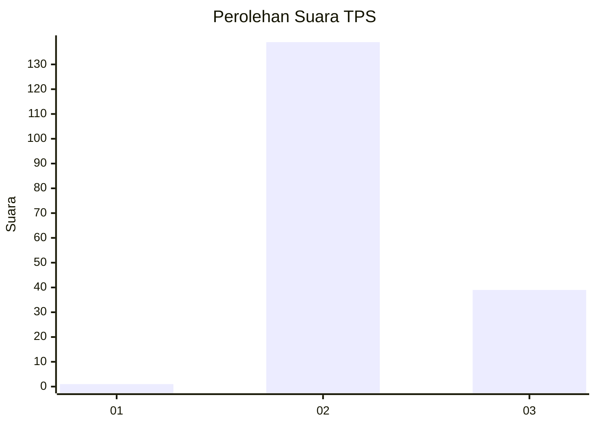
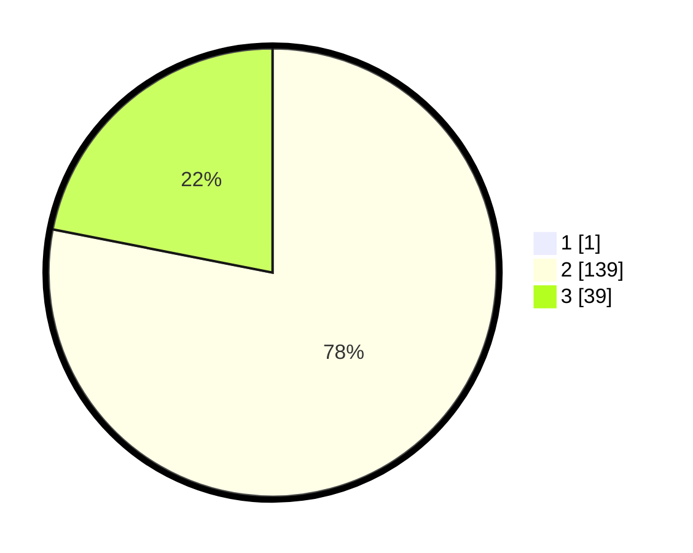

# Hasil

## Grafik

## Tabel

| No. | Nama Paslon    | Suara | Suara (raw) | Persentase |
|:--- |:-------------- | -----:| -----------:| ----------:|
| 1   | ANIES MUHAIMIN | 1     | [1][p-1]    | 0,56       |
| 2   | PRABOWO GIBRAN | 139   | [139][p-2]  | 77,65      |
| 3   | GANJAR MAHFUD  | 39    | [39][p-3]   | 21,79      |

[p-1]: https://github.com/gigit-pemilu/pemilu-2024/blob/main/pilpres/hitung-suara/sub/12-sumatera-utara/sub/02-tapanuli-utara/sub/12-sipahutar/sub/2006-onan-runggu-i/sub/002-tps/sub/paslon-1.txt
[p-2]: https://github.com/gigit-pemilu/pemilu-2024/blob/main/pilpres/hitung-suara/sub/12-sumatera-utara/sub/02-tapanuli-utara/sub/12-sipahutar/sub/2006-onan-runggu-i/sub/002-tps/sub/paslon-2.txt
[p-3]: https://github.com/gigit-pemilu/pemilu-2024/blob/main/pilpres/hitung-suara/sub/12-sumatera-utara/sub/02-tapanuli-utara/sub/12-sipahutar/sub/2006-onan-runggu-i/sub/002-tps/sub/paslon-3.txt

## Foto C Plano

https://sirekap-obj-formc.kpu.go.id/e7c8/pemilu/ppwp/12/02/12/20/06/1202122006002-20240219-095905--8e7937f3-3359-4c75-8f16-2d3084ba0d1b.jpg

https://sirekap-obj-formc.kpu.go.id/e7c8/pemilu/ppwp/12/02/12/20/06/1202122006002-20240219-095943--e8a434ee-9af8-4626-aa2c-bdcc4ba39a60.jpg

https://sirekap-obj-formc.kpu.go.id/e7c8/pemilu/ppwp/12/02/12/20/06/1202122006002-20240219-100034--8635e4b7-b847-4cc8-9c9a-562a63838e5a.jpg

## Metadata

| Key        | Value               |
| ---------- | ------------------- |
| Time Stamp | 2024-02-25 15:00:00 |

