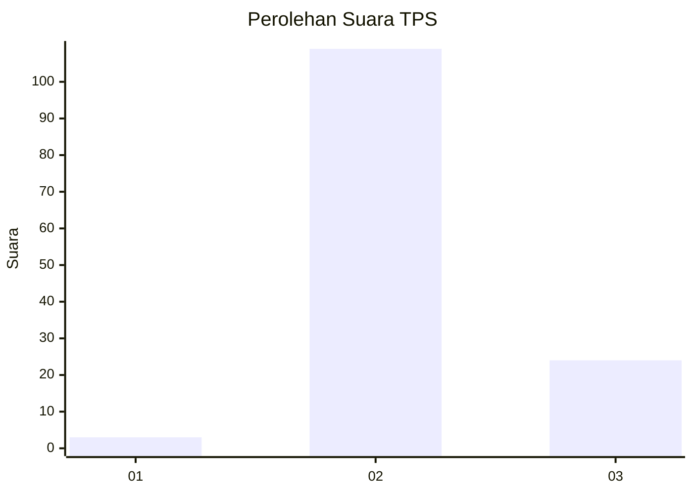

# Hasil

## Grafik

## Tabel

| No. | Nama Paslon    | Suara | Suara (raw) | Persentase |
|:--- |:-------------- | -----:| -----------:| ----------:|
| 1   | ANIES MUHAIMIN | 3     | [3][p-1]    | 2,21       |
| 2   | PRABOWO GIBRAN | 109   | [109][p-2]  | 80,15      |
| 3   | GANJAR MAHFUD  | 24    | [24][p-3]   | 17,65      |

[p-1]: https://github.com/gigit-pemilu/pemilu-2024/blob/main/pilpres/hitung-suara/sub/12-sumatera-utara/sub/02-tapanuli-utara/sub/12-sipahutar/sub/2007-tapian-nauli-iii/sub/001-tps/sub/paslon-1.txt
[p-2]: https://github.com/gigit-pemilu/pemilu-2024/blob/main/pilpres/hitung-suara/sub/12-sumatera-utara/sub/02-tapanuli-utara/sub/12-sipahutar/sub/2007-tapian-nauli-iii/sub/001-tps/sub/paslon-2.txt
[p-3]: https://github.com/gigit-pemilu/pemilu-2024/blob/main/pilpres/hitung-suara/sub/12-sumatera-utara/sub/02-tapanuli-utara/sub/12-sipahutar/sub/2007-tapian-nauli-iii/sub/001-tps/sub/paslon-3.txt

## Foto C Plano

https://sirekap-obj-formc.kpu.go.id/d0a4/pemilu/ppwp/12/02/12/20/07/1202122007001-20240222-093316--a126aeac-bb76-4715-91d9-c0f758667073.jpg

https://sirekap-obj-formc.kpu.go.id/d0a4/pemilu/ppwp/12/02/12/20/07/1202122007001-20240222-093430--00472599-b359-493d-ac0b-a2fdce18d999.jpg

https://sirekap-obj-formc.kpu.go.id/d0a4/pemilu/ppwp/12/02/12/20/07/1202122007001-20240222-093509--ceff6cfb-c0f3-48af-ad12-75af5d1767df.jpg

## Metadata

| Key        | Value               |
| ---------- | ------------------- |
| Time Stamp | 2024-02-25 20:00:00 |

