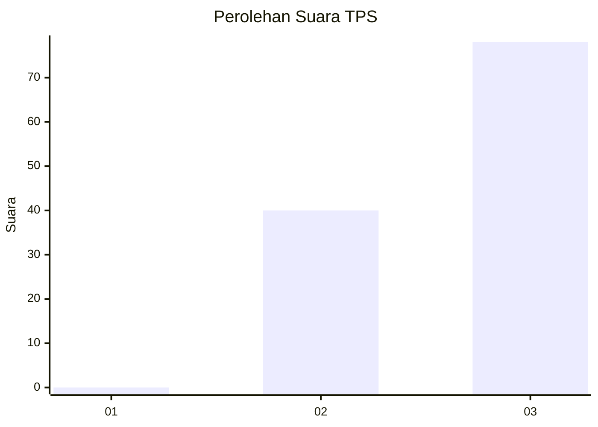
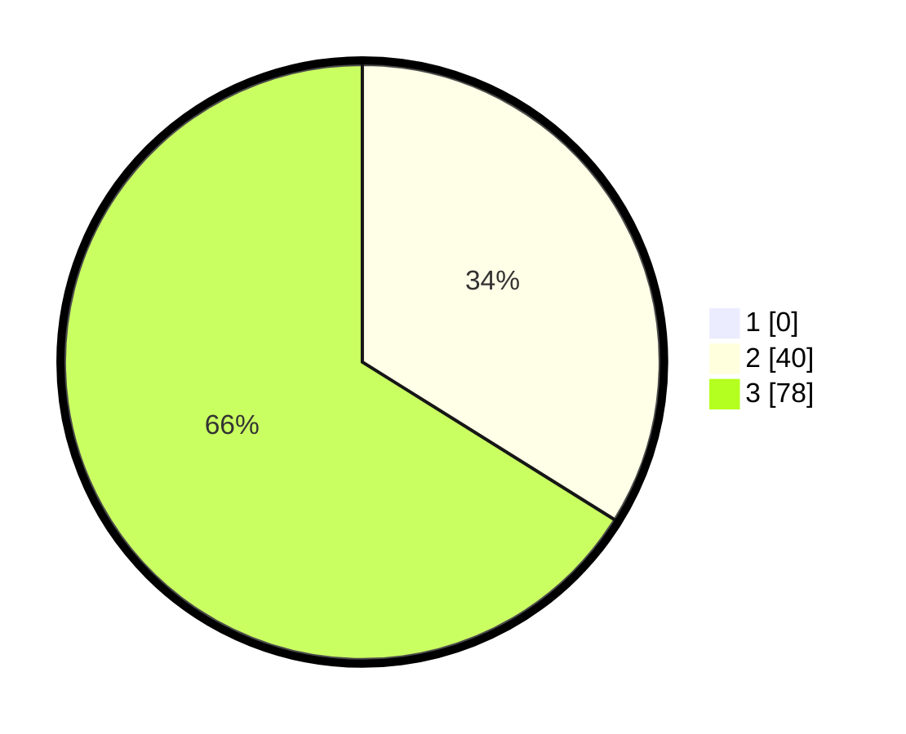

# Hasil

## Grafik

## Tabel

| No. | Nama Paslon    | Suara | Suara (raw) | Persentase |
|:--- |:-------------- | -----:| -----------:| ----------:|
| 1   | ANIES MUHAIMIN | 0     | [0][p-1]    | 0,00       |
| 2   | PRABOWO GIBRAN | 40    | [40][p-2]   | 33,90      |
| 3   | GANJAR MAHFUD  | 78    | [78][p-3]   | 66,10      |

[p-1]: https://github.com/gigit-pemilu/pemilu-2024/blob/main/pilpres/hitung-suara/sub/12-sumatera-utara/sub/02-tapanuli-utara/sub/12-sipahutar/sub/2011-aek-nauli-ii/sub/002-tps/sub/paslon-1.txt
[p-2]: https://github.com/gigit-pemilu/pemilu-2024/blob/main/pilpres/hitung-suara/sub/12-sumatera-utara/sub/02-tapanuli-utara/sub/12-sipahutar/sub/2011-aek-nauli-ii/sub/002-tps/sub/paslon-2.txt
[p-3]: https://github.com/gigit-pemilu/pemilu-2024/blob/main/pilpres/hitung-suara/sub/12-sumatera-utara/sub/02-tapanuli-utara/sub/12-sipahutar/sub/2011-aek-nauli-ii/sub/002-tps/sub/paslon-3.txt

## Foto C Plano

https://sirekap-obj-formc.kpu.go.id/0987/pemilu/ppwp/12/02/12/20/11/1202122011002-20240218-102557--71e4cd26-fde3-4c87-bf5f-cbb1ec664369.jpg

https://sirekap-obj-formc.kpu.go.id/0987/pemilu/ppwp/12/02/12/20/11/1202122011002-20240218-102708--35bb6a0c-28fc-44a4-bbc3-7737c111bb7b.jpg

https://sirekap-obj-formc.kpu.go.id/0987/pemilu/ppwp/12/02/12/20/11/1202122011002-20240218-102727--fc614006-bccd-43a8-b87a-b9130669db05.jpg

## Metadata

| Key        | Value               |
| ---------- | ------------------- |
| Time Stamp | 2024-02-24 22:31:28 |

