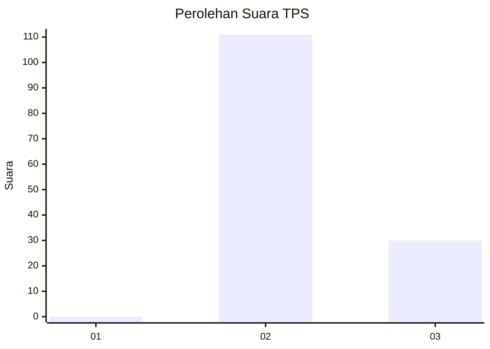
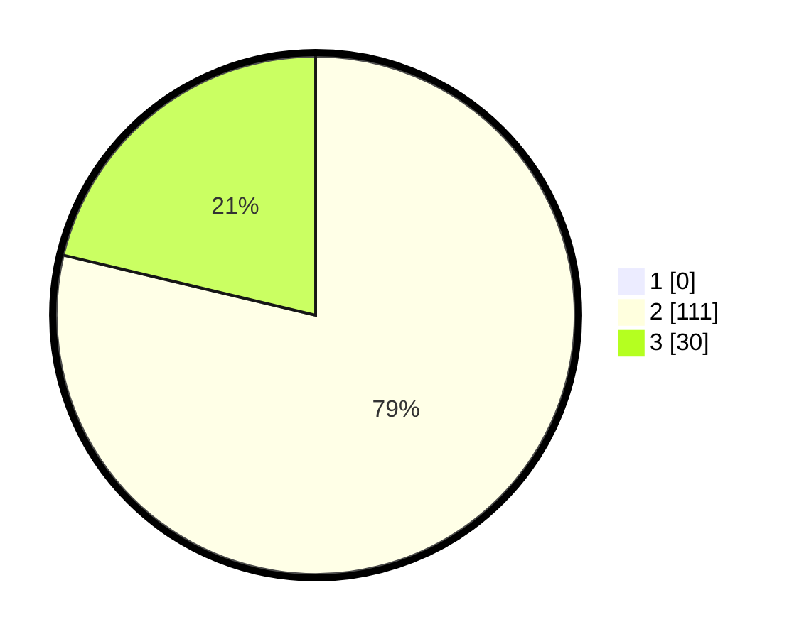

# Hasil

## Grafik

## Tabel

| No. | Nama Paslon    | Suara | Suara (raw) | Persentase |
|:--- |:-------------- | -----:| -----------:| ----------:|
| 1   | ANIES MUHAIMIN | 0     | [0][p-1]    | 0,00       |
| 2   | PRABOWO GIBRAN | 111   | [111][p-2]  | 78,72      |
| 3   | GANJAR MAHFUD  | 30    | [30][p-3]   | 21,28      |

[p-1]: https://github.com/gigit-pemilu/pemilu-2024/blob/main/pilpres/hitung-suara/sub/12-sumatera-utara/sub/02-tapanuli-utara/sub/12-sipahutar/sub/2013-sabungannihuta-iii/sub/001-tps/sub/paslon-1.txt
[p-2]: https://github.com/gigit-pemilu/pemilu-2024/blob/main/pilpres/hitung-suara/sub/12-sumatera-utara/sub/02-tapanuli-utara/sub/12-sipahutar/sub/2013-sabungannihuta-iii/sub/001-tps/sub/paslon-2.txt
[p-3]: https://github.com/gigit-pemilu/pemilu-2024/blob/main/pilpres/hitung-suara/sub/12-sumatera-utara/sub/02-tapanuli-utara/sub/12-sipahutar/sub/2013-sabungannihuta-iii/sub/001-tps/sub/paslon-3.txt

## Foto C Plano

https://sirekap-obj-formc.kpu.go.id/942f/pemilu/ppwp/12/02/12/20/13/1202122013001-20240224-212122--59aa7550-cf96-4a44-acc3-24eb46950f7a.jpg

https://sirekap-obj-formc.kpu.go.id/942f/pemilu/ppwp/12/02/12/20/13/1202122013001-20240224-212240--6d6e8cfe-ff5d-4f1b-bd63-9c74420409d7.jpg

https://sirekap-obj-formc.kpu.go.id/942f/pemilu/ppwp/12/02/12/20/13/1202122013001-20240224-212419--18936b14-efbd-43a7-a3bd-a5aacab9f2cd.jpg

## Metadata

| Key        | Value               |
| ---------- | ------------------- |
| Time Stamp | 2024-03-02 12:00:00 |

