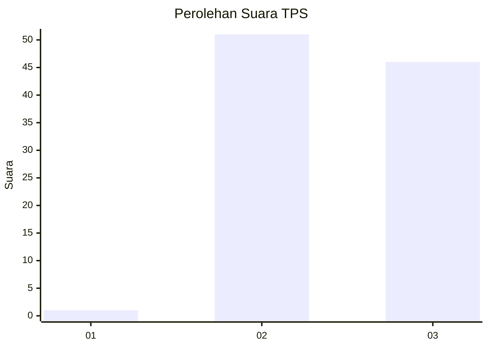
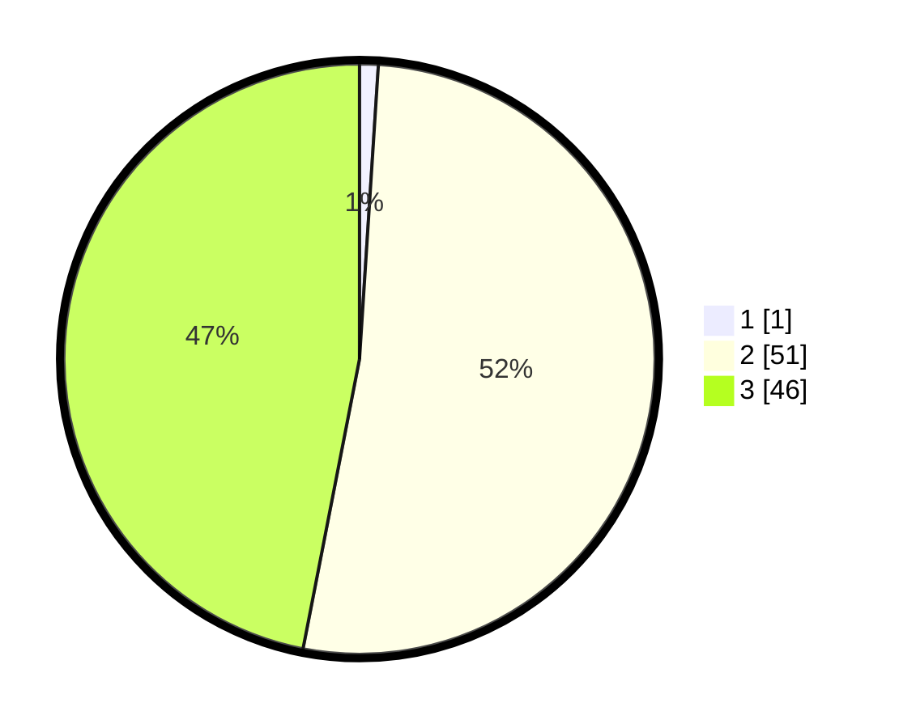

# Hasil

## Grafik

## Tabel

| No. | Nama Paslon    | Suara | Suara (raw) | Persentase |
|:--- |:-------------- | -----:| -----------:| ----------:|
| 1   | ANIES MUHAIMIN | 1     | [1][p-1]    | 1,02       |
| 2   | PRABOWO GIBRAN | 51    | [51][p-2]   | 52,04      |
| 3   | GANJAR MAHFUD  | 46    | [46][p-3]   | 46,94      |

[p-1]: https://github.com/gigit-pemilu/pemilu-2024-12-sumatera-utara/blob/main/pilpres/hitung-suara/sub/12-sumatera-utara/sub/02-tapanuli-utara/sub/12-sipahutar/sub/2017-aek-nauli-iii/sub/003-tps/sub/paslon-1.txt
[p-2]: https://github.com/gigit-pemilu/pemilu-2024-12-sumatera-utara/blob/main/pilpres/hitung-suara/sub/12-sumatera-utara/sub/02-tapanuli-utara/sub/12-sipahutar/sub/2017-aek-nauli-iii/sub/003-tps/sub/paslon-2.txt
[p-3]: https://github.com/gigit-pemilu/pemilu-2024-12-sumatera-utara/blob/main/pilpres/hitung-suara/sub/12-sumatera-utara/sub/02-tapanuli-utara/sub/12-sipahutar/sub/2017-aek-nauli-iii/sub/003-tps/sub/paslon-3.txt

## Foto C Plano

https://sirekap-obj-formc.kpu.go.id/d66b/pemilu/ppwp/12/02/12/20/17/1202122017003-20240218-131310--d3ca8437-3514-44ac-9221-4169f408b602.jpg

https://sirekap-obj-formc.kpu.go.id/d66b/pemilu/ppwp/12/02/12/20/17/1202122017003-20240218-131533--1cf9eba2-28c2-40f2-9d44-d9642a8f5613.jpg

https://sirekap-obj-formc.kpu.go.id/d66b/pemilu/ppwp/12/02/12/20/17/1202122017003-20240218-131653--5666ef93-d7e2-44fb-b7eb-dd888ef67585.jpg

## Metadata

| Key        | Value               |
| ---------- | ------------------- |
| Time Stamp | 2024-02-25 17:00:00 |

