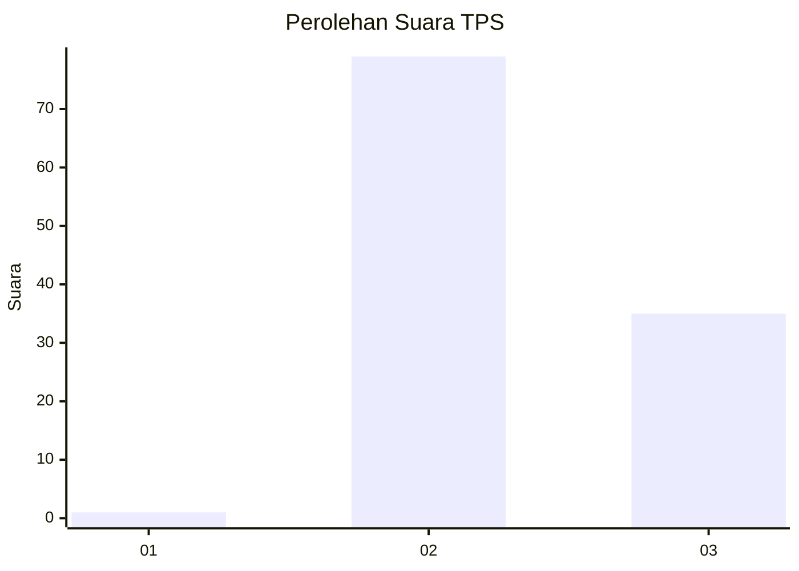
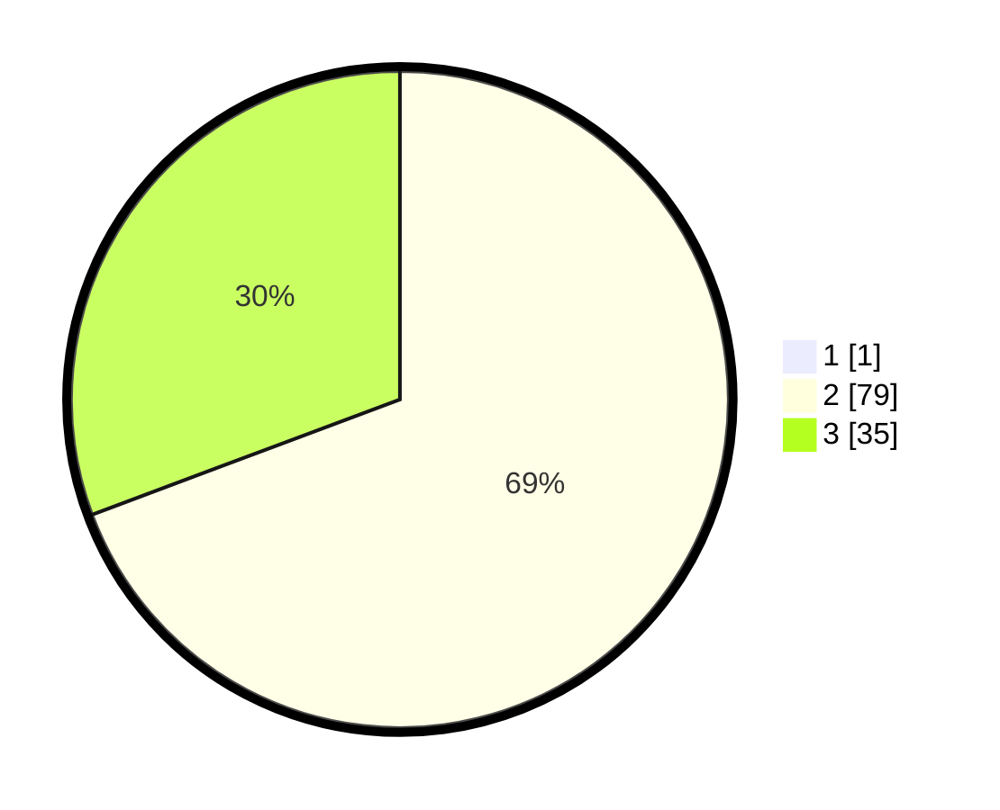

# Hasil

## Grafik

## Tabel

| No. | Nama Paslon    | Suara | Suara (raw) | Persentase |
|:--- |:-------------- | -----:| -----------:| ----------:|
| 1   | ANIES MUHAIMIN | 1     | [1][p-1]    | 0,87       |
| 2   | PRABOWO GIBRAN | 79    | [79][p-2]   | 68,70      |
| 3   | GANJAR MAHFUD  | 35    | [35][p-3]   | 30,43      |

[p-1]: https://github.com/gigit-pemilu/pemilu-2024/blob/main/pilpres/hitung-suara/sub/12-sumatera-utara/sub/02-tapanuli-utara/sub/12-sipahutar/sub/2017-aek-nauli-iii/sub/004-tps/sub/paslon-1.txt
[p-2]: https://github.com/gigit-pemilu/pemilu-2024/blob/main/pilpres/hitung-suara/sub/12-sumatera-utara/sub/02-tapanuli-utara/sub/12-sipahutar/sub/2017-aek-nauli-iii/sub/004-tps/sub/paslon-2.txt
[p-3]: https://github.com/gigit-pemilu/pemilu-2024/blob/main/pilpres/hitung-suara/sub/12-sumatera-utara/sub/02-tapanuli-utara/sub/12-sipahutar/sub/2017-aek-nauli-iii/sub/004-tps/sub/paslon-3.txt

## Foto C Plano

https://sirekap-obj-formc.kpu.go.id/dfb8/pemilu/ppwp/12/02/12/20/17/1202122017004-20240215-002225--426d6c56-5257-4faa-8556-5caf21db94a6.jpg

https://sirekap-obj-formc.kpu.go.id/dfb8/pemilu/ppwp/12/02/12/20/17/1202122017004-20240215-002256--c2787221-4f7c-4b90-8b5d-3ac108c74ee2.jpg

https://sirekap-obj-formc.kpu.go.id/dfb8/pemilu/ppwp/12/02/12/20/17/1202122017004-20240215-002317--93bc647b-b929-48fd-87a8-e40ff56ba7f3.jpg

## Metadata

| Key        | Value               |
| ---------- | ------------------- |
| Time Stamp | 2024-02-15 23:29:50 |

