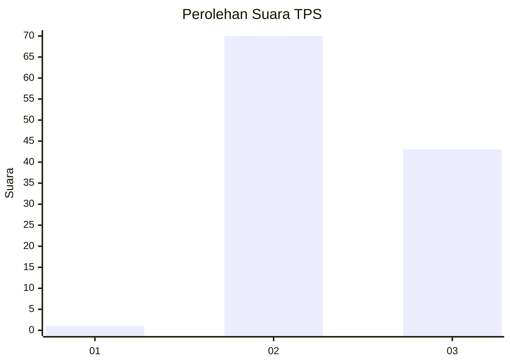
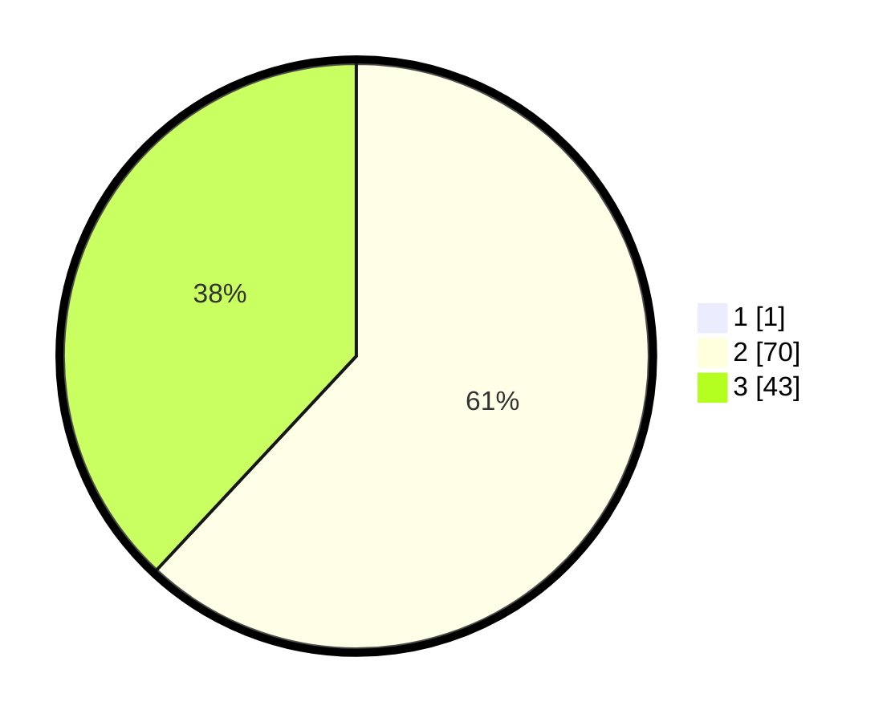

# Hasil

## Grafik

## Tabel

| No. | Nama Paslon    | Suara | Suara (raw) | Persentase |
|:--- |:-------------- | -----:| -----------:| ----------:|
| 1   | ANIES MUHAIMIN | 1     | [1][p-1]    | 0,88       |
| 2   | PRABOWO GIBRAN | 70    | [70][p-2]   | 61,40      |
| 3   | GANJAR MAHFUD  | 43    | [43][p-3]   | 37,72      |

[p-1]: https://github.com/gigit-pemilu/pemilu-2024/blob/main/pilpres/hitung-suara/sub/12-sumatera-utara/sub/02-tapanuli-utara/sub/12-sipahutar/sub/2017-aek-nauli-iii/sub/005-tps/sub/paslon-1.txt
[p-2]: https://github.com/gigit-pemilu/pemilu-2024/blob/main/pilpres/hitung-suara/sub/12-sumatera-utara/sub/02-tapanuli-utara/sub/12-sipahutar/sub/2017-aek-nauli-iii/sub/005-tps/sub/paslon-2.txt
[p-3]: https://github.com/gigit-pemilu/pemilu-2024/blob/main/pilpres/hitung-suara/sub/12-sumatera-utara/sub/02-tapanuli-utara/sub/12-sipahutar/sub/2017-aek-nauli-iii/sub/005-tps/sub/paslon-3.txt

## Foto C Plano

https://sirekap-obj-formc.kpu.go.id/ebed/pemilu/ppwp/12/02/12/20/17/1202122017005-20240214-141727--424125f5-d7d5-4443-9d0c-2de542eedb7f.jpg

https://sirekap-obj-formc.kpu.go.id/ebed/pemilu/ppwp/12/02/12/20/17/1202122017005-20240215-023755--16a4bb8e-0bd8-493a-a36d-f13a2617e308.jpg

https://sirekap-obj-formc.kpu.go.id/ebed/pemilu/ppwp/12/02/12/20/17/1202122017005-20240218-153803--b2b2e285-f619-44e7-a61b-004474927c74.jpg

## Metadata

| Key        | Value               |
| ---------- | ------------------- |
| Time Stamp | 2024-02-19 06:16:00 |

