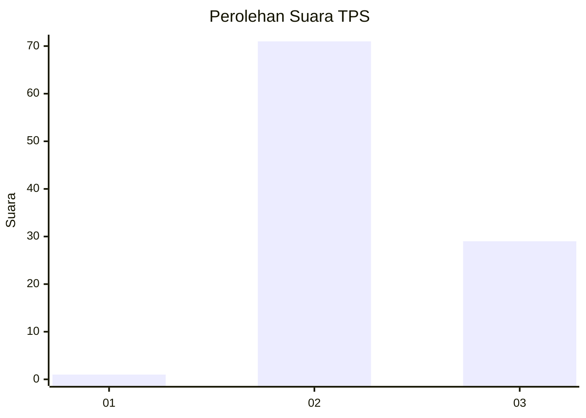
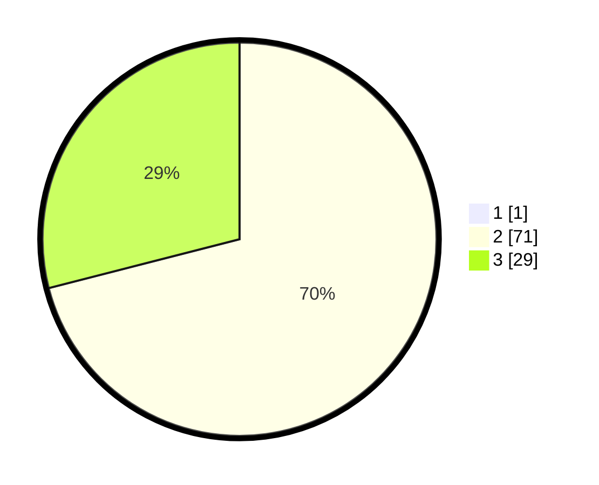

# Hasil

## Grafik

## Tabel

| No. | Nama Paslon    | Suara | Suara (raw) | Persentase |
|:--- |:-------------- | -----:| -----------:| ----------:|
| 1   | ANIES MUHAIMIN | 1     | [1][p-1]    | 0,99       |
| 2   | PRABOWO GIBRAN | 71    | [71][p-2]   | 70,30      |
| 3   | GANJAR MAHFUD  | 29    | [29][p-3]   | 28,71      |

[p-1]: https://github.com/gigit-pemilu/pemilu-2024-12-sumatera-utara/blob/main/pilpres/hitung-suara/sub/12-sumatera-utara/sub/02-tapanuli-utara/sub/12-sipahutar/sub/2018-onan-runggu-ii/sub/005-tps/sub/paslon-1.txt
[p-2]: https://github.com/gigit-pemilu/pemilu-2024-12-sumatera-utara/blob/main/pilpres/hitung-suara/sub/12-sumatera-utara/sub/02-tapanuli-utara/sub/12-sipahutar/sub/2018-onan-runggu-ii/sub/005-tps/sub/paslon-2.txt
[p-3]: https://github.com/gigit-pemilu/pemilu-2024-12-sumatera-utara/blob/main/pilpres/hitung-suara/sub/12-sumatera-utara/sub/02-tapanuli-utara/sub/12-sipahutar/sub/2018-onan-runggu-ii/sub/005-tps/sub/paslon-3.txt

## Foto C Plano

https://sirekap-obj-formc.kpu.go.id/50c2/pemilu/ppwp/12/02/12/20/18/1202122018005-20240219-174310--2d8eb700-b598-4e74-b730-c464caaf04f2.jpg

https://sirekap-obj-formc.kpu.go.id/50c2/pemilu/ppwp/12/02/12/20/18/1202122018005-20240219-174337--4cdb2132-4117-45d8-97dd-c6fb695f7a3d.jpg

https://sirekap-obj-formc.kpu.go.id/50c2/pemilu/ppwp/12/02/12/20/18/1202122018005-20240219-174637--d5d1b33a-94f8-41bf-b661-3efc2c9daa0c.jpg

## Metadata

| Key        | Value               |
| ---------- | ------------------- |
| Time Stamp | 2024-02-25 17:00:00 |

