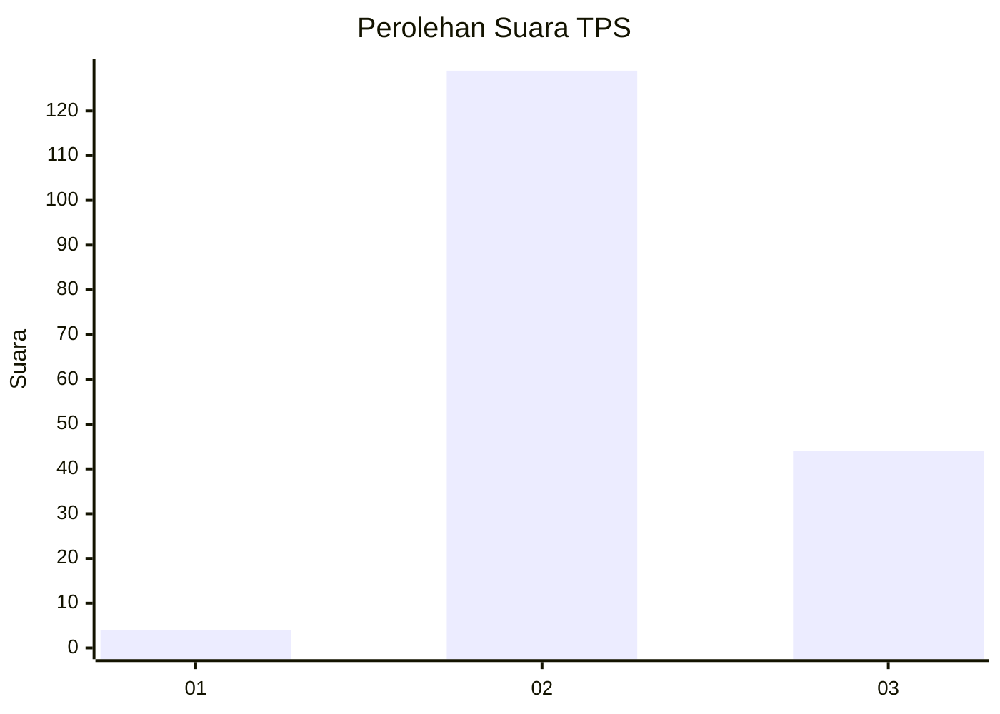
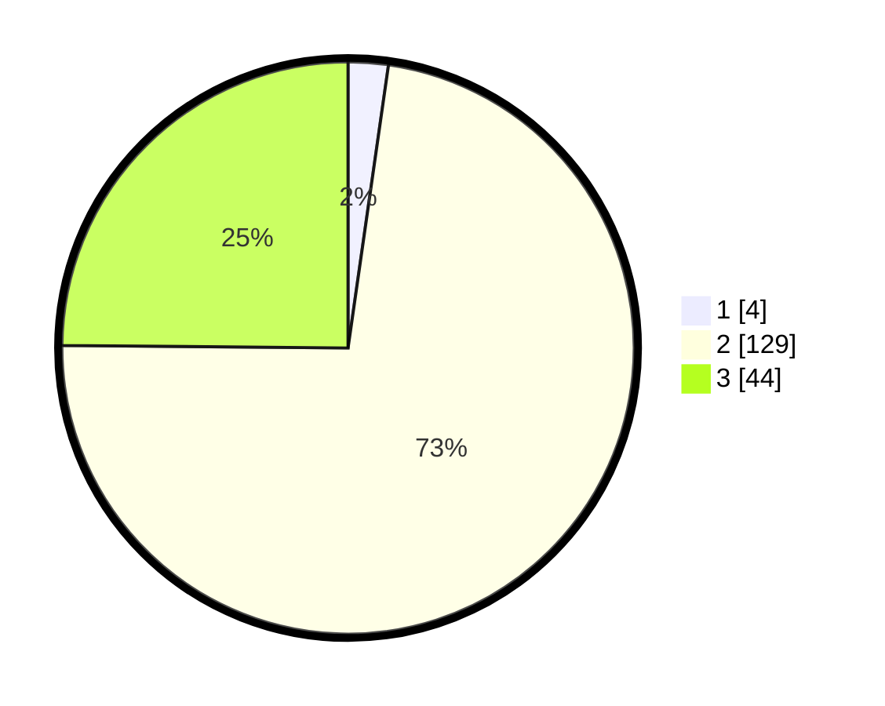

# Hasil

## Grafik

## Tabel

| No. | Nama Paslon    | Suara | Suara (raw) | Persentase |
|:--- |:-------------- | -----:| -----------:| ----------:|
| 1   | ANIES MUHAIMIN | 4     | [4][p-1]    | 2,26       |
| 2   | PRABOWO GIBRAN | 129   | [129][p-2]  | 72,88      |
| 3   | GANJAR MAHFUD  | 44    | [44][p-3]   | 24,86      |

[p-1]: https://github.com/gigit-pemilu/pemilu-2024-12-sumatera-utara/blob/main/pilpres/hitung-suara/sub/12-sumatera-utara/sub/02-tapanuli-utara/sub/13-pangaribuan/sub/2001-pakpahan/sub/001-tps/sub/paslon-1.txt
[p-2]: https://github.com/gigit-pemilu/pemilu-2024-12-sumatera-utara/blob/main/pilpres/hitung-suara/sub/12-sumatera-utara/sub/02-tapanuli-utara/sub/13-pangaribuan/sub/2001-pakpahan/sub/001-tps/sub/paslon-2.txt
[p-3]: https://github.com/gigit-pemilu/pemilu-2024-12-sumatera-utara/blob/main/pilpres/hitung-suara/sub/12-sumatera-utara/sub/02-tapanuli-utara/sub/13-pangaribuan/sub/2001-pakpahan/sub/001-tps/sub/paslon-3.txt

## Foto C Plano

https://sirekap-obj-formc.kpu.go.id/1b57/pemilu/ppwp/12/02/13/20/01/1202132001001-20240218-002521--5c5422c4-8081-46f2-8a50-0b16c178389d.jpg

https://sirekap-obj-formc.kpu.go.id/1b57/pemilu/ppwp/12/02/13/20/01/1202132001001-20240218-002711--92866aed-6dd5-48a0-ab02-3ea1c3a4cd67.jpg

https://sirekap-obj-formc.kpu.go.id/1b57/pemilu/ppwp/12/02/13/20/01/1202132001001-20240218-002949--b1c5564b-90c3-43be-a8bb-23499510c10b.jpg

## Metadata

| Key        | Value               |
| ---------- | ------------------- |
| Time Stamp | 2024-02-24 22:31:28 |

