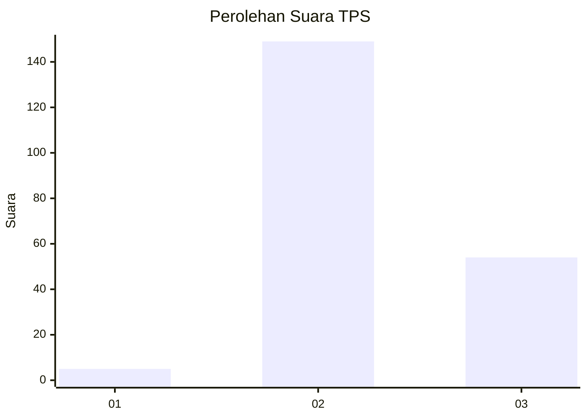
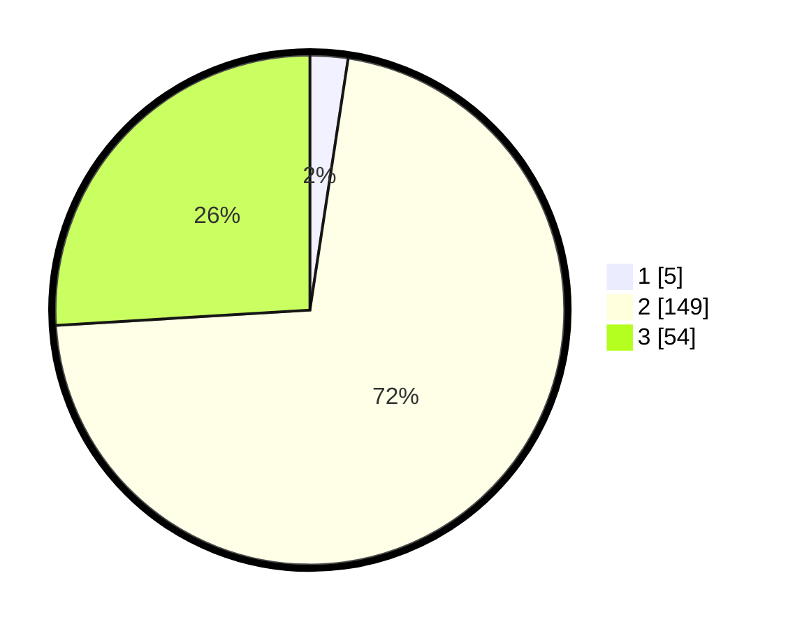

# Hasil

## Grafik

## Tabel

| No. | Nama Paslon    | Suara | Suara (raw) | Persentase |
|:--- |:-------------- | -----:| -----------:| ----------:|
| 1   | ANIES MUHAIMIN | 5     | [5][p-1]    | 2,40       |
| 2   | PRABOWO GIBRAN | 149   | [149][p-2]  | 71,63      |
| 3   | GANJAR MAHFUD  | 54    | [54][p-3]   | 25,96      |

[p-1]: https://github.com/gigit-pemilu/pemilu-2024-12-sumatera-utara/blob/main/pilpres/hitung-suara/sub/12-sumatera-utara/sub/02-tapanuli-utara/sub/13-pangaribuan/sub/2001-pakpahan/sub/002-tps/sub/paslon-1.txt
[p-2]: https://github.com/gigit-pemilu/pemilu-2024-12-sumatera-utara/blob/main/pilpres/hitung-suara/sub/12-sumatera-utara/sub/02-tapanuli-utara/sub/13-pangaribuan/sub/2001-pakpahan/sub/002-tps/sub/paslon-2.txt
[p-3]: https://github.com/gigit-pemilu/pemilu-2024-12-sumatera-utara/blob/main/pilpres/hitung-suara/sub/12-sumatera-utara/sub/02-tapanuli-utara/sub/13-pangaribuan/sub/2001-pakpahan/sub/002-tps/sub/paslon-3.txt

## Foto C Plano

https://sirekap-obj-formc.kpu.go.id/8023/pemilu/ppwp/12/02/13/20/01/1202132001002-20240214-212410--962eee0f-95c0-4d67-8897-a6cef24c61ab.jpg

https://sirekap-obj-formc.kpu.go.id/8023/pemilu/ppwp/12/02/13/20/01/1202132001002-20240214-212644--38ec4b5b-4d62-4106-91ed-a8fbdd7df6c6.jpg

https://sirekap-obj-formc.kpu.go.id/8023/pemilu/ppwp/12/02/13/20/01/1202132001002-20240214-212914--0036901f-c91b-44e3-b6a6-c428ff1c690f.jpg

## Metadata

| Key        | Value               |
| ---------- | ------------------- |
| Time Stamp | 2024-02-16 01:30:27 |

