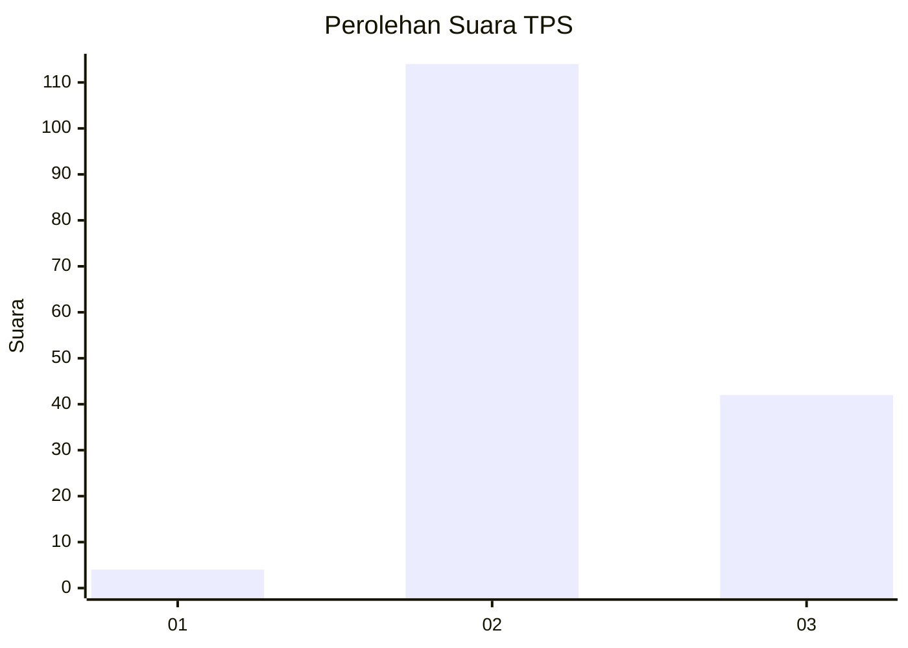
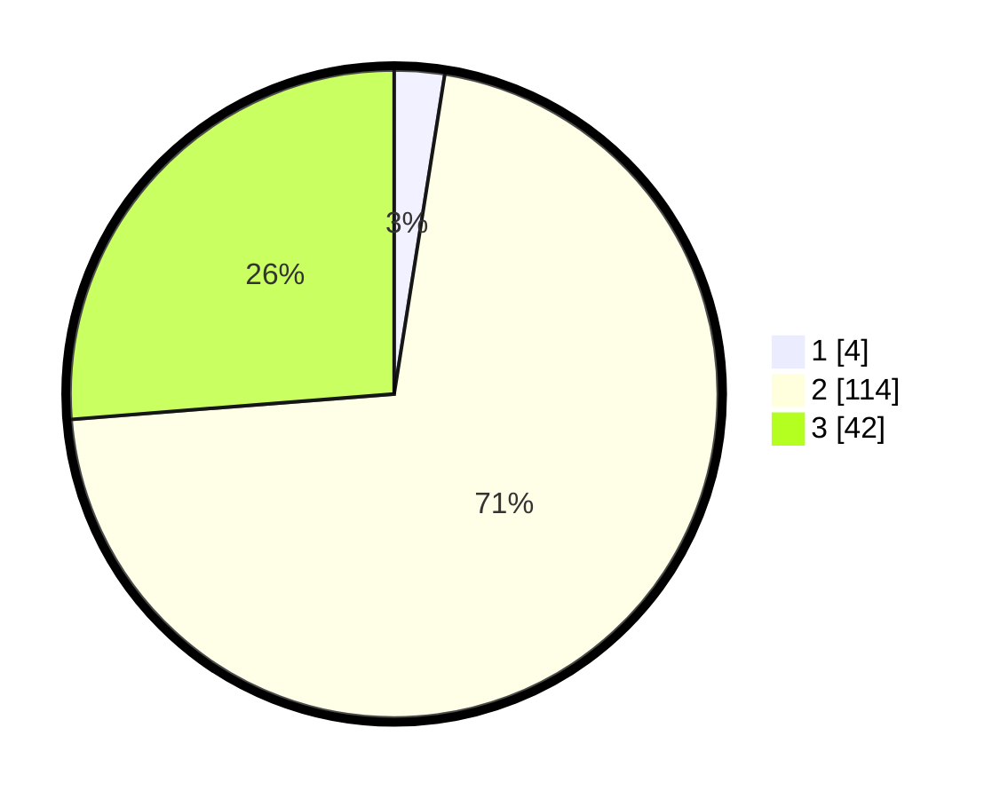

# Hasil

## Grafik

## Tabel

| No. | Nama Paslon    | Suara | Suara (raw) | Persentase |
|:--- |:-------------- | -----:| -----------:| ----------:|
| 1   | ANIES MUHAIMIN | 4     | [4][p-1]    | 2,50       |
| 2   | PRABOWO GIBRAN | 114   | [114][p-2]  | 71,25      |
| 3   | GANJAR MAHFUD  | 42    | [42][p-3]   | 26,25      |

[p-1]: https://github.com/gigit-pemilu/pemilu-2024/blob/main/pilpres/hitung-suara/sub/12-sumatera-utara/sub/02-tapanuli-utara/sub/13-pangaribuan/sub/2001-pakpahan/sub/003-tps/sub/paslon-1.txt
[p-2]: https://github.com/gigit-pemilu/pemilu-2024/blob/main/pilpres/hitung-suara/sub/12-sumatera-utara/sub/02-tapanuli-utara/sub/13-pangaribuan/sub/2001-pakpahan/sub/003-tps/sub/paslon-2.txt
[p-3]: https://github.com/gigit-pemilu/pemilu-2024/blob/main/pilpres/hitung-suara/sub/12-sumatera-utara/sub/02-tapanuli-utara/sub/13-pangaribuan/sub/2001-pakpahan/sub/003-tps/sub/paslon-3.txt

## Foto C Plano

https://sirekap-obj-formc.kpu.go.id/39e9/pemilu/ppwp/12/02/13/20/01/1202132001003-20240218-022039--4bde5fbd-826d-494e-a3ad-db35aa878cfe.jpg

https://sirekap-obj-formc.kpu.go.id/39e9/pemilu/ppwp/12/02/13/20/01/1202132001003-20240218-015348--1074553f-3bba-4a76-94c9-b612732c62a9.jpg

https://sirekap-obj-formc.kpu.go.id/39e9/pemilu/ppwp/12/02/13/20/01/1202132001003-20240218-015432--3cdb5337-3948-4aa1-b14c-f5ec3c7274a1.jpg

## Metadata

| Key        | Value               |
| ---------- | ------------------- |
| Time Stamp | 2024-02-25 13:00:00 |

