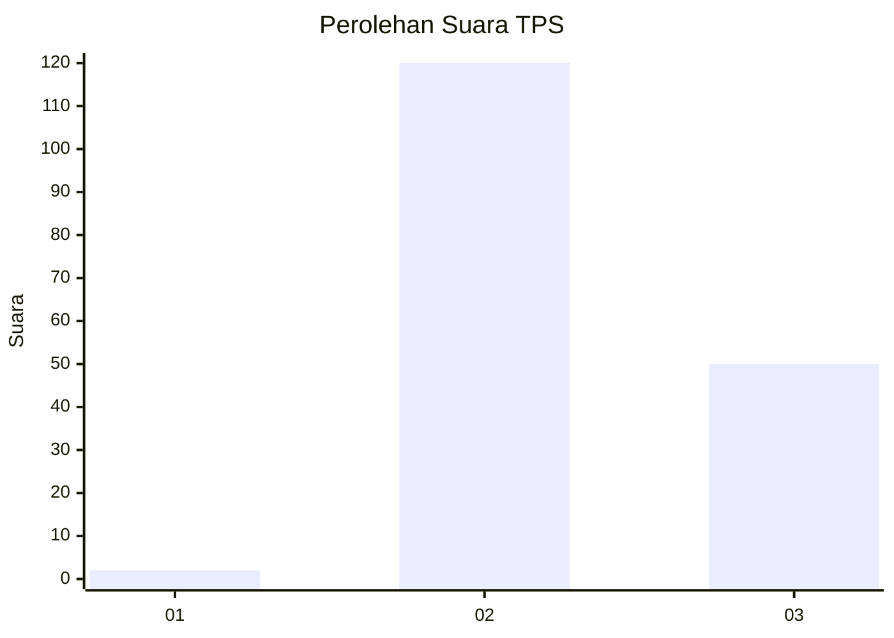

# Hasil

## Grafik

## Tabel

| No. | Nama Paslon    | Suara | Suara (raw) | Persentase |
|:--- |:-------------- | -----:| -----------:| ----------:|
| 1   | ANIES MUHAIMIN | 2     | [2][p-1]    | 1,16       |
| 2   | PRABOWO GIBRAN | 120   | [120][p-2]  | 69,77      |
| 3   | GANJAR MAHFUD  | 50    | [50][p-3]   | 29,07      |

[p-1]: https://github.com/gigit-pemilu/pemilu-2024/blob/main/pilpres/hitung-suara/sub/12-sumatera-utara/sub/02-tapanuli-utara/sub/13-pangaribuan/sub/2001-pakpahan/sub/004-tps/sub/paslon-1.txt
[p-2]: https://github.com/gigit-pemilu/pemilu-2024/blob/main/pilpres/hitung-suara/sub/12-sumatera-utara/sub/02-tapanuli-utara/sub/13-pangaribuan/sub/2001-pakpahan/sub/004-tps/sub/paslon-2.txt
[p-3]: https://github.com/gigit-pemilu/pemilu-2024/blob/main/pilpres/hitung-suara/sub/12-sumatera-utara/sub/02-tapanuli-utara/sub/13-pangaribuan/sub/2001-pakpahan/sub/004-tps/sub/paslon-3.txt

## Foto C Plano

https://sirekap-obj-formc.kpu.go.id/7bbc/pemilu/ppwp/12/02/13/20/01/1202132001004-20240217-160436--ebd214e0-5d1e-48c3-94bc-3315d8e8fab7.jpg

https://sirekap-obj-formc.kpu.go.id/7bbc/pemilu/ppwp/12/02/13/20/01/1202132001004-20240217-160539--8d767e3f-5d82-485c-8407-425d3c5315c7.jpg

https://sirekap-obj-formc.kpu.go.id/7bbc/pemilu/ppwp/12/02/13/20/01/1202132001004-20240217-150237--249a3513-7111-4e82-b9e7-1203c52868db.jpg

## Metadata

| Key        | Value               |
| ---------- | ------------------- |
| Time Stamp | 2024-02-25 17:00:00 |

