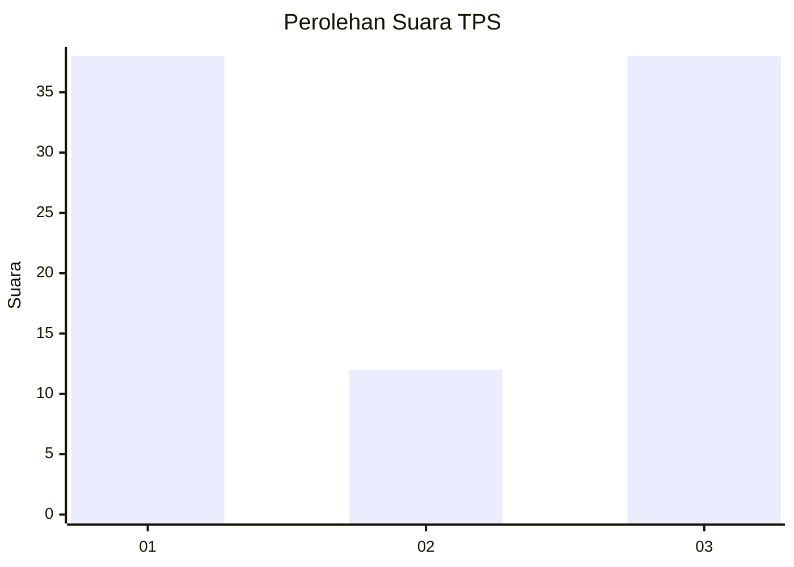
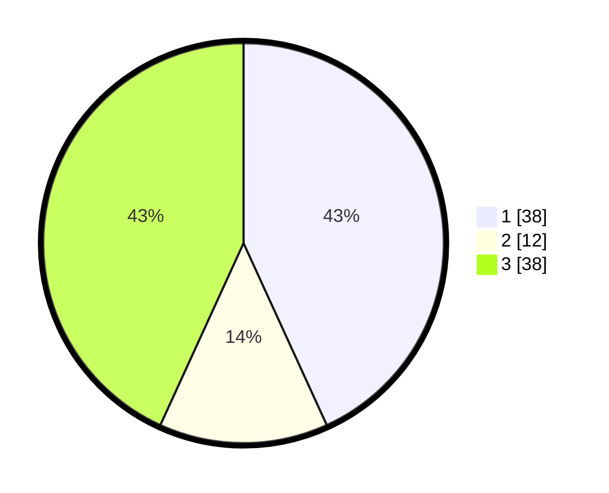

# Hasil

## Grafik

## Tabel

| No. | Nama Paslon    | Suara | Suara (raw) | Persentase |
|:--- |:-------------- | -----:| -----------:| ----------:|
| 1   | ANIES MUHAIMIN | 38    | [38][p-1]   | 43,18      |
| 2   | PRABOWO GIBRAN | 12    | [12][p-2]   | 13,64      |
| 3   | GANJAR MAHFUD  | 38    | [38][p-3]   | 43,18      |

[p-1]: https://github.com/gigit-pemilu/pemilu-2024/blob/main/pilpres/hitung-suara/sub/12-sumatera-utara/sub/02-tapanuli-utara/sub/13-pangaribuan/sub/2006-sigotom-julu/sub/004-tps/sub/paslon-1.txt
[p-2]: https://github.com/gigit-pemilu/pemilu-2024/blob/main/pilpres/hitung-suara/sub/12-sumatera-utara/sub/02-tapanuli-utara/sub/13-pangaribuan/sub/2006-sigotom-julu/sub/004-tps/sub/paslon-2.txt
[p-3]: https://github.com/gigit-pemilu/pemilu-2024/blob/main/pilpres/hitung-suara/sub/12-sumatera-utara/sub/02-tapanuli-utara/sub/13-pangaribuan/sub/2006-sigotom-julu/sub/004-tps/sub/paslon-3.txt

## Foto C Plano

https://sirekap-obj-formc.kpu.go.id/1290/pemilu/ppwp/12/02/13/20/06/1202132006004-20240220-135030--cceddcf7-c8ca-4be2-b6a1-a4a0eb5882ef.jpg

https://sirekap-obj-formc.kpu.go.id/1290/pemilu/ppwp/12/02/13/20/06/1202132006004-20240220-135148--ed45b9b7-5817-4c2e-a103-fc6e326113fb.jpg

https://sirekap-obj-formc.kpu.go.id/1290/pemilu/ppwp/12/02/13/20/06/1202132006004-20240220-135212--1e3db9c5-8568-453c-b59a-eab903607e42.jpg

## Metadata

| Key        | Value               |
| ---------- | ------------------- |
| Time Stamp | 2024-02-26 14:00:00 |

