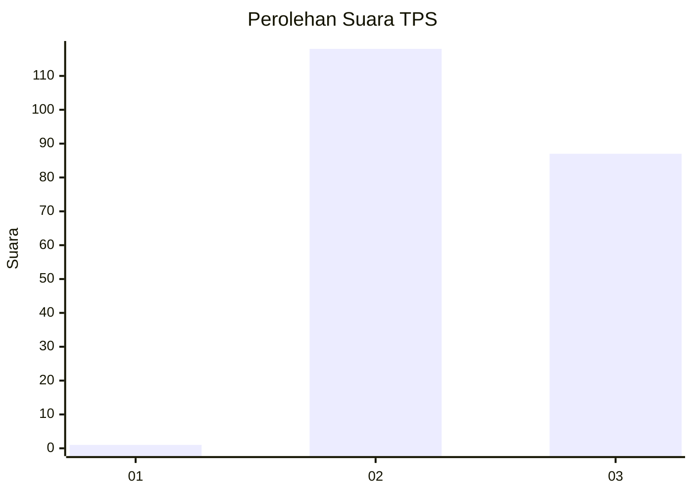
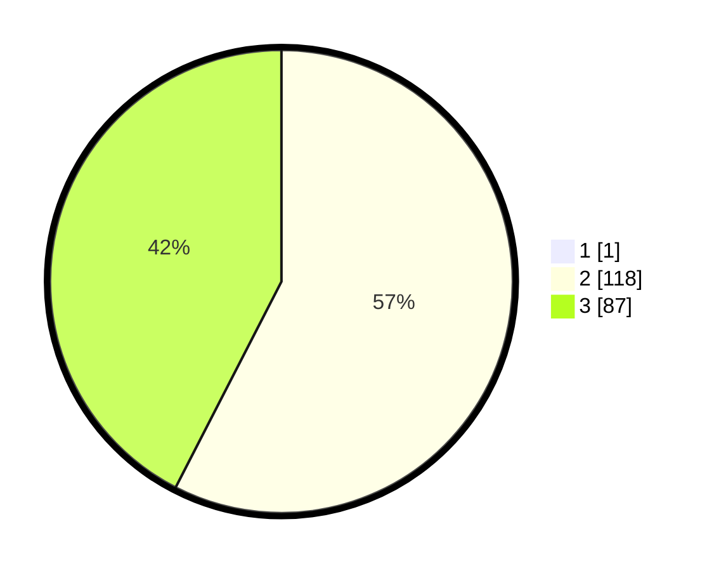

# Hasil

## Grafik

## Tabel

| No. | Nama Paslon    | Suara | Suara (raw) | Persentase |
|:--- |:-------------- | -----:| -----------:| ----------:|
| 1   | ANIES MUHAIMIN | 1     | [1][p-1]    | 0,49       |
| 2   | PRABOWO GIBRAN | 118   | [118][p-2]  | 57,28      |
| 3   | GANJAR MAHFUD  | 87    | [87][p-3]   | 42,23      |

[p-1]: https://github.com/gigit-pemilu/pemilu-2024/blob/main/pilpres/hitung-suara/sub/12-sumatera-utara/sub/02-tapanuli-utara/sub/13-pangaribuan/sub/2014-lumban-sinaga-simatupang/sub/001-tps/sub/paslon-1.txt
[p-2]: https://github.com/gigit-pemilu/pemilu-2024/blob/main/pilpres/hitung-suara/sub/12-sumatera-utara/sub/02-tapanuli-utara/sub/13-pangaribuan/sub/2014-lumban-sinaga-simatupang/sub/001-tps/sub/paslon-2.txt
[p-3]: https://github.com/gigit-pemilu/pemilu-2024/blob/main/pilpres/hitung-suara/sub/12-sumatera-utara/sub/02-tapanuli-utara/sub/13-pangaribuan/sub/2014-lumban-sinaga-simatupang/sub/001-tps/sub/paslon-3.txt

## Foto C Plano

https://sirekap-obj-formc.kpu.go.id/953c/pemilu/ppwp/12/02/13/20/14/1202132014001-20240223-095040--3354068a-3c57-47cc-b3b4-29f74d8f9ab3.jpg

https://sirekap-obj-formc.kpu.go.id/953c/pemilu/ppwp/12/02/13/20/14/1202132014001-20240223-095200--dd1fa809-92f4-4d8e-bb06-628faaeb4d57.jpg

https://sirekap-obj-formc.kpu.go.id/953c/pemilu/ppwp/12/02/13/20/14/1202132014001-20240223-100146--63ebff59-0271-470f-83f6-7b7b13a794e9.jpg

## Metadata

| Key        | Value               |
| ---------- | ------------------- |
| Time Stamp | 2024-02-25 16:00:00 |

