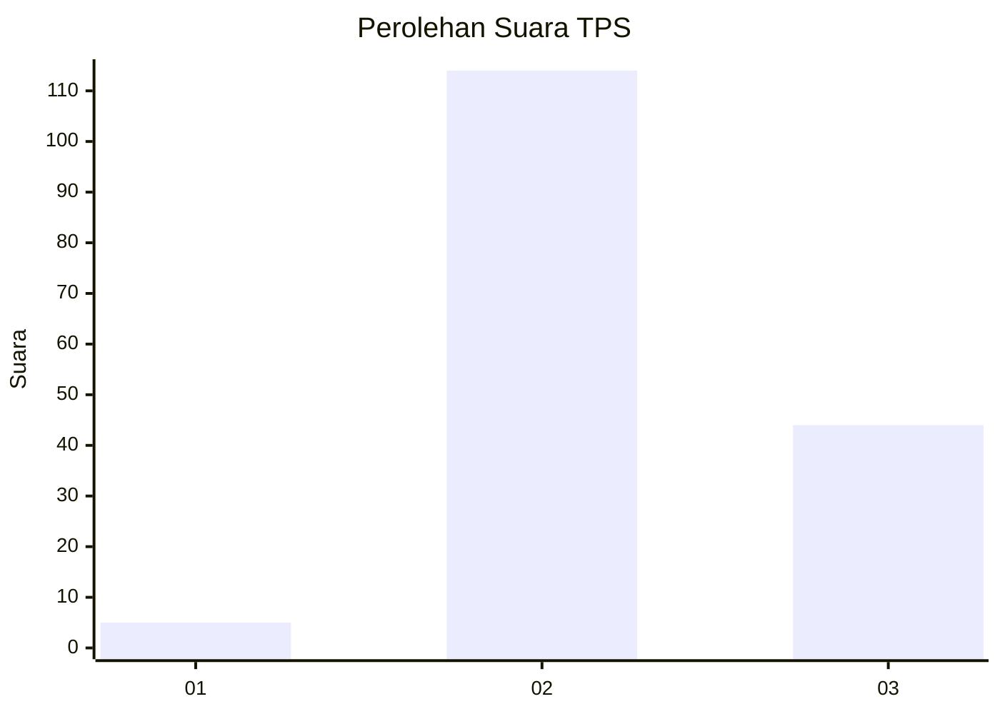
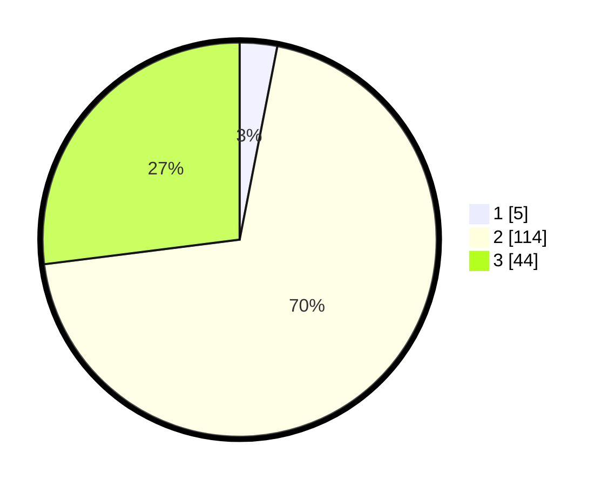

# Hasil

## Grafik

## Tabel

| No. | Nama Paslon    | Suara | Suara (raw) | Persentase |
|:--- |:-------------- | -----:| -----------:| ----------:|
| 1   | ANIES MUHAIMIN | 5     | [5][p-1]    | 3,07       |
| 2   | PRABOWO GIBRAN | 114   | [114][p-2]  | 69,94      |
| 3   | GANJAR MAHFUD  | 44    | [44][p-3]   | 26,99      |

[p-1]: https://github.com/gigit-pemilu/pemilu-2024/blob/main/pilpres/hitung-suara/sub/12-sumatera-utara/sub/02-tapanuli-utara/sub/13-pangaribuan/sub/2014-lumban-sinaga-simatupang/sub/002-tps/sub/paslon-1.txt
[p-2]: https://github.com/gigit-pemilu/pemilu-2024/blob/main/pilpres/hitung-suara/sub/12-sumatera-utara/sub/02-tapanuli-utara/sub/13-pangaribuan/sub/2014-lumban-sinaga-simatupang/sub/002-tps/sub/paslon-2.txt
[p-3]: https://github.com/gigit-pemilu/pemilu-2024/blob/main/pilpres/hitung-suara/sub/12-sumatera-utara/sub/02-tapanuli-utara/sub/13-pangaribuan/sub/2014-lumban-sinaga-simatupang/sub/002-tps/sub/paslon-3.txt

## Foto C Plano

https://sirekap-obj-formc.kpu.go.id/da70/pemilu/ppwp/12/02/13/20/14/1202132014002-20240223-132403--c79d5669-6276-41f7-8bd2-eb142d8ab0e2.jpg

https://sirekap-obj-formc.kpu.go.id/da70/pemilu/ppwp/12/02/13/20/14/1202132014002-20240223-132155--4d807d55-3730-487b-8377-3aa2c7632a90.jpg

https://sirekap-obj-formc.kpu.go.id/da70/pemilu/ppwp/12/02/13/20/14/1202132014002-20240223-132515--69b91b1c-84a8-4778-b151-d3db12d6865c.jpg

## Metadata

| Key        | Value               |
| ---------- | ------------------- |
| Time Stamp | 2024-02-25 12:00:00 |

