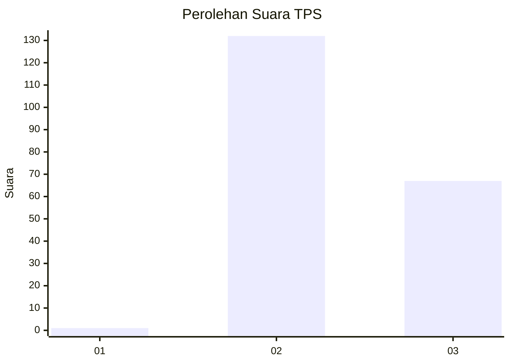
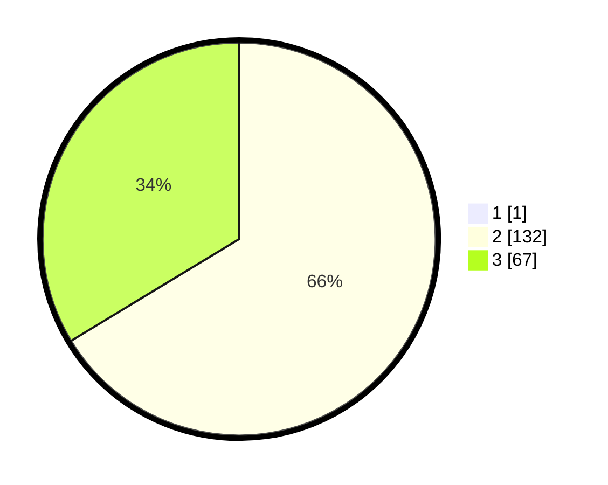

# Hasil

## Grafik

## Tabel

| No. | Nama Paslon    | Suara | Suara (raw) | Persentase |
|:--- |:-------------- | -----:| -----------:| ----------:|
| 1   | ANIES MUHAIMIN | 1     | [1][p-1]    | 0,50       |
| 2   | PRABOWO GIBRAN | 132   | [132][p-2]  | 66,00      |
| 3   | GANJAR MAHFUD  | 67    | [67][p-3]   | 33,50      |

[p-1]: https://github.com/gigit-pemilu/pemilu-2024/blob/main/pilpres/hitung-suara/sub/12-sumatera-utara/sub/02-tapanuli-utara/sub/13-pangaribuan/sub/2014-lumban-sinaga-simatupang/sub/003-tps/sub/paslon-1.txt
[p-2]: https://github.com/gigit-pemilu/pemilu-2024/blob/main/pilpres/hitung-suara/sub/12-sumatera-utara/sub/02-tapanuli-utara/sub/13-pangaribuan/sub/2014-lumban-sinaga-simatupang/sub/003-tps/sub/paslon-2.txt
[p-3]: https://github.com/gigit-pemilu/pemilu-2024/blob/main/pilpres/hitung-suara/sub/12-sumatera-utara/sub/02-tapanuli-utara/sub/13-pangaribuan/sub/2014-lumban-sinaga-simatupang/sub/003-tps/sub/paslon-3.txt

## Foto C Plano

https://sirekap-obj-formc.kpu.go.id/c9e7/pemilu/ppwp/12/02/13/20/14/1202132014003-20240223-151543--1e009d78-1298-4315-925b-de8db91f20e0.jpg

https://sirekap-obj-formc.kpu.go.id/c9e7/pemilu/ppwp/12/02/13/20/14/1202132014003-20240223-151621--ccb0179b-2921-492d-b040-55d3016231a4.jpg

https://sirekap-obj-formc.kpu.go.id/c9e7/pemilu/ppwp/12/02/13/20/14/1202132014003-20240223-151657--1186d917-9c72-4b49-9c9a-e368b677aab8.jpg

## Metadata

| Key        | Value               |
| ---------- | ------------------- |
| Time Stamp | 2024-02-25 12:00:00 |

