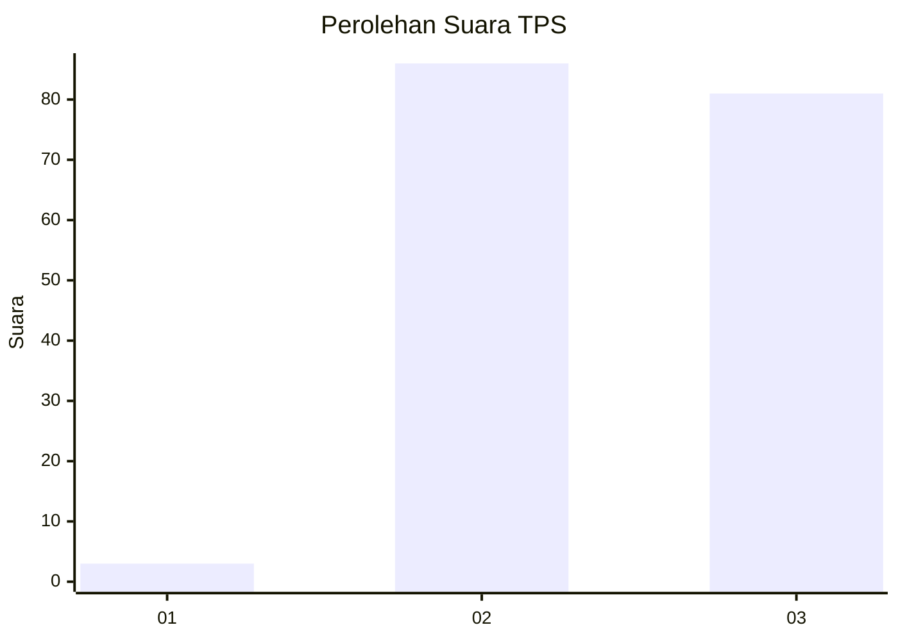
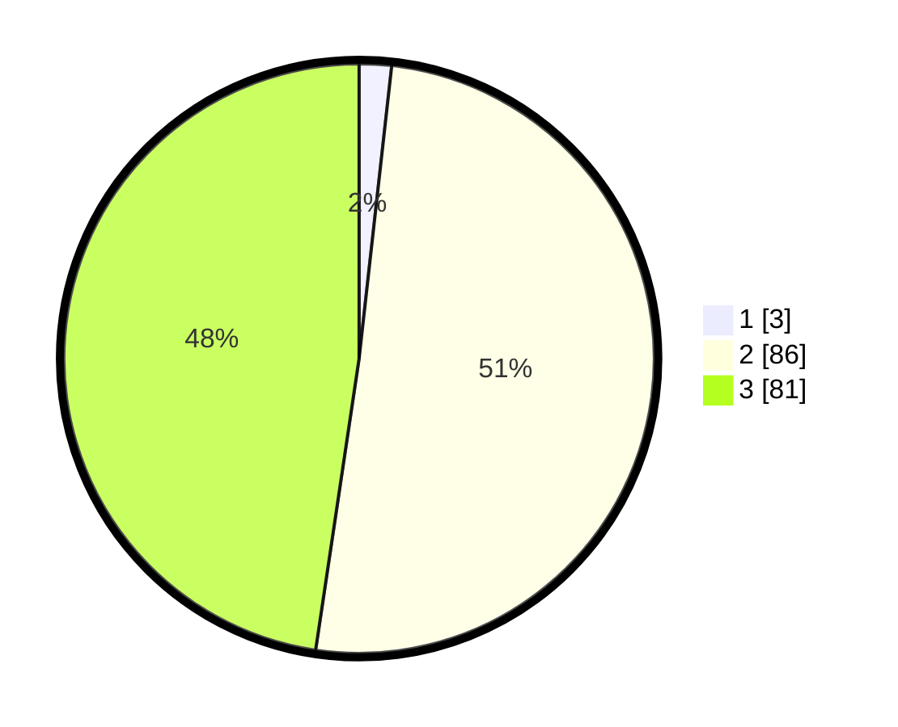

# Hasil

## Grafik

## Tabel

| No. | Nama Paslon    | Suara | Suara (raw) | Persentase |
|:--- |:-------------- | -----:| -----------:| ----------:|
| 1   | ANIES MUHAIMIN | 3     | [3][p-1]    | 1,76       |
| 2   | PRABOWO GIBRAN | 86    | [86][p-2]   | 50,59      |
| 3   | GANJAR MAHFUD  | 81    | [81][p-3]   | 47,65      |

[p-1]: https://github.com/gigit-pemilu/pemilu-2024/blob/main/pilpres/hitung-suara/sub/12-sumatera-utara/sub/02-tapanuli-utara/sub/13-pangaribuan/sub/2014-lumban-sinaga-simatupang/sub/004-tps/sub/paslon-1.txt
[p-2]: https://github.com/gigit-pemilu/pemilu-2024/blob/main/pilpres/hitung-suara/sub/12-sumatera-utara/sub/02-tapanuli-utara/sub/13-pangaribuan/sub/2014-lumban-sinaga-simatupang/sub/004-tps/sub/paslon-2.txt
[p-3]: https://github.com/gigit-pemilu/pemilu-2024/blob/main/pilpres/hitung-suara/sub/12-sumatera-utara/sub/02-tapanuli-utara/sub/13-pangaribuan/sub/2014-lumban-sinaga-simatupang/sub/004-tps/sub/paslon-3.txt

## Foto C Plano

https://sirekap-obj-formc.kpu.go.id/1770/pemilu/ppwp/12/02/13/20/14/1202132014004-20240223-162945--69f9c996-30ee-46fb-81fd-29c61ce0cbe0.jpg

https://sirekap-obj-formc.kpu.go.id/1770/pemilu/ppwp/12/02/13/20/14/1202132014004-20240223-163001--00168922-2e32-4d88-9d78-1faa276b6ea5.jpg

https://sirekap-obj-formc.kpu.go.id/1770/pemilu/ppwp/12/02/13/20/14/1202132014004-20240223-163020--fded8039-40d3-4627-92a3-d11af2575019.jpg

## Metadata

| Key        | Value               |
| ---------- | ------------------- |
| Time Stamp | 2024-02-25 17:00:00 |

