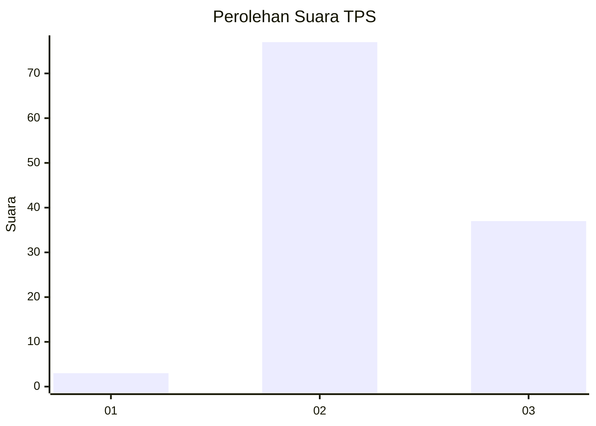
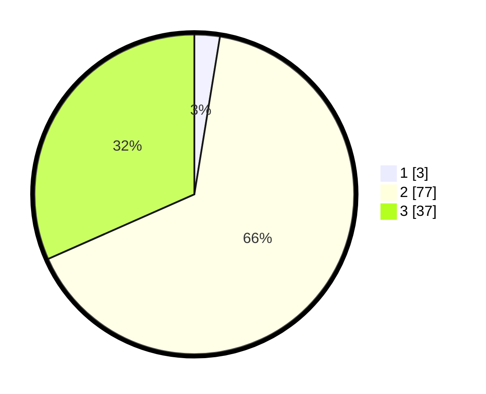

# Hasil

## Grafik

## Tabel

| No. | Nama Paslon    | Suara | Suara (raw) | Persentase |
|:--- |:-------------- | -----:| -----------:| ----------:|
| 1   | ANIES MUHAIMIN | 3     | [3][p-1]    | 2,56       |
| 2   | PRABOWO GIBRAN | 77    | [77][p-2]   | 65,81      |
| 3   | GANJAR MAHFUD  | 37    | [37][p-3]   | 31,62      |

[p-1]: https://github.com/gigit-pemilu/pemilu-2024/blob/main/pilpres/hitung-suara/sub/12-sumatera-utara/sub/02-tapanuli-utara/sub/13-pangaribuan/sub/2017-najumambe/sub/001-tps/sub/paslon-1.txt
[p-2]: https://github.com/gigit-pemilu/pemilu-2024/blob/main/pilpres/hitung-suara/sub/12-sumatera-utara/sub/02-tapanuli-utara/sub/13-pangaribuan/sub/2017-najumambe/sub/001-tps/sub/paslon-2.txt
[p-3]: https://github.com/gigit-pemilu/pemilu-2024/blob/main/pilpres/hitung-suara/sub/12-sumatera-utara/sub/02-tapanuli-utara/sub/13-pangaribuan/sub/2017-najumambe/sub/001-tps/sub/paslon-3.txt

## Foto C Plano

https://sirekap-obj-formc.kpu.go.id/27d0/pemilu/ppwp/12/02/13/20/17/1202132017001-20240222-145138--4dfa15c5-209f-4b69-b8de-db702366f7bd.jpg

https://sirekap-obj-formc.kpu.go.id/27d0/pemilu/ppwp/12/02/13/20/17/1202132017001-20240222-145232--3f8b1d26-eb2c-4925-b483-b1d37a537df8.jpg

https://sirekap-obj-formc.kpu.go.id/27d0/pemilu/ppwp/12/02/13/20/17/1202132017001-20240222-145557--4a3b99bb-2373-4305-a2fd-1985b6c77103.jpg

## Metadata

| Key        | Value               |
| ---------- | ------------------- |
| Time Stamp | 2024-02-25 10:00:00 |

