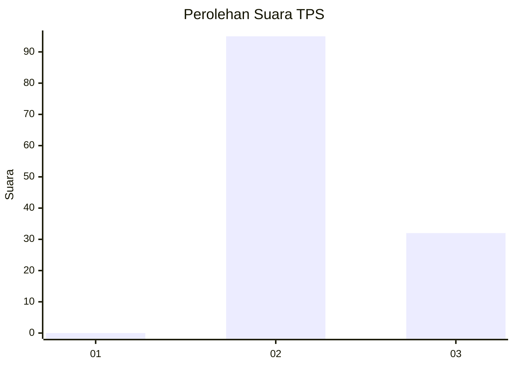
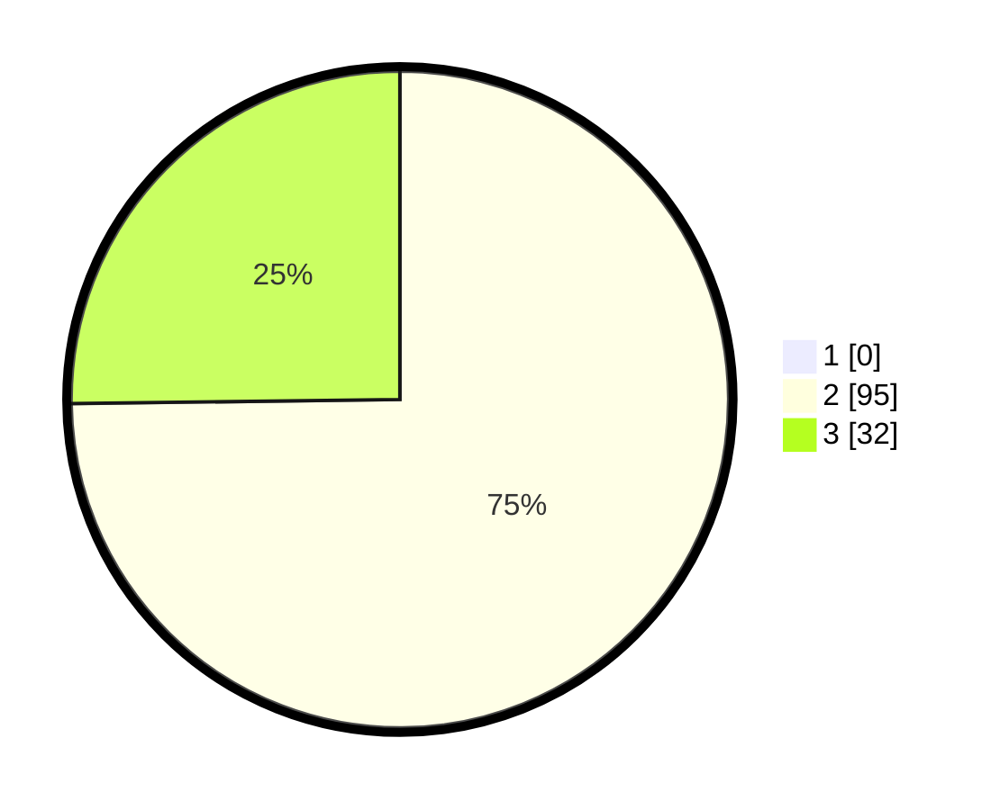

# Hasil

## Grafik

## Tabel

| No. | Nama Paslon    | Suara | Suara (raw) | Persentase |
|:--- |:-------------- | -----:| -----------:| ----------:|
| 1   | ANIES MUHAIMIN | 0     | [0][p-1]    | 0,00       |
| 2   | PRABOWO GIBRAN | 95    | [95][p-2]   | 74,80      |
| 3   | GANJAR MAHFUD  | 32    | [32][p-3]   | 25,20      |

[p-1]: https://github.com/gigit-pemilu/pemilu-2024-12-sumatera-utara/blob/main/pilpres/hitung-suara/sub/12-sumatera-utara/sub/02-tapanuli-utara/sub/13-pangaribuan/sub/2019-harianja/sub/004-tps/sub/paslon-1.txt
[p-2]: https://github.com/gigit-pemilu/pemilu-2024-12-sumatera-utara/blob/main/pilpres/hitung-suara/sub/12-sumatera-utara/sub/02-tapanuli-utara/sub/13-pangaribuan/sub/2019-harianja/sub/004-tps/sub/paslon-2.txt
[p-3]: https://github.com/gigit-pemilu/pemilu-2024-12-sumatera-utara/blob/main/pilpres/hitung-suara/sub/12-sumatera-utara/sub/02-tapanuli-utara/sub/13-pangaribuan/sub/2019-harianja/sub/004-tps/sub/paslon-3.txt

## Foto C Plano

https://sirekap-obj-formc.kpu.go.id/37cf/pemilu/ppwp/12/02/13/20/19/1202132019004-20240219-221711--4a355ccc-654c-4cbb-8bd1-19ea7927a257.jpg

https://sirekap-obj-formc.kpu.go.id/37cf/pemilu/ppwp/12/02/13/20/19/1202132019004-20240219-221821--58cb8775-7119-4e06-825b-aef49e136b28.jpg

https://sirekap-obj-formc.kpu.go.id/37cf/pemilu/ppwp/12/02/13/20/19/1202132019004-20240219-221910--2a328d06-7f8b-470e-89cc-95a016d98b21.jpg

## Metadata

| Key        | Value               |
| ---------- | ------------------- |
| Time Stamp | 2024-02-25 23:00:00 |

