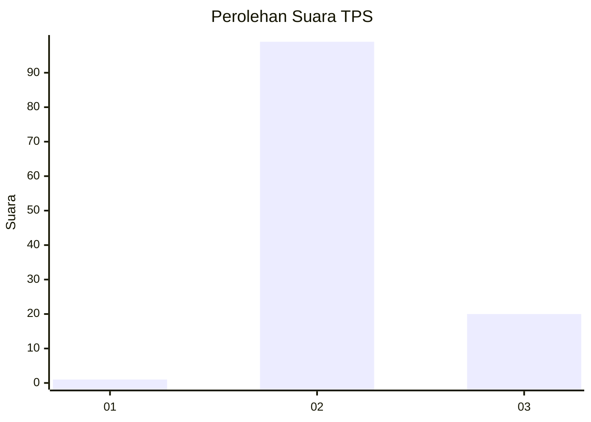
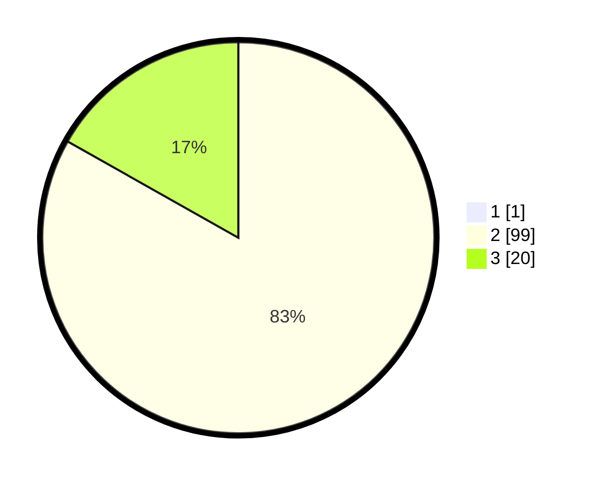

# Hasil

## Grafik

## Tabel

| No. | Nama Paslon    | Suara | Suara (raw) | Persentase |
|:--- |:-------------- | -----:| -----------:| ----------:|
| 1   | ANIES MUHAIMIN | 1     | [1][p-1]    | 0,83       |
| 2   | PRABOWO GIBRAN | 99    | [99][p-2]   | 82,50      |
| 3   | GANJAR MAHFUD  | 20    | [20][p-3]   | 16,67      |

[p-1]: https://github.com/gigit-pemilu/pemilu-2024-12-sumatera-utara/blob/main/pilpres/hitung-suara/sub/12-sumatera-utara/sub/02-tapanuli-utara/sub/14-garoga/sub/2008-lontung-jae-ii/sub/003-tps/sub/paslon-1.txt
[p-2]: https://github.com/gigit-pemilu/pemilu-2024-12-sumatera-utara/blob/main/pilpres/hitung-suara/sub/12-sumatera-utara/sub/02-tapanuli-utara/sub/14-garoga/sub/2008-lontung-jae-ii/sub/003-tps/sub/paslon-2.txt
[p-3]: https://github.com/gigit-pemilu/pemilu-2024-12-sumatera-utara/blob/main/pilpres/hitung-suara/sub/12-sumatera-utara/sub/02-tapanuli-utara/sub/14-garoga/sub/2008-lontung-jae-ii/sub/003-tps/sub/paslon-3.txt

## Foto C Plano

https://sirekap-obj-formc.kpu.go.id/8cd0/pemilu/ppwp/12/02/14/20/08/1202142008003-20240215-140828--24a5248d-0467-4ac2-a1ac-e662414d77c1.jpg

https://sirekap-obj-formc.kpu.go.id/8cd0/pemilu/ppwp/12/02/14/20/08/1202142008003-20240215-143816--e5ae5a66-f8dc-4df2-9924-9547e0bee3c4.jpg

https://sirekap-obj-formc.kpu.go.id/8cd0/pemilu/ppwp/12/02/14/20/08/1202142008003-20240215-140933--c4a112a6-7d94-4db9-b19c-ac7e9ac5c176.jpg

## Metadata

| Key        | Value               |
| ---------- | ------------------- |
| Time Stamp | 2024-02-16 01:30:27 |

