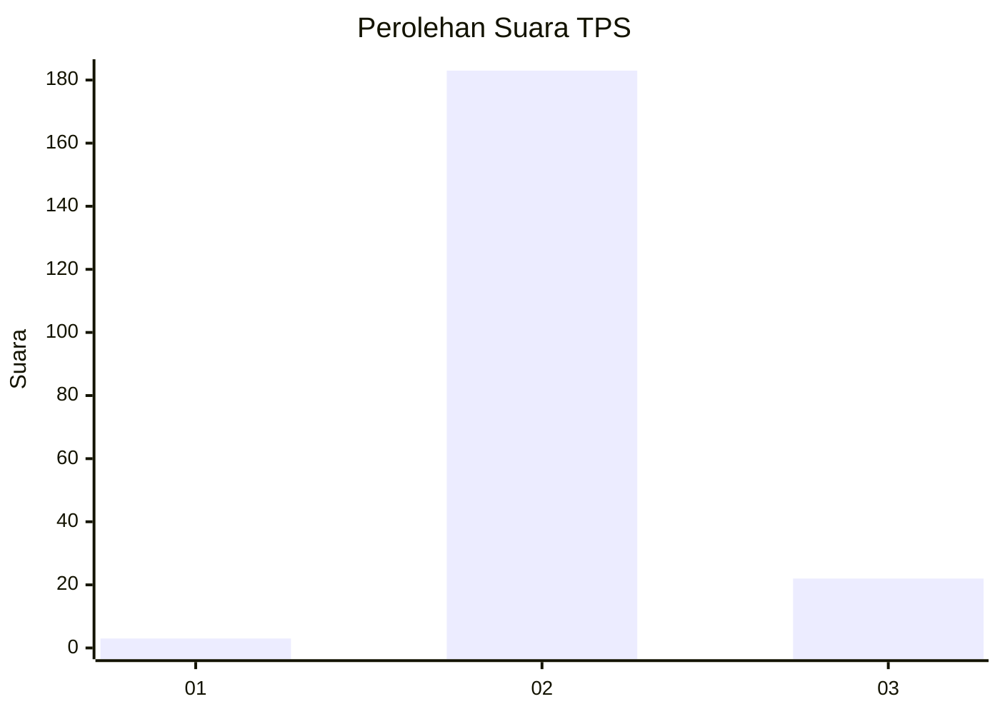
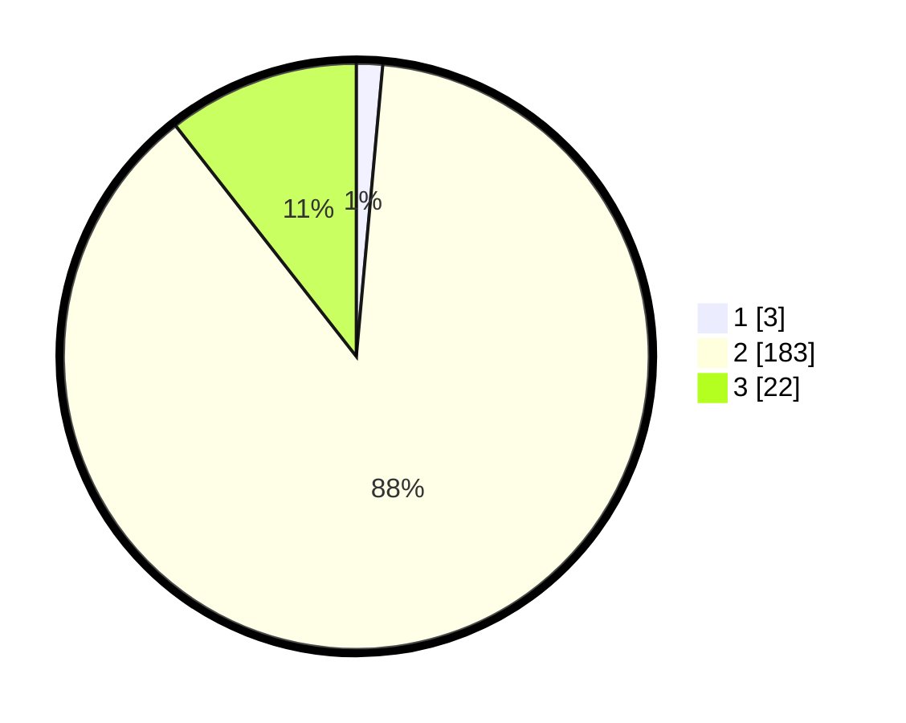

# Hasil

## Grafik

## Tabel

| No. | Nama Paslon    | Suara | Suara (raw) | Persentase |
|:--- |:-------------- | -----:| -----------:| ----------:|
| 1   | ANIES MUHAIMIN | 3     | [3][p-1]    | 1,44       |
| 2   | PRABOWO GIBRAN | 183   | [183][p-2]  | 87,98      |
| 3   | GANJAR MAHFUD  | 22    | [22][p-3]   | 10,58      |

[p-1]: https://github.com/gigit-pemilu/pemilu-2024/blob/main/pilpres/hitung-suara/sub/12-sumatera-utara/sub/02-tapanuli-utara/sub/14-garoga/sub/2011-aek-tangga/sub/005-tps/sub/paslon-1.txt
[p-2]: https://github.com/gigit-pemilu/pemilu-2024/blob/main/pilpres/hitung-suara/sub/12-sumatera-utara/sub/02-tapanuli-utara/sub/14-garoga/sub/2011-aek-tangga/sub/005-tps/sub/paslon-2.txt
[p-3]: https://github.com/gigit-pemilu/pemilu-2024/blob/main/pilpres/hitung-suara/sub/12-sumatera-utara/sub/02-tapanuli-utara/sub/14-garoga/sub/2011-aek-tangga/sub/005-tps/sub/paslon-3.txt

## Foto C Plano

https://sirekap-obj-formc.kpu.go.id/5481/pemilu/ppwp/12/02/14/20/11/1202142011005-20240215-100231--9d1feafe-a0ce-4ff2-a874-10763769bc08.jpg

https://sirekap-obj-formc.kpu.go.id/5481/pemilu/ppwp/12/02/14/20/11/1202142011005-20240215-100504--47ac0136-95c9-4104-9654-19648b7bef88.jpg

https://sirekap-obj-formc.kpu.go.id/5481/pemilu/ppwp/12/02/14/20/11/1202142011005-20240215-100729--d4c3e000-08a7-4dea-86d1-ed40c8553098.jpg

## Metadata

| Key        | Value               |
| ---------- | ------------------- |
| Time Stamp | 2024-02-15 23:29:50 |

