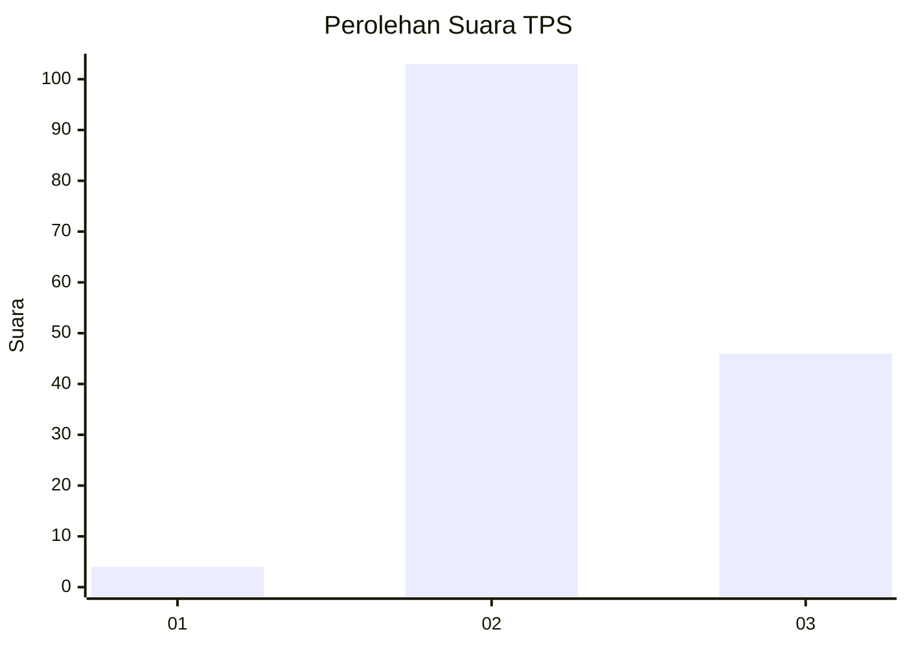

# Hasil

## Grafik

## Tabel

| No. | Nama Paslon    | Suara | Suara (raw) | Persentase |
|:--- |:-------------- | -----:| -----------:| ----------:|
| 1   | ANIES MUHAIMIN | 4     | [4][p-1]    | 2,61       |
| 2   | PRABOWO GIBRAN | 103   | [103][p-2]  | 67,32      |
| 3   | GANJAR MAHFUD  | 46    | [46][p-3]   | 30,07      |

[p-1]: https://github.com/gigit-pemilu/pemilu-2024/blob/main/pilpres/hitung-suara/sub/12-sumatera-utara/sub/02-tapanuli-utara/sub/15-muara/sub/2001-hutanagodang/sub/002-tps/sub/paslon-1.txt
[p-2]: https://github.com/gigit-pemilu/pemilu-2024/blob/main/pilpres/hitung-suara/sub/12-sumatera-utara/sub/02-tapanuli-utara/sub/15-muara/sub/2001-hutanagodang/sub/002-tps/sub/paslon-2.txt
[p-3]: https://github.com/gigit-pemilu/pemilu-2024/blob/main/pilpres/hitung-suara/sub/12-sumatera-utara/sub/02-tapanuli-utara/sub/15-muara/sub/2001-hutanagodang/sub/002-tps/sub/paslon-3.txt

## Foto C Plano

https://sirekap-obj-formc.kpu.go.id/11d6/pemilu/ppwp/12/02/15/20/01/1202152001002-20240214-223236--65cfbad8-9c0d-4db3-ba8f-280fc440656e.jpg

https://sirekap-obj-formc.kpu.go.id/11d6/pemilu/ppwp/12/02/15/20/01/1202152001002-20240214-223837--baa16059-8058-4980-8719-4fabce874201.jpg

https://sirekap-obj-formc.kpu.go.id/11d6/pemilu/ppwp/12/02/15/20/01/1202152001002-20240214-223627--8f780f35-46b9-453d-a0b8-1663e2e8b1ad.jpg

## Metadata

| Key        | Value               |
| ---------- | ------------------- |
| Time Stamp | 2024-02-15 22:40:13 |

