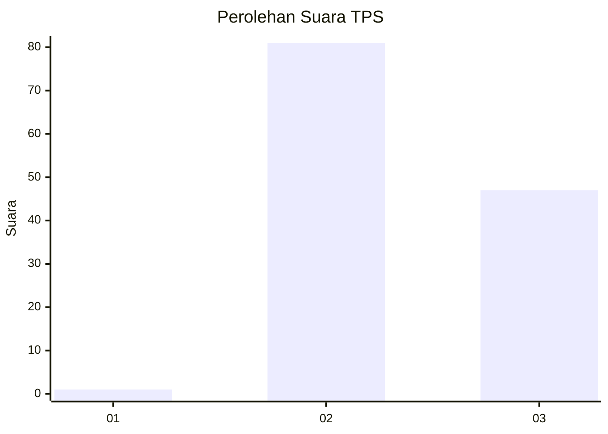
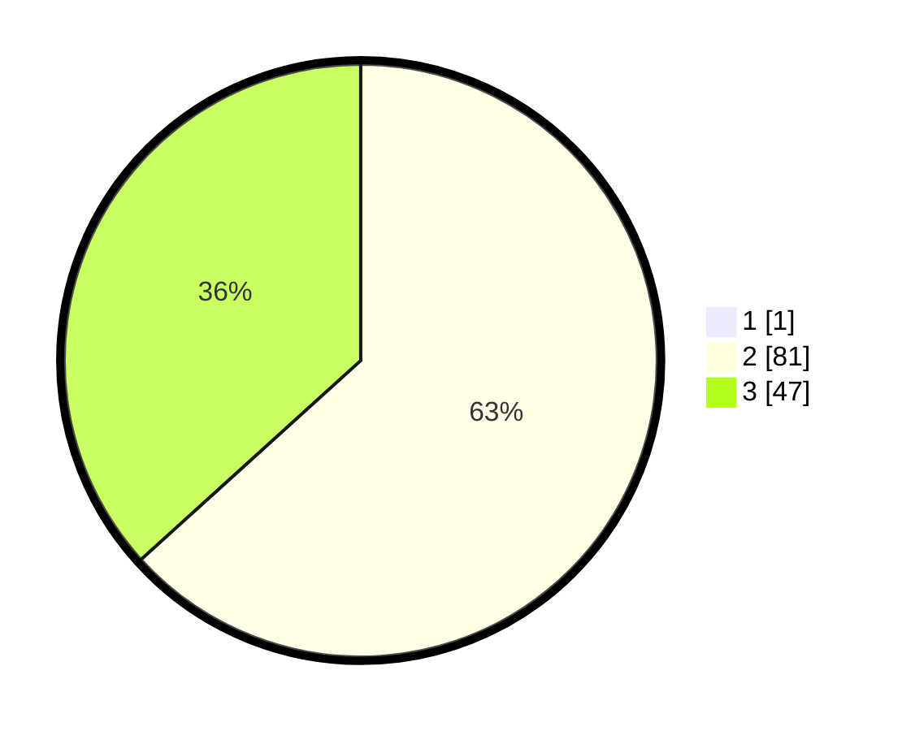

# Hasil

## Grafik

## Tabel

| No. | Nama Paslon    | Suara | Suara (raw) | Persentase |
|:--- |:-------------- | -----:| -----------:| ----------:|
| 1   | ANIES MUHAIMIN | 1     | [1][p-1]    | 0,78       |
| 2   | PRABOWO GIBRAN | 81    | [81][p-2]   | 62,79      |
| 3   | GANJAR MAHFUD  | 47    | [47][p-3]   | 36,43      |

[p-1]: https://github.com/gigit-pemilu/pemilu-2024/blob/main/pilpres/hitung-suara/sub/12-sumatera-utara/sub/02-tapanuli-utara/sub/15-muara/sub/2001-hutanagodang/sub/004-tps/sub/paslon-1.txt
[p-2]: https://github.com/gigit-pemilu/pemilu-2024/blob/main/pilpres/hitung-suara/sub/12-sumatera-utara/sub/02-tapanuli-utara/sub/15-muara/sub/2001-hutanagodang/sub/004-tps/sub/paslon-2.txt
[p-3]: https://github.com/gigit-pemilu/pemilu-2024/blob/main/pilpres/hitung-suara/sub/12-sumatera-utara/sub/02-tapanuli-utara/sub/15-muara/sub/2001-hutanagodang/sub/004-tps/sub/paslon-3.txt

## Foto C Plano

https://sirekap-obj-formc.kpu.go.id/013a/pemilu/ppwp/12/02/15/20/01/1202152001004-20240218-155917--6f2d681c-ac56-4c8b-8463-ea26b95fd5f6.jpg

https://sirekap-obj-formc.kpu.go.id/013a/pemilu/ppwp/12/02/15/20/01/1202152001004-20240218-155932--7f101187-0b1c-461f-ab3c-e557b62fe0dd.jpg

https://sirekap-obj-formc.kpu.go.id/013a/pemilu/ppwp/12/02/15/20/01/1202152001004-20240218-160001--579ae2a0-cda6-45ca-ae98-9672397de99a.jpg

## Metadata

| Key        | Value               |
| ---------- | ------------------- |
| Time Stamp | 2024-02-26 14:00:00 |

