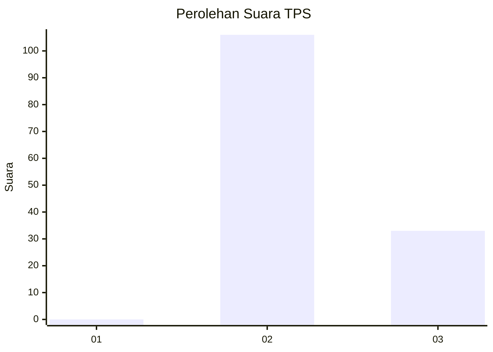
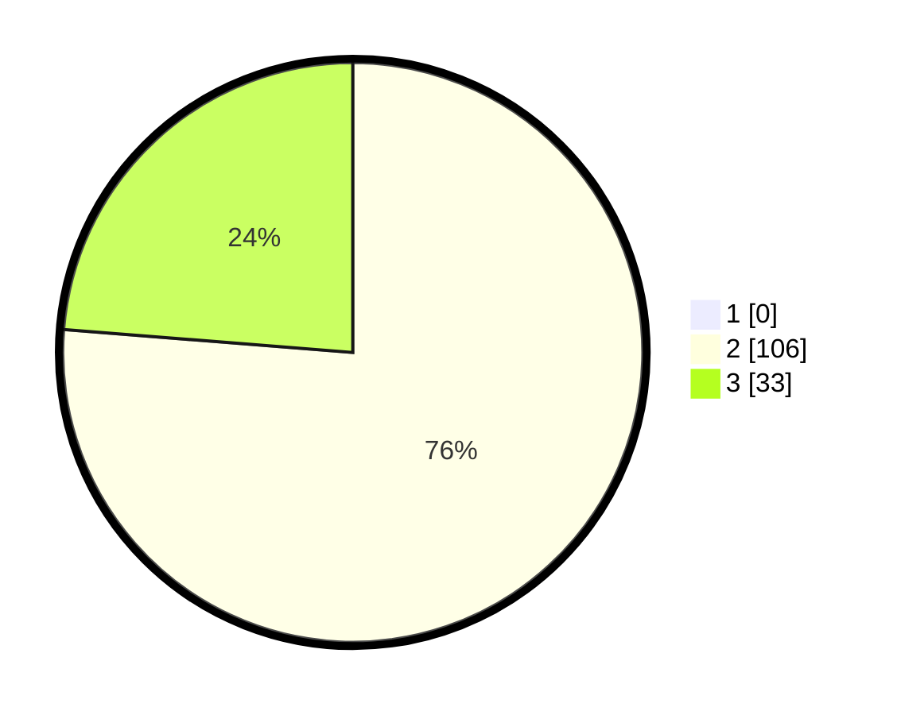

# Hasil

## Grafik

## Tabel

| No. | Nama Paslon    | Suara | Suara (raw) | Persentase |
|:--- |:-------------- | -----:| -----------:| ----------:|
| 1   | ANIES MUHAIMIN | 0     | [0][p-1]    | 0,00       |
| 2   | PRABOWO GIBRAN | 106   | [106][p-2]  | 76,26      |
| 3   | GANJAR MAHFUD  | 33    | [33][p-3]   | 23,74      |

[p-1]: https://github.com/gigit-pemilu/pemilu-2024-12-sumatera-utara/blob/main/pilpres/hitung-suara/sub/12-sumatera-utara/sub/02-tapanuli-utara/sub/15-muara/sub/2001-hutanagodang/sub/006-tps/sub/paslon-1.txt
[p-2]: https://github.com/gigit-pemilu/pemilu-2024-12-sumatera-utara/blob/main/pilpres/hitung-suara/sub/12-sumatera-utara/sub/02-tapanuli-utara/sub/15-muara/sub/2001-hutanagodang/sub/006-tps/sub/paslon-2.txt
[p-3]: https://github.com/gigit-pemilu/pemilu-2024-12-sumatera-utara/blob/main/pilpres/hitung-suara/sub/12-sumatera-utara/sub/02-tapanuli-utara/sub/15-muara/sub/2001-hutanagodang/sub/006-tps/sub/paslon-3.txt

## Foto C Plano

https://sirekap-obj-formc.kpu.go.id/5679/pemilu/ppwp/12/02/15/20/01/1202152001006-20240218-142140--3e815c40-ed10-44a9-b897-925dd5b4d1e4.jpg

https://sirekap-obj-formc.kpu.go.id/5679/pemilu/ppwp/12/02/15/20/01/1202152001006-20240218-082620--71204c7b-beb8-409b-85f9-a7f569bd49be.jpg

https://sirekap-obj-formc.kpu.go.id/5679/pemilu/ppwp/12/02/15/20/01/1202152001006-20240218-133756--17ac5ffa-664d-431d-90b4-f5b05e73549d.jpg

## Metadata

| Key        | Value               |
| ---------- | ------------------- |
| Time Stamp | 2024-02-21 10:00:00 |

