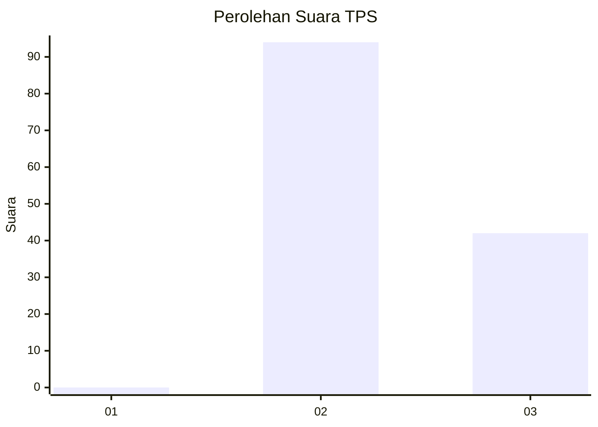
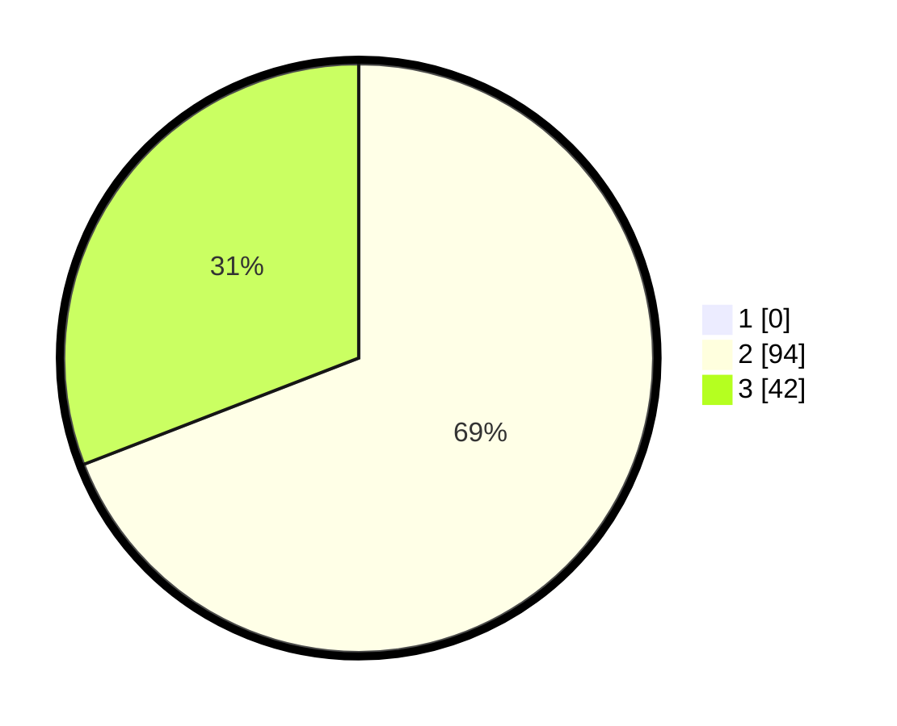

# Hasil

## Grafik

## Tabel

| No. | Nama Paslon    | Suara | Suara (raw) | Persentase |
|:--- |:-------------- | -----:| -----------:| ----------:|
| 1   | ANIES MUHAIMIN | 0     | [0][p-1]    | 0,00       |
| 2   | PRABOWO GIBRAN | 94    | [94][p-2]   | 69,12      |
| 3   | GANJAR MAHFUD  | 42    | [42][p-3]   | 30,88      |

[p-1]: https://github.com/gigit-pemilu/pemilu-2024/blob/main/pilpres/hitung-suara/sub/12-sumatera-utara/sub/02-tapanuli-utara/sub/15-muara/sub/2002-unte-mungkur/sub/001-tps/sub/paslon-1.txt
[p-2]: https://github.com/gigit-pemilu/pemilu-2024/blob/main/pilpres/hitung-suara/sub/12-sumatera-utara/sub/02-tapanuli-utara/sub/15-muara/sub/2002-unte-mungkur/sub/001-tps/sub/paslon-2.txt
[p-3]: https://github.com/gigit-pemilu/pemilu-2024/blob/main/pilpres/hitung-suara/sub/12-sumatera-utara/sub/02-tapanuli-utara/sub/15-muara/sub/2002-unte-mungkur/sub/001-tps/sub/paslon-3.txt

## Foto C Plano

https://sirekap-obj-formc.kpu.go.id/2043/pemilu/ppwp/12/02/15/20/02/1202152002001-20240214-221650--b3041950-7f03-429e-baa4-95d90d88be26.jpg

https://sirekap-obj-formc.kpu.go.id/2043/pemilu/ppwp/12/02/15/20/02/1202152002001-20240214-221848--00ff853f-8949-4dea-a4a4-2a57a1508da6.jpg

https://sirekap-obj-formc.kpu.go.id/2043/pemilu/ppwp/12/02/15/20/02/1202152002001-20240214-222013--682efdf2-0adc-455b-abe7-b08bcca37650.jpg

## Metadata

| Key        | Value               |
| ---------- | ------------------- |
| Time Stamp | 2024-02-15 23:29:50 |

