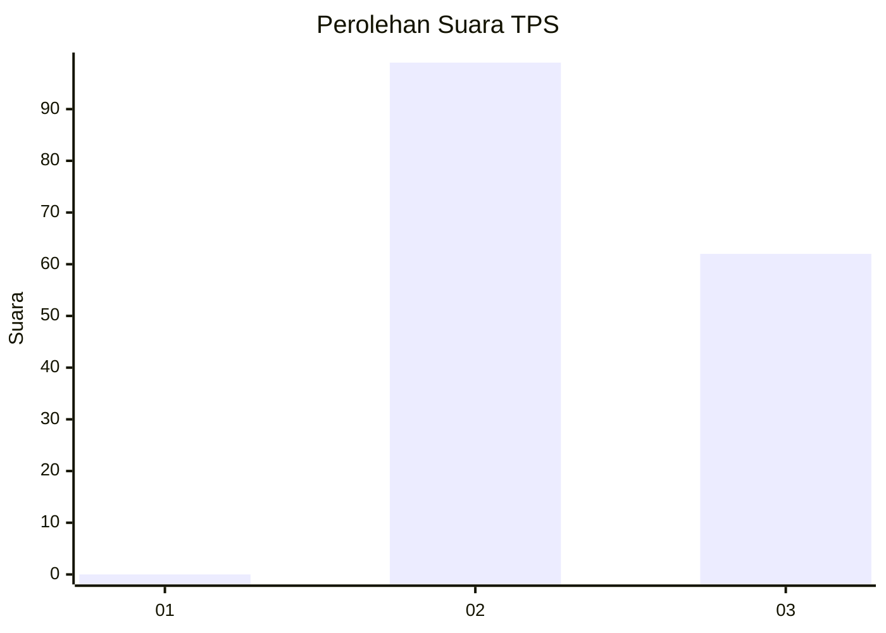
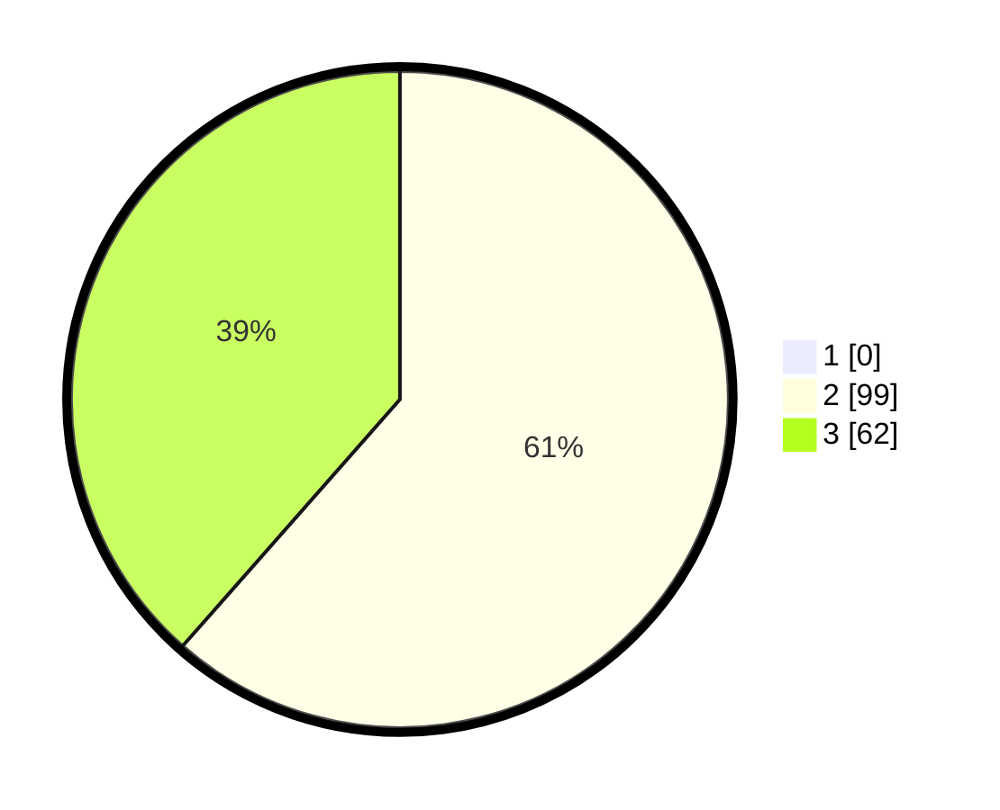

# Hasil

## Grafik

## Tabel

| No. | Nama Paslon    | Suara | Suara (raw) | Persentase |
|:--- |:-------------- | -----:| -----------:| ----------:|
| 1   | ANIES MUHAIMIN | 0     | [0][p-1]    | 0,00       |
| 2   | PRABOWO GIBRAN | 99    | [99][p-2]   | 61,49      |
| 3   | GANJAR MAHFUD  | 62    | [62][p-3]   | 38,51      |

[p-1]: https://github.com/gigit-pemilu/pemilu-2024/blob/main/pilpres/hitung-suara/sub/12-sumatera-utara/sub/02-tapanuli-utara/sub/15-muara/sub/2002-unte-mungkur/sub/004-tps/sub/paslon-1.txt
[p-2]: https://github.com/gigit-pemilu/pemilu-2024/blob/main/pilpres/hitung-suara/sub/12-sumatera-utara/sub/02-tapanuli-utara/sub/15-muara/sub/2002-unte-mungkur/sub/004-tps/sub/paslon-2.txt
[p-3]: https://github.com/gigit-pemilu/pemilu-2024/blob/main/pilpres/hitung-suara/sub/12-sumatera-utara/sub/02-tapanuli-utara/sub/15-muara/sub/2002-unte-mungkur/sub/004-tps/sub/paslon-3.txt

## Foto C Plano

https://sirekap-obj-formc.kpu.go.id/b613/pemilu/ppwp/12/02/15/20/02/1202152002004-20240215-011309--eaf569a7-f0cc-4b38-94d7-9513c0f052ce.jpg

https://sirekap-obj-formc.kpu.go.id/b613/pemilu/ppwp/12/02/15/20/02/1202152002004-20240215-011435--9b32e7ce-ca5a-4a89-92c1-3ebaa1e84b04.jpg

https://sirekap-obj-formc.kpu.go.id/b613/pemilu/ppwp/12/02/15/20/02/1202152002004-20240215-011616--363cf14f-073c-4508-8303-ccfd840e9281.jpg

## Metadata

| Key        | Value               |
| ---------- | ------------------- |
| Time Stamp | 2024-02-16 00:00:26 |

