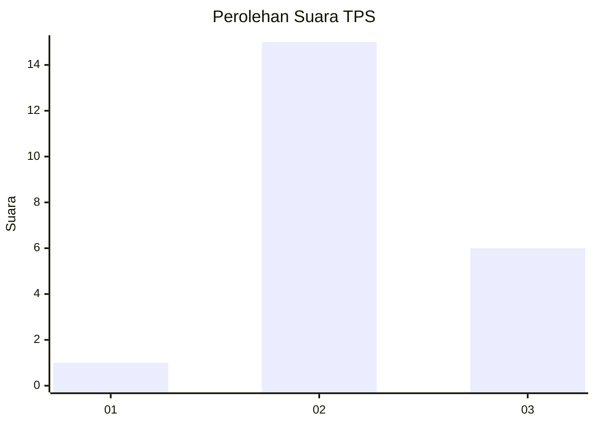
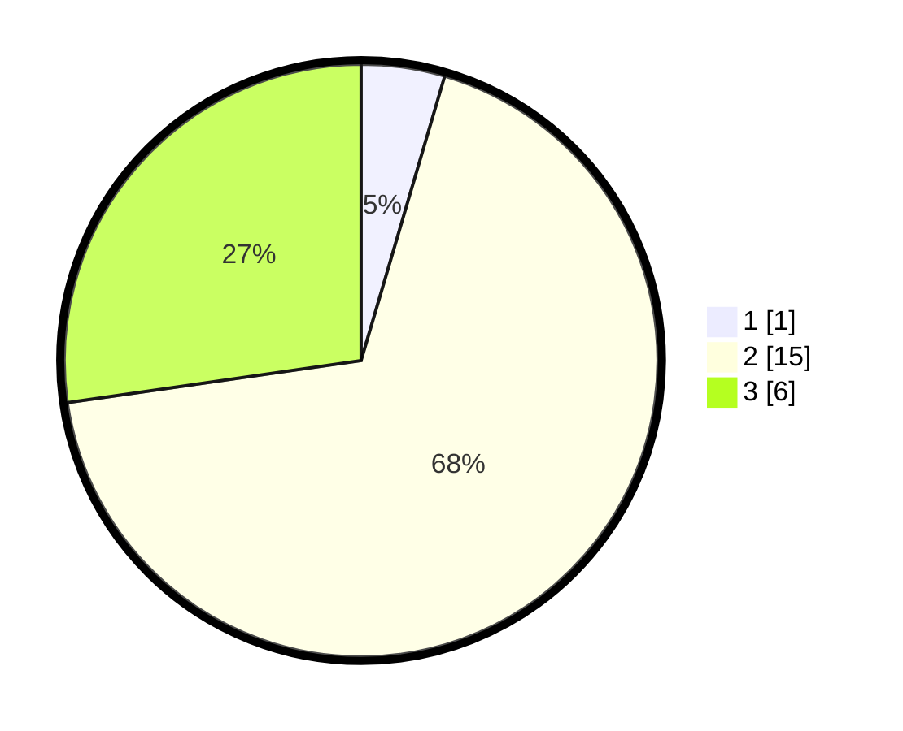

# Hasil

## Grafik

## Tabel

| No. | Nama Paslon    | Suara | Suara (raw) | Persentase |
|:--- |:-------------- | -----:| -----------:| ----------:|
| 1   | ANIES MUHAIMIN | 1     | [1][p-1]    | 4,55       |
| 2   | PRABOWO GIBRAN | 15    | [15][p-2]   | 68,18      |
| 3   | GANJAR MAHFUD  | 6     | [6][p-3]    | 27,27      |

[p-1]: https://github.com/gigit-pemilu/pemilu-2024-12-sumatera-utara/blob/main/pilpres/hitung-suara/sub/12-sumatera-utara/sub/02-tapanuli-utara/sub/15-muara/sub/2003-hutalontung/sub/003-tps/sub/paslon-1.txt
[p-2]: https://github.com/gigit-pemilu/pemilu-2024-12-sumatera-utara/blob/main/pilpres/hitung-suara/sub/12-sumatera-utara/sub/02-tapanuli-utara/sub/15-muara/sub/2003-hutalontung/sub/003-tps/sub/paslon-2.txt
[p-3]: https://github.com/gigit-pemilu/pemilu-2024-12-sumatera-utara/blob/main/pilpres/hitung-suara/sub/12-sumatera-utara/sub/02-tapanuli-utara/sub/15-muara/sub/2003-hutalontung/sub/003-tps/sub/paslon-3.txt

## Foto C Plano

https://sirekap-obj-formc.kpu.go.id/e97e/pemilu/ppwp/12/02/15/20/03/1202152003003-20240214-192852--0a113c52-778a-4a5c-a72a-58a1c790f05b.jpg

https://sirekap-obj-formc.kpu.go.id/e97e/pemilu/ppwp/12/02/15/20/03/1202152003003-20240214-195552--5b8f8ddd-2edd-4ac2-8350-8c0e8ff21d3e.jpg

https://sirekap-obj-formc.kpu.go.id/e97e/pemilu/ppwp/12/02/15/20/03/1202152003003-20240214-192939--c720a36d-9f5c-4d9c-b933-26d5c4ed4dbc.jpg

## Metadata

| Key        | Value               |
| ---------- | ------------------- |
| Time Stamp | 2024-02-14 21:46:01 |

## DATA PEMILIH TETAP

Jumlah pemilih dalam DPT: **38**.
 * L: **17**.
 * P: **21**.

## DATA PENGGUNA HAK PILIH

Jumlah pengguna hak pilih dalam DPT: **22**.
 * L: **12**.
 * P: **10**.

Jumlah pengguna hak pilih dalam DPTb: **0**.
 * L: **0**.
 * P: **0**.

Jumlah pengguna hak pilih dalam DPK: **1**.
 * L: **1**.
 * P: **0**.

Jumlah pengguna hak pilih: **23**.
 * L: **13**.
 * P: **10**.

## JUMLAH SUARA SAH DAN TIDAK SAH

JUMLAH SELURUH SUARA SAH: **22**.

JUMLAH SUARA TIDAK SAH: **1**.

JUMLAH SELURUH SUARA SAH DAN SUARA TIDAK SAH: **23**.

