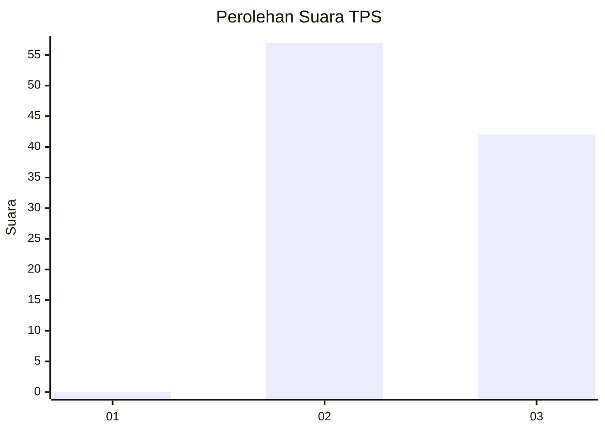
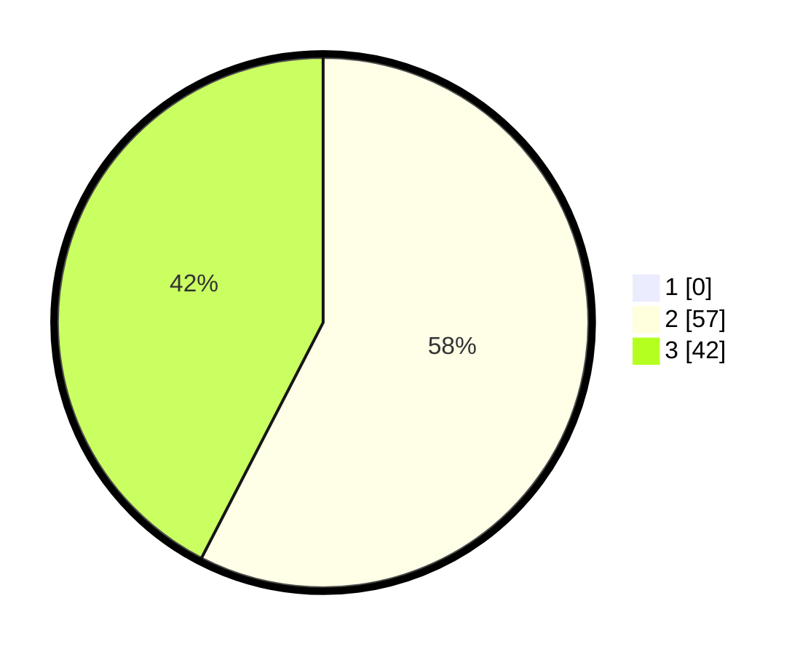

# Hasil

## Grafik

## Tabel

| No. | Nama Paslon    | Suara | Suara (raw) | Persentase |
|:--- |:-------------- | -----:| -----------:| ----------:|
| 1   | ANIES MUHAIMIN | 0     | [0][p-1]    | 0,00       |
| 2   | PRABOWO GIBRAN | 57    | [57][p-2]   | 57,58      |
| 3   | GANJAR MAHFUD  | 42    | [42][p-3]   | 42,42      |

[p-1]: https://github.com/gigit-pemilu/pemilu-2024-12-sumatera-utara/blob/main/pilpres/hitung-suara/sub/12-sumatera-utara/sub/02-tapanuli-utara/sub/15-muara/sub/2006-mariba-ni-aek/sub/003-tps/sub/paslon-1.txt
[p-2]: https://github.com/gigit-pemilu/pemilu-2024-12-sumatera-utara/blob/main/pilpres/hitung-suara/sub/12-sumatera-utara/sub/02-tapanuli-utara/sub/15-muara/sub/2006-mariba-ni-aek/sub/003-tps/sub/paslon-2.txt
[p-3]: https://github.com/gigit-pemilu/pemilu-2024-12-sumatera-utara/blob/main/pilpres/hitung-suara/sub/12-sumatera-utara/sub/02-tapanuli-utara/sub/15-muara/sub/2006-mariba-ni-aek/sub/003-tps/sub/paslon-3.txt

## Foto C Plano

https://sirekap-obj-formc.kpu.go.id/81d6/pemilu/ppwp/12/02/15/20/06/1202152006003-20240214-205039--9fe41a28-3e0a-45c2-88e1-fabf493df22b.jpg

https://sirekap-obj-formc.kpu.go.id/81d6/pemilu/ppwp/12/02/15/20/06/1202152006003-20240214-205340--2aac3115-6204-4a21-9ae8-6e911d2034b5.jpg

https://sirekap-obj-formc.kpu.go.id/81d6/pemilu/ppwp/12/02/15/20/06/1202152006003-20240214-205454--3010609b-f2e7-412f-8407-1f6d407a0335.jpg

## Metadata

| Key        | Value               |
| ---------- | ------------------- |
| Time Stamp | 2024-02-16 02:00:27 |

